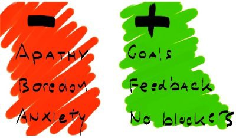

---
path:	"/blog/104-questions-for-product-development-teams"
date:	"2015-12-26"
title:	"104 Questions For Product Development Teams"
image:	"../images/0*h332lIEr3yb8sR3R.jpg"
---

**Please bookmark this post. Don’t try to read it all in one sitting. You will hate me and call me crazy.**

It will not go well with your coffee. You will get distracted, and if you are a product manager it will likely trigger some anxiety. I could have written this in 10 posts, but I figured it would be easier to keep it all in one place.

After bookmarking the post, please do the following:

**1.** Email it to a trusted co-worker with one of these subject lines:

* “What goes on in a product manager’s brain …. “
* “Before we start the next project … “
* “This is why I need a vacation … “
* “Answering these questions can make our engineers happy … “
**2.** Read the introduction, and then browse ten (10) questions to get the gist. Then return to it when you’re in a bind, need to reality check your situation, or want some ideas on how to give your team more clarity.

### Introduction

Let’s get started. To quote [one of my favorite posts on the role of product management](https://medium.com/@joshelman/a-product-managers-job-63c09a43d0ec), the product manager’s job is to:

> Help your team (and company) ship the right product to your usersSimple right? Hardly. I like to think that product helps the team (both the immediate “doers” and the broader team) achieve a state of Flow for the benefit of your company and users. [Wikipedia defines Flows as](http://en.wikipedia.org/wiki/Flow_%28psychology%29):

> … the [mental state](http://en.wikipedia.org/wiki/Mental_state) of operation in which a person performing an activity is fully immersed in a feeling of energized focus, full involvement, and enjoyment in the process of the activity.Apathy, boredom, and anxiety are Flow anti-patterns. Clear goals, tight feedback loops, and the absence of blockers are Flow state prerequisites.

And they also happen to fit squarely in a product manager’s job description. In short, help the team focus all of its energy on driving value directly to the users/customers. Do “everything else”. And do so in situations that are often ambiguous and constantly changing. Servant leadership (without the authority)

 at its best.

Below I have documented 104 questions (@250 if you count the questions inside the questions) that I ask myself during an average day, week, month, and year. They revolve mostly around the internal facing role of product and promoting Flow. For some of these questions, it is my responsibility to have the answer. The team deserves no less. For others, I guide the team towards self-discovery. Either way, the focus is on clarity, and a clear path forward.

### Team and Situation

What must I know about the team and situation before we really get started?

1. How experienced is the engineering team? How familiar is the team with the problem domain? How motivated is the team to address this problem?
2. Can we co-locate the team? If not, does the team have a strong track record of working remote, and are they committed to overcoming remote challenges?
3. Is the team comfortable with ambiguity?
4. Does the team want to be involved in the more strategic aspects of the effort? If so, what is their background in assumption/hypothesis driven development?
5. Is the team comfortable interacting directly with end-users and customers?
6. Is the team empowered to solve the problem autonomously? Is there typically a lot of healthy debate and push-back? Or is the team eager for someone else to make the difficult decisions?
7. Does the team possess a good mix of viewpoints, backgrounds, and communication styles? Or do some team members exert a disproportionate influence?
8. What is the history of the team? Are they coming off a positive experience with high momentum, or a negative experience with no momentum?
9. What is the history behind this effort? How has that history shaped current perceptions? Is this viewed as an “about time” project, or a “why the hell?” project? Have other teams failed? Why? If building on top of an old feature, why was the feature left in the current state? How will it impact the bottom line? Where is the product in the product lifecycle?
10. Who are the major stakeholders? How do the stakeholders view the problem? Have they already become emotionally attached to potential solutions? Am I already biased? What is the general consensus on the risks involved? Are there any agendas at play? If so, what is our plan to navigate individual agendas?
### Goal And Vision

What is the big picture? Where are we going?

1. Are the business goals clear and actionable? Are goals framed as target outcomes?
2. How is our work tied to the goals of the business, and how will we measure our impact?
3. How is our work tied to the goals of our users/customers, and how will we measure that impact?
4. Have we communicated those goals with a compelling vision? Does the vision inspire and focus our work? Can it be explained in a tweet? What is our “true north” ? Is the team engaged?
5. As we discover new information, have we refined the goal appropriately?
### Problem

What problem are we trying to solve?

1. Does the team have a shared understanding of the problem we are solving? Are we speaking the same language? Does the team have a shared understanding of the problem’s root cause?
2. Do we understand who we are solving the problem for? What are their needs? In their words, how do they describe those needs? Have we sufficiently researched our customer goals and pain points, including speaking directly with a minimum of ten customers (ideally with the team)?
3. How are customers solving the problem right now, keeping in mind that our biggest competition is often the status quo?
4. How much time and resources do we have to solve the problem? Are we running out of either? Do we share a similar sense of urgency? Do we share a high level idea of what we’ll be doing in the next week, weeks, month, and beyond?
5. How will we rightsize our solution to the problem at hand? At what point will the investment of more time and energy have a limited return?
6. If we are releasing a feature for an existing product, have we identified the feature as a basic must-have “table stakes” feature, a performance feature, or a differentiator? Have we validated this understanding, or are we operating with limited information?
7. Who are the team’s go-to subject matter experts (SMEs)? Are they available?
8. Have we injected the necessary awareness of the market, competition, market, and legal issues into our understanding of the problem? If not, what is the next step to gather that data?
9. Was the team involved in defining the problem? Do they feel vested and engaged? How can we help them become more vested and engaged?
10. Would some reframing of our goals and/or KPIs allow us to more effectively understand the problem from the perspective of the business? If this is impossible, is the team OK with the ambiguity? Is this a leap of faith, or a hesitant nosedive?
11. What would happen if we simply did nothing? Is that an option? Is there a possibility that the problem will solve itself, or the metrics will move without our intervention?
12. Have we framed the problem in terms of desired outcomes as opposed to possible solutions/features?
13. Have we leveraged all of our available sources of data to understand the problem, current workarounds, customer behavior, and competitive options?
### Assumptions and Hypotheses

What are our knowns and unknowns?

1. What are our operating assumptions? Have we validated these assumptions? Does the team understand and share these assumptions? How will we test our untested assumptions?
2. How do these assumptions stack up in terms of risk? Who bears the possible burden of that risk? Which assumptions must we accept as givens, and which assumptions are open to testing and validation?
3. What are the constraints to our solution? For example, do we need to use an existing technology framework? Do we have to complete the feature in time for an annual convention?
4. What parts of the solution are negotiable? For example, could we reduce the breadth of features to release more quickly?
5. Have we discussed our individual biases? How do these biases impact our view of the problem, and our attachment to our proposed solution?
6. What is the current, single greatest threat to the project’s success? How will we defend against that threat?
7. Assuming that “not delivering the intended value to the customer” is our worst case scenario, what steps can we take to make sure that does not happen?
8. What is our biggest gap in knowledge at the moment? What do we need to learn now? What can we learn later? How can we learn quickly and cheaply? Can we restate these gaps as a series of well-articulated questions?
9. What piece of information/data impacting our work would we gladly buy if it was immediately available? Is it available? If not, how might we “purchase” that information by committing our resources?
10. What is the current working hypothesis in terms of a solution? Is there consensus among team members regarding our working hypothesis?
11. Was the team involved in generating the list of key assumptions, questions, and solution hypotheses? Do they feel vested and engaged? Did the whole team have an opportunity to state key assumptions impacting their area of expertise?
12. Could some of our questions be resolved by simply having clearer goals?
13. We likely will need to function amidst some level of ambiguity. Are we potentially overreacting to, or under-reacting to the perceived level of ambiguity?
14. Have we agreed on a process to track and iterate on our assumptions, risks, and questions?
### Prioritization, Sequence, Delivery

How do we do the most important thing next?

1. Does the team have a shared understanding of our current priorities, and our near-term prioritization and sequencing of work? Are we in agreement that this is the best plan of action?
2. Is the sequence of how we intend to release our solution optimized for information gathering? Will it be possible to gather meaningful data given the scope of the incremental releases?
3. Have we effectively mitigated the risk of confirmation bias / tunnel vision for our solution?
4. What key decisions will we need to make soon? How will we make these decisions? Are we about to make any irreversible decisions, and if so, do we agree on the potential risks involved?
5. Is there consensus around which decisions can be deferred?
6. How will we decide which features are truly essential?
7. Is the team comfortable with the rough sizing (estimation) of prioritized items?
8. How will we decide that we’re done? If that seems a long ways off, what are some short term definitions of done? Are these goals specific, measurable, actionable, realistic, and time constrained?
9. Are we currently on a good trajectory to deliver the best solution possible given our current constraints?
10. Have we collectively agreed on when we’ll reconvene to reassess our progress?
11. To what extent are edge cases and newfound dependencies influencing prioritization? Is there a way to decouple our solution from these issues?
12. Have we acknowledged any technical debt we might introduce into the system? What is our plan for working down any debt caused by our solution?
13. Do we have a shared understanding of the target fidelity for the next iteration?
14. How large is our current inventory of untested and unimplemented ideas? How much rework would be required if all of our current inventory was found to be off-target?
15. How might potential disruption to customers guide our prioritization? Will the feature require training and “unlearning” old habits? Must we validate how we intend to launch the feature?
16. Was the team involved in prioritizing work and developing the guidelines around how work was sequenced? If their involvement was minimal, are they ok with that?
17. Does the sequence of work and current prioritization scheme pass rational muster with the team? Could the team repeat the prioritization and sequencing exercise and arrive at the same results? Is it a system that could be used in the future?
### Users/Customers

How do we keep the solution relevant to customers?

1. Does the team have a working user/customer persona hypothesis? Is the persona visible?
2. What is the current customer attitude towards the problem? Is this something that users have been expecting for years? Or will the solution come as a welcome surprise?
3. How are we engaging our customers as we formulate and build a solution? How are we building empathy for their situation and goals? When and how, exactly, will we next share some aspect of our solution with customers?
4. When was the last time the team interacted with a “real live” customer? What did we learn? How can we learn more when this opportunity next presents itself?
5. Are we investing our time such that we are maximizing value to our customers? How would an average customer respond if they were to participate in our last meeting or last discussion? Would they call our work valuable? Is our work being described and framed in terms of its utility and value to customers?
6. At what point will we expose our solution to customers using their data, in their context, and with their day-to-day organic workflows?
7. Once released to users, how will we gather feedback such that it is actionable and timely? Do we intend to act on this feedback? Will our customers expect us to act on their feedback immediately?
8. Are our usability testing methods matched with the phase of the solution? Are they generating statistically significant data appropriate for the phase goal? Are we using a good mix of qualitative and quantitative methods?
9. How will we measure what our customers do in addition to what they say?
10. What challenges might we face when gathering customer feedback? How can we address these challenges?
11. Are we leveraging all available channels to gather customer feedback?
12. How will we make customers aware of this feature? Is this a feature with limited appeal to our customer base? How will we measure adoption as distinct from usability or feature/need fit? Is driving adoption of the feature in scope, and if so, what is the plan to drive adoption?
### Dependencies

How do we manage dependencies?

1. Will our solution disrupt our customers in the short term? How will this be managed, and what data will we need to feel confident in our management strategy?
2. Are we communicating effectively to stakeholders outside of our team (sales, support, other teams, users, etc.)?
3. Are there legal /privacy implications?
4. Will our solution touch other parts of the product? Are we at risk of negatively impacting the user experience elsewhere?
5. How and when are we playing “three dimensional chess” as we seek to resolve dependencies? Are we discounting the simplest path forward?
### How We Work

How does the team stay efficient and healthy?

1. Do we have clear agendas for the next week’s worth of meetings? Do any meetings need to be repurposed to meet current challenges? Can any meetings be canceled?
2. Are meetings managed for maximum utility? Who documents the decisions and action items resulting from meetings? Are they conducted in conducive settings, with the right tools and participants?
3. Is the product owner available at all times?
4. Do we have a clear idea of individual responsibilities? When there are overlaps, have we discussed potential conflicts?
5. Does our team have the requisite information to make most decisions regarding the solution autonomously? Or, are we losing cycles due to ambiguous goals?
6. Are we limiting the amount of extraneous and “noisy” data? Does the team feel protected from any competing agendas and politics?
7. Are we calling things by the same name? Have we developed a common vocabulary to discuss our solution, the problem, and our assumptions?
8. Do we have momentum? Is that sense of momentum and progress shared by all members of the team? Can the team focus on doing instead of strategizing? Is everyone inspired? Is anyone unclear about what their week looks like? Is momentum building or waning? How can we recover from a recent drop in momentum?
9. Is anyone on the team blocked? What can be done to remove those blockers? Is our process suffering from any bottlenecks? What can be done to remove those bottlenecks?
10. Is the team suitably buffered from distractions and disruption?
11. Does the team feel focused and productive? Are we having fun?
12. Is the work suitably decomposed so as to limit work in progress? Does the team share a solid definition of done?
13. Has the team formalized its hand-offs, stages, and agreed upon process?
14. Have factions formed within the team and, if so, are these factions healthy? Do different points of view drive value to the customer, or should we work to reduce personal bias? Can we harness these differences for good? Can any back-channels be made public?
15. Is the team collaborating and communicating in an effective manner? Are tools being used consistently?
16. Can I provide adequate information to other stakeholders regarding the status and focus of the effort? If a rough schedule is required, is that available? Are we maintaining a burndown chart? How does my work fit into the overall roadmap?
17. Are all sources of information — including ticketing tools, wikis, documents — up to date? Do stakeholders have necessary access? Can extraneous information be removed for clarity?
18. Are our emails clear, actionable, and scannable?
### Off The Rails?

What happens when things go off the rails?

1. What does my gut say?
2. Am I the blocker? If so, how can I change that?
3. Is there animosity on the team? How can we dispel that immediately?
4. Am I doing my absolute best to build a shared understanding for all aspects of the project? Am I doing so without dragging the team “through the mud” ?
5. Beyond presenting data and sound reasoning, am I providing inspiration?
6. Are we actually shipping?
7. Can I see the forest through the trees? Can the team?
8. Are my actions creating an environment of trust and ownership? If I am second guessing the team, can I find a productive way to express my concerns?
9. What does the team need right now? Did the team crack at least one joke today? Lighten up! Time for beers.
10. Am I taking care of myself? Eating well? Sleeping well. It all counts?
### Conclusion

Did anyone make it this far? Really? Please comment.

