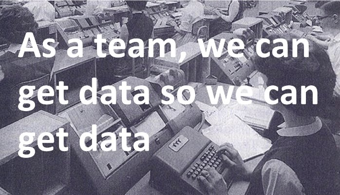
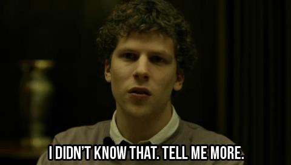

---
path:	"/blog/user-stories-and-data"
date:	"2016-01-06"
title:	"User Stories and Data"
image:	"../images//images/1*YI6YoTq9GexVQpoNxav-dA.png"
---

I frequently hear questions like …

***“How do you know what to measure?”***  
***“How do you write data stories?”***  
***“Where do we even start?”***

One approach is to write data-specific user stories. These stories often look something like this:

***Data stuff. See John***

That’s not great. Though it is a placeholder for a conversation which is a good user story pattern. I’ll give it that. One step up is to try something like this:

***As a product development team, we can measure the rate of successful adoption for the new widget maker so that we can optimize the experience for customers***

This is decent. But something is missing. Where is the direct value to the customer? And if you’re like most teams this type of story will be an afterthought. Which makes perfect sense. User value ([and user personas](http://www.romanpichler.com/blog/personas-epics-user-stories/)) comes first.

I prefer to take another approach. Incorporate data into each and every story.

Think for a moment about the “T” in the [popular INVEST acronym](http://guide.agilealliance.org/guide/invest.html) (a way to remember and assess what makes a good User Story). User stories are supposed to be Testable. We go to great ends to write unit, functional, and integration tests. But how about testing our basic hypotheses? Or that the story is meeting user expectations and driving the expected value?

User acceptance testing to the rescue! Well, sort of. Wouldn’t it be great if everything worked as smoothly as this [Stackoverflow](http://stackoverflow.com/questions/4904096/whats-the-difference-between-unit-functional-acceptance-and-integration-test) snippet:

> If the tests pass, it means the software should meet the customer’s requirements and the stories can be considered complete. An acceptance test suite is basically an executable specification written in a domain specific language that describes the tests in the language used by the users of the system.Great. Fire up that domain specific language. When your executable specification passes you’ve got a winning feature! Mark it complete! And keep that velocity rolling. Cue my favorite user story from real 1st hand experience:

***As a product manager, I can see the [Feature Name] feature finished in two weeks, so that I can approve it***

Joke? Almost. Keep in mind that the Scrum basically relies on a customer, or customer proxy, to sit there and “approve” the feature. You’re done at the end of the sprint when someone nods and says “yes”. And then the feature disappears off into the ether. **Out of Sprint, out of mind! **Or at least into the hands of business analysts.

But acceptance tests give a valuable hint. Let’s take a look at a [popular acceptance test format](http://codesqueeze.com/the-easy-way-to-writing-good-user-stories/):

> Given [context] And [some more context]… When [event] Then [outcome] And [another outcome]…Sure this format can be used for the low level aspects of a story. But take a broader view. We’re making assumptions about:

* **Context:** The problem context or situation
* **Events:** Events taken to rectify the problem
* **Outcomes: **What outcomes result from attempts to solve the problem
Consider this example from a great, new, product idea I just had:

> Example: **GIVEN** that people are perpetually in need of social gratification,**AND THAT** they enjoy seeing news from their friends, **WHEN** they encounter a “feed” of friend related news-snippets, **THEN** they will spend hours online, and may even click on ads.

Bingo! You have some clues for what to measure. You have context, events, and outcomes. Now validate!

[Alexander Cowan puts it bes](http://www.alexandercowan.com/best-agile-user-story/)t:

> It’s silly to hold your nose, take the plunge and hope you’re right. It’s practical and effective to max out what you can know without spending a lot of time and money, start with the simplest possible implementation of a new feature, and then have an explicit plan to get a definitive result about its relevance. This is how a lot of actual innovation happens- effective experimentation (aka effective trial and error).When I suggest this approach, the first question I typically hear is something like:

> This is all good in theory, but Scrum says I need to mark the job complete at the end of two weeks. And that we’ll ship it. There is no place for this experiment! And we’ll never finish those stories if we actually add the tracking.To that I would ask whether it is better to do the 20% that matters, or the 80% that doesn’t. Which brings up my final point. Taking a more data-centric approach is actually not about the tools, or even how you write stories. It is about something more fundamental.

Do you have dedicated, cross-functional, problem focused, and outcome driven teams? And do they actually control the destiny and shape of their work? Are they allowed to fail sometimes? And are they incentivized for output and utilization (being busy) or generating results?

Answer those questions and address any issues there (easier said than done), and then find a way to work in the data stories. My preference is to place them immediately in the user-centric stories or epics. Keep it lightweight, and similar to acceptance tests. Add some baselines and targets. And then use Kanban or another tool to pass the stories out from the sprint, and into a measure/learn flow. You may be “done”, but the story isn’t “Done” until it has achieved the desired intent.

