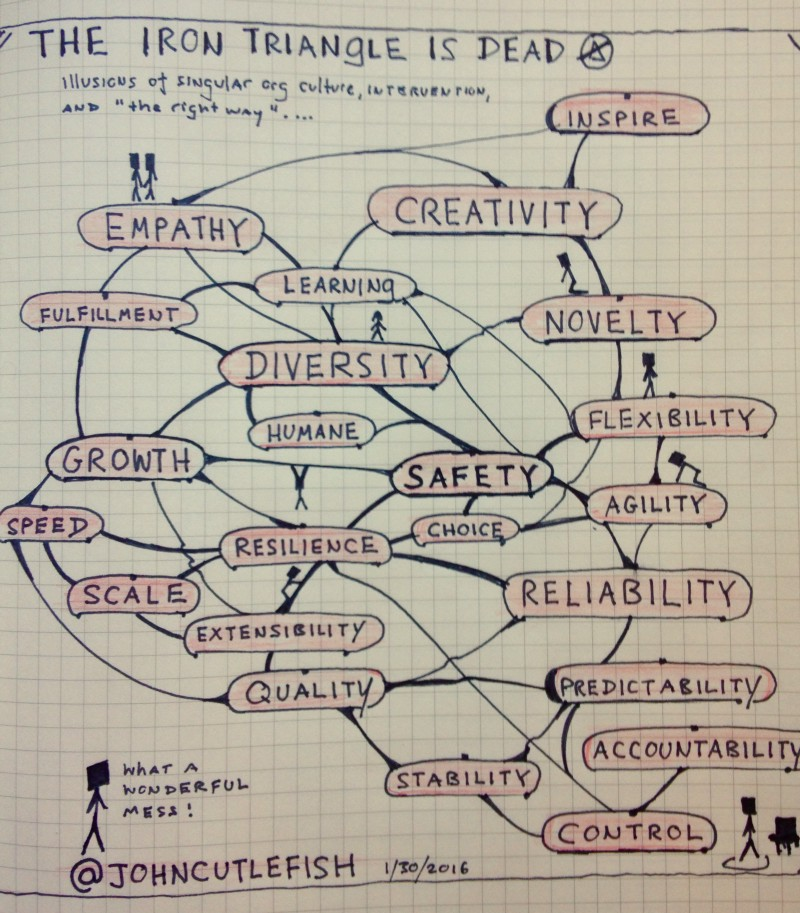

---
path:	"/blog/the-iron-triangle-is-dead"
date:	"2016-01-31"
title:	"The Iron Triangle Is Dead"
image:	"../images/1*A_VyiMYQB7VoabXbI_e0pg.jpeg"
---

#### Illusions of singular org culture, intervention, and the “right way”

There is something very calming about doodling in a notebook. For me, Saturday mornings is about doodles and coffee.

The [traditional Iron Triangle](http://www.projecttimes.com/articles/traditional-iron-triangle-vs.-agile-triangle.html) has three nodes: Scope, Resources, and Schedule. When you talk to executives they’ll describe their central challenges as Growth, or Innovation, or both. As product developers we’re supposed to decide between [Building The Right Thing, Build It Fast, and Build The Thing Right](http://yedingding.com/images/deliver-better-product-i/KnibergRoles.jpg?1404985052).

The reality is that there are far more things at play. Contrary to the simplifications, there are no levers … but rather fields, sinew, arcs, push, pull, momentum, complexity, and travel. Creativity is a journey. Scale has multiple roots. Quality doesn’t just magically materialize.

This is what I came up with ([click here for high res](https://drive.google.com/file/d/0BwV5ydXhNqgiRlgzUk04VER4aEE/view?usp=sharing)). What do you see?

