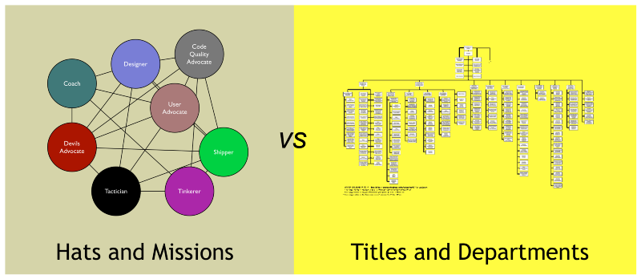

---
path:	"/blog/100-product-development-hats"
date:	"2016-04-24"
title:	"100 Product Development Hats"
image:	"../images/1*7pCG2R6cOLWYDGR_LAiCKQ.png"
---

Stop thinking about titles in product development. Start thinking about Hats. Why? Because it takes 100+ Hats to build an awesome product.

Too often we focus solely on accountability, alignment, and efficiency. This fixation frequently manifests in silos, politics, title obsession, and hierarchies. Instead of focusing on what we need to build an awesome product— safety, trust, and a diversity of viewpoints and skill-sets — we sub-optimize to preserve the neat and tidy boxes. The turf-war benefits no one. And neither does creating a shadow market of skills where people are not acknowledged and recognized for the work they *really* do.

**So what do *you* need? What does your *product* need? What do your *teams* need? **Talk over these needs and hats with your team. Be flexible. Let people do what they’re good at, or want to learn more about. It will be “messy”, but the neat and tidy just results in crappy product.

