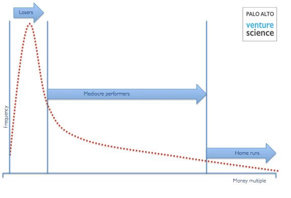

---
path:	"/blog/before-you-join-a-startup"
date:	"2016-05-14"
title:	"Before You Join A Startup …"
image:	"../images/1*HqV_INUN2nZBDmCF-zHFbA.png"
---

When you join a venture-funded startup, remember that you’re playing someone else’s game.

There are plenty of business models — creative agencies / consultancies, for example — that group people by a passion for doing great work and making a reasonable salary. Most venture funded startups are not in this category. So you have to come to accept that.

One of the harshest realities of the startup world is that what can be good for your investors (and founders even), might not jive well with your sense of craft, responsibility, and happiness. And that’s no one’s fault. It just is how it is. The economics, risk profile, and odds dictate the tactics. The letdown comes when you believe otherwise.

<http://techcrunch.com/2014/05/24/deciphering-the-economics-of-venture-capital/>What is right for the customer, right for your sense of intellectual rigor, and right for your sense of a job well done, aren’t always right for someone else’s portfolio. Again, you’re playing two different games. You might be trying to grow a healthy vegetable garden. They’re trying to build an oasis in the desert. Your veggie garden is the much derided “lifestyle business”, while their oasis is the Unicorn. Neither is bad.

Reality check: some of the biggest venture “wins” come from land-grabs, vaporware, accu-hires, and mediocre products. Interestingly, these wins are often followed by refocusing on impact and culture — a big reversal — but that’s for another post.

I remember being involved in the music business and watching my friends struggle with the harsh world of the major labels. One month you were on top of the world and the next month you were basically in $120k of debt to the label. [Without that hit single, you weren’t much good to anyone](http://www.negativland.com/news/?page_id=17). For better or worse that’s how much of the startup world works.

Much of the startup world revolves around the heuristic that high growth validates the business model, and that you can always find more efficiencies down the road. Unfortunately, this provides little solace to those on the front-lines. “Making the number” often doesn’t equate to “job well done” (unless you’re in sales). Some folks like [Jason Fried](https://medium.com/u/c030228809f2) and David Heinemeier Hansson ([DHH](https://medium.com/u/54bcbf647830))

 have advocated heavily for the craft and empathy focused middle ground, the “indie rock” of the startup world, but that is rare.

This tension forms the backdrop to countless startup water-cooler conversations (or private Slack channels, or coffee maker chats … pick your poison). It happens so predictably and consistently that it almost feels cliche. Anyone who has done their time in startups knows the script.

As an individual, it is important to ask yourself the hard questions. What inspires you? Why do you show up day after day? Are you in this for a small chance at a big upside? If it all burns to the ground — and most of the time it does (financially, morally, culturally, or otherwise) — will you be happy you were along for the ride?

The startup world holds a certain seduction. It is stripped of the politics, the hard-and-fast rules, and the monotony. But remember to take a step back and look at the big picture.

I love startups. I love the ride. But I’ve learned to understand (and respect) it for what it is. And alas the irony: at some point you’ll have your own thing and need to make the hard decisions. It’s never easy, but it’s always interesting!

