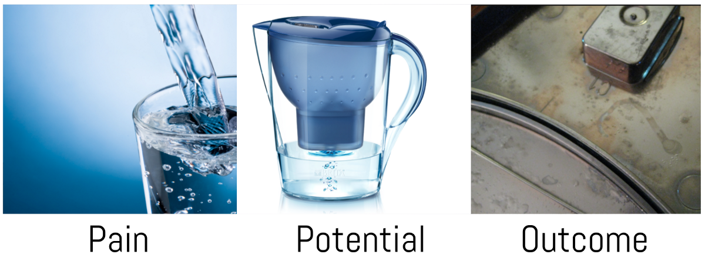
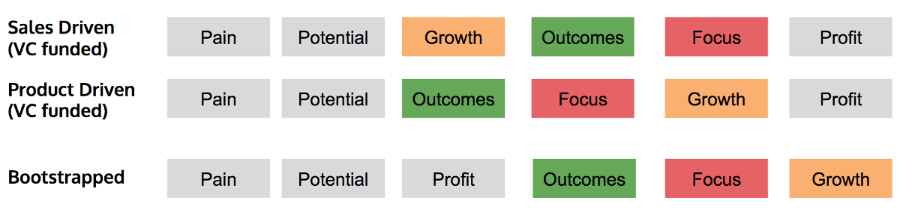

---
path:	"/blog/pain-potential-and-outcomes"
date:	"2016-07-30"
title:	"Pain, Potential, and Outcomes"
image:	"../images/1*GJzOsXVzrYmWqw56dv19Mw.png"
---

Eat healthy! Get in shape! All your data in one place! Faster time to market! Stop the information overload! Uptime! Speed! Less busywork! Happier customers! Lower churn! More with less! More revenue! Lower costs!

Can you relate? Sure. Are there thousands (maybe tens of thousands) of startups trying to solve those pains? Yes.

It all starts with **pain** (latent, expressed, or otherwise). You won’t get things into 2nd gear unless someone cares. And then **potential**. What you have — your product or service — has to at least hint at the possibility of solving that pain. And finally, an **outcome**. The product *uniquely, affordably, and gracefully* alleviates your pain. There’s return on investment.

It doesn’t always go as planned.

* Example. I want clean water. I don’t want crap in my water. **Pain!**
* My goodness, the Brita water filter looks amazingly clear, crisp, and pure. **Potential!**
* Damn, they never told me about these filters, and the charcoal, and how I’m a lazy person who can’t be bothered to clean the thing, or remember to buy the filters. **Outcome? No.**
The temptation when validating your startup is to stop at **Pain and Potential**. Pain and potential can get you pretty far when prospects are looking for an edge. It can feel exhilarating. You can grow quickly on pain and potential. A pain with an alluring product offering can attract a broad cross-section of people, especially if you’ve got a good sales team.

But at the end of the day, it’ll be the competitor that produces **Outcomes** (and keeps costs in line with the degree of differentiation) that will win the day. You absolutely must know whether the potential promised in your product is delivering an outcome. I always say…

> Sales and marketing sell the pain and the potential. Product delivers on that promiseYou could broadly divide up “sales driven” and “product driven” startups by how they approach this sequence:

The sales driven startup puts energy behind selling the pain and potential. **Growth** is the first objective. After going broad and taking stock of customer outcomes, they’ll attempt to **Focus**.

The product driven startup validates **Outcomes** first, **Focuses** based on those learnings, and then attempts **Growth**.

The bootstrapped startup has to achieve some level of profitability early to keep the lights on, then must chase **Outcomes** to validate their offering as quickly as possible, and then move on to **Focus** based on that knowledge and **Grow**.

Regardless of the approach, you’ll need to consider outcomes eventually.

Does your product *uniquely, affordably, and gracefully* alleviates the customer pain? Your product is not a list of features. It’s a vehicle to create outcomes.

Feature bullets sell the product. Your product delivers the outcomes.

