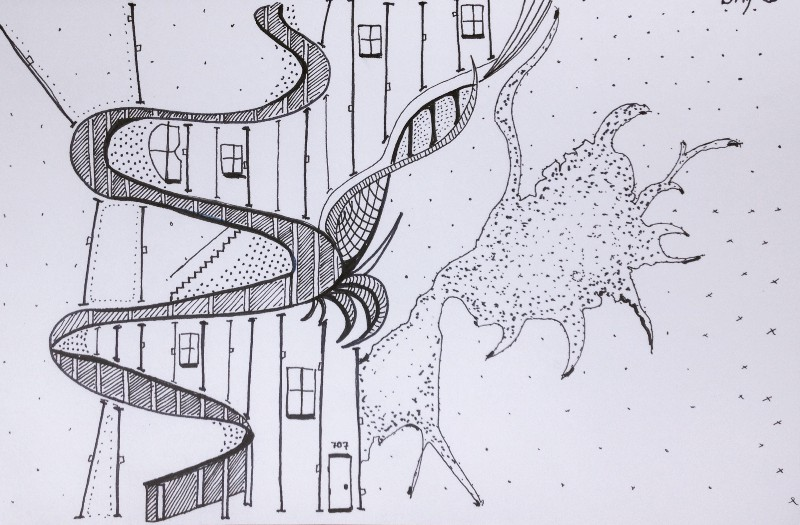
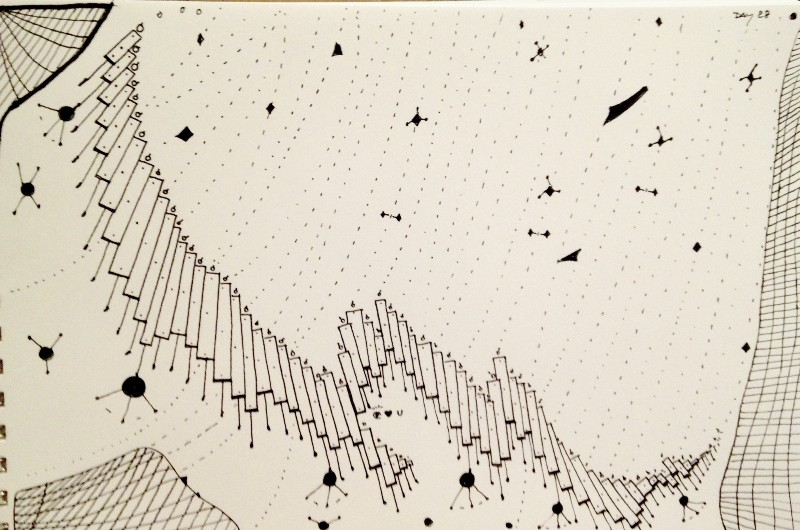
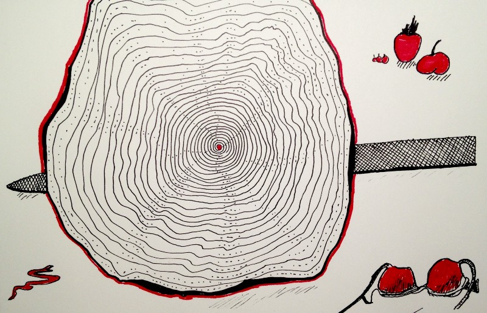
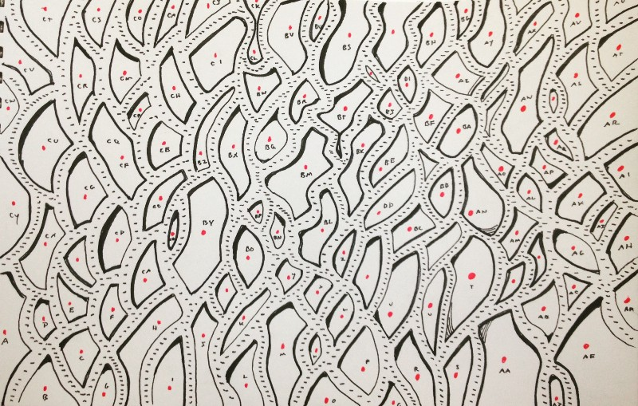
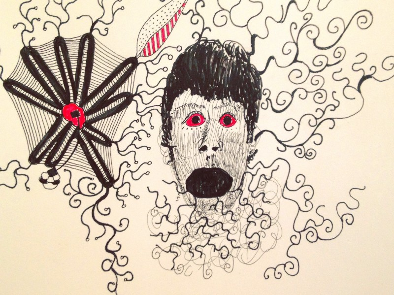

---
path:	"/blog/10-things-i-learned-by-doodling-for-100-days-straight"
date:	"2016-08-31"
title:	"10 Things I Learned By Doodling For 100 Days Straight"
image:	"../images/1*7ocOOfbnr1J8vMTQTWUL5w.jpeg"
---

I recently finished a 100 day doodle challenge. How did it go?

### The Rules

I set a small number of rules.

* One drawing a day for 100 consecutive days. No skipping
* Share the drawing on [Instagram](https://www.instagram.com/cutlegram/) and Facebook
* No erasing, start-overs, tear-outs, whiteout
* Don’t overthink. Start drawing within 60 seconds of opening pad
* Black and red pen
* In one sitting
### What I learned …

1. I spent 100hrs+ “meditating” with a pen. That’s a win. No screens! No typing! No devices! The careful line-work in particular was very calming
2. Overall my mood and outlook improved
3. Peer pressure works! Once my friends started chiming in on Facebook I wasn’t turning back. On a couple occasions my challenge inspired others to take the plunge. That was very rewarding and inspiring
4. The workweek saps your creative energy. It’s hard to focus when you’re stressed. Stress would increase as the week progressed, and the drawings would become increasingly scattered. On Saturday, the relaxation kicked in. I kept thinking … what would it take to make every day like Saturday? And was my work suffering from the same lack of lateral thinking?
5. Ritual matters. 90% of my drawings were completed at the same coffee place (Raleigh Raw), drinking the same coffee (bullet coffee with grass-fed butter), and having the same smoothie (blueberry). It took 10 days or so to get in the swing of things. And maybe 30 to make it a habit. I’m pretty sure the caffeine injection / timing played some part in this
6. Tools inspire. Having a good set of pens and a pen bag was a big part of the experience. I have a pen fetish now
7. It takes practice to turn off your inner critic. Social sharing boosts the need to “make it cool”. Some of the best drawings started with no censorship and forethought. I had to consciously block out the inevitable share and looking for likes and comments.
8. When you do something every day, it’s ok if it sucks! You have another shot. If it’s your only shot, you’re more prone to freak yourself out
9. Some days you’ll want to get serious and meaningful. Other days you’ll shoot for trite and flippant. That’s ok! When you have output, you wait patiently for the “good ones”
10. Constraints help. Limiting myself to mostly black pen let me practice and explore what was possible
### The Drawings (In Order)

**1:100** This wasn’t too much of a stretch. I draw mind-maps all day. So it was no surprise that I started off in familiar territory.

**2: 100** He sure looks scared. And of course there’s the wing-suit which must be a reference to one of my favorite films …. [Brazil](http://cinearchive.org/post/37275277565/behind-the-scenes-of-brazil-rob-heddens)

. Tiny dots make their first appearance, but overall I haven’t found my groove yet.

**3:100** Adele! Hello it’s me. Themes of isolation, rain, birds, flying, and tall places predominate. Plus I’m still using words.

**4:100** What a smarty pants! Actually, this did start with me imagining the sensation of a rose petals on my eyeballs. This one made me happy. And it was deliberate to some degree so it didn’t feel completely accidental.

**5:100** Wordplay continues. I was high from the rose colored glasses, so I took another shot at something witty. At this point I was all in. I had shared the drawings on Facebook. Game on. But it didn’t have the zing of the glasses.

**6:100** Major discovery! Starbucks can completely **** me up. My hands were shaking and it felt like lasers were shooting out of my eyeballs. So I drew that.

**7:100 **OK. Things get serious. I remember what NYC looked like shortly after 9/11. I remember all the posters taped up on construction site walls. It was heart breaking. But I have to admit … I questioned whether I was just milking this memory for the drawing. Have you ever had that happen?

**8:100 **My first of the the weird “the people are kind of small and the object is super big” drawings. I also discovered how to draw sand. The father and son walking away held some significance for me. This was the first drawing where I stated to get super anal with the line-work.

**9:100** Strange how this happens. Back to back small people (see 8:100). This started as an insect, but I wasn’t happy with it. It didn’t look “right”. So at the last minute I turned it into a kite. I was traveling at the time, so I was likely caffeinated with Starbucks coffee (bad ideas)

, and my head wasn’t in the game.

**10:100** OK! Now we’re in business. The addiction with line-work, different textures, rain clouds, and awkward perspective gazebos begins. I actually finished this at an Agile conference in King of Prussia (of all places)

. My mind must have been pretty dialed in. I start to notice the fetish of carrying around nice pens.

**11:100** Travel day. This felt like weak sauce. It can be hard to string together super-anal line-work on back to back days.

**12:100** Strange swirls and flourishes rise! This was one of those wandering “I won’t know until it is almost done” doodles. I go to my old standby little-people (see above)

 and it comes to life. I loved the idea of a strange ferris / hamster wheel. The buttocks in the lower left was unintentional.

**13:100 **13 was not lucky to me. I get lost in the swirls. This was probably a stressful day.

**14:100** Birds! Rain! Sand! Themes unite. My favorite part of this drawing was doing the clouds. I didn’t expect it to work. But in retrospect they look very layered and humid.

**15:100** I patted myself on the back a bunch of times for this one. Anal line-work? Check. Word-play? Check. My friend Tim counted them to make sure I did include 50 shades. I did. Pulling this off made my day. I haven’t seen the movie. Is it good?

**16:100** Return of the crazy gazebo and little people. There’s some movement here … they’re climbing to the top. What’s at the top? I don’t know. Remember the rocks. I come back to them near the end.

**17:100** Stressful morning. I couldn’t get my head in the game here, and work was looming on my mind. Stress muffles the thoughts and saps the patience.

**18:100** Regaining some momentum I tap into my childhood obsession with catfish. I considered the return to halfway focused and inspired drawing a win here (given the previous day’s doodle crap)

.

**19:100** Is it a house? A hotel? How about a weird house with stairs? You can see the lines become tighter here. Dots. A wild freeform splat. These themes will return in future drawings.

**20:100** And now for something completely different! I was getting bored with the semi-literal stuff. The idea of parallel lines seemed appealing.

**21:100** I channel a bracelet designer and go for symmetry.

**22:100** This followed the pattern of “ok, let’s draw a bunch of patterns and then position a person in the drawing”. Webs, roses, thorns. Some familiar themes and a more confident larger non-stick-figure.

**24:100** A crying elephant in a hall of mirrors with a nude. Makes perfect sense. I came to the elephant about halfway through the doodle.

**25:100** A lapse. My mind wasn’t in it and work was piling up the stress. I try to resurrect it a couple ways, but it will be the flying steak forever.

**26:100** Patterns and doodles. Some new techniques … little circles, network drawings, a stray bra, and booze.

**27:100** More structure and control. For a while I was thinking about making it a woman’s back. Maybe it is. But I resort to a small man on a bicycle underneath a bunch of balloons.

**28:100** End of the workweek! Can’t hold it together. Fridays aren’t great doodle days. Note that I repeated #27. This is #28.

**29:100** Ah! Saturdays. Time to be incredibly detailed. The steps descend.

**30:100** First of the knife drawings. And sexual fruit.

**31:100** Must be a Monday. Semi-relaxed but mind buzzing. The squares return in a tree drawing later.

**32:100** This was more playful with larger circles. On some level it is related to the prior day’s drawing, but I go big.

**33:100** Intriguing. I was thinking about turning 41 years old apparently.

**34:100** More knives, fruit, and sex. Replete with a bra and a serpent. What was going on?

**35:100** I return to the blocky tree (see 11:100), and scaling extremes (little house or person)

. But there’s a balance here I like.

**36:100** And now for a different tree! This was a good recovery from the prior day. Weekend work for sure.

**37:100 **Robot insect. With crown (or something)

. I return to this a bit later.

**38:100** I really loved this. The bullet coffee actually works. I was in the zone for a while. It was like meditating. I discovered that messy dot work can be effective for contouring things.

**39:100** And I lose it! After the joy of the prior day’s work — probably early in the work week — I lose focus. The fish is nice though.

**40:100** Light nudity. Lizards. Bikes. Excel cell references. Octopus. Just another day I guess. This fits in the “lots of boxes / circles with little things mixed in” theme.

**41:100** This was the first of the “matchstick” type drawings.

**42:100** And … with the Cat Save! When in doubt make it a monitor and include a cat. Totally makes sense.

**43:100** I was looking at Weather Underground and noticed the wind markers. That seemed like a cool thing to obsessively draw over and over. But I wanted to take a risk … on something “Real”. So I drew an arm and didn’t destroy it. See later for the Sperm Tree. I avoided that effect here.

**44:100** Color by numbers?

**45:100** Bolstered by my confidence drawing “people”, I tried to sprinkle some people in. Like Nigel Tufnell. And boys. But I’m most proud of the globs on globs.

**46:100** Self-portrait. I was in a pretty angst mood that day. I was coming up with a ton of ideas … but all the ideas freaked me out.

**47:100** And the hill slopes up to the right! There are birds and rocks. And patterns. And network drawings. Some classic themes with good line-work.

**48:100** Why don’t we keep on this network drawing kick? Sure! It even looks like an animal. See later for the nude with tiny networks.

**49:100** Weird hotel on a hill. Knives. Patterns!

**50:100** Bolstered by my new pen purchases, I go completely ape-shit. There’s blood. And bones. And feathers.

**51:100** These pens are great. Seriously, good tools — and having 50 drawings under my belt — made this a ton of fun. The dots, crosshatch, etc.

**52:100** I go deep. This started as a network drawing. Incredibly detailed. But it started to take the form of a woman. I was excited. Did the red mess it up?

**53:100** Maybe it is fatigue, but I return to something less arduous. I’m pretty sure this was a Monday. After the weekend of new pens and meditation, I go for something less busy.

**54:100** As strange as it sounds, the “messy” branches on the upper left were a major win for me. I was really in the line-mode, and broke out of it with some happiness-producing results.

**55:100 **Tunnels? More and more lines, but the “fuzziness” on the tubing was pleasing. It felt less linear.

**56:100** Black Lives Matter news. I kept thinking about a person trying to scream, but nothing coming out.

**57:100** And then follow that up with a completely unrelated sperm tree. I really didn’t want this to be the sperm tree. I doodled and doodled, and kept hoping it wouldn’t look like a sperm tree. But it ended up that way.

**58:100** Shit! That was super lucky. A whale! A real whale. Once the form took shape, I found it hard to turn back. I learned with this drawing that you could also use light pen pressure for the line work. It was more like shading.

**59:100** Weekday distraction. Oh well, it must be a vein. Let’s draw arrows to show the disease creeping in.

**60:100** Feeling toxic. Like only bullshit is leaving my mouth! Self-portrait again.

**61:100 **One of those days!

**62:100** Thicker lines. Petals. Layers. A good reprieve from the day before.

**63:100** And we’re back to little gazebos and walkways. Phew.

**64:100** Lest we forget trees, little people, fruit, and all of that good stuff.

**65:100** Today let’s draw a ton of squares! So I did. There was something challenging about drawing little squares, and not circles.

**66:100** Let’s get angular! And draw lines. This is an oft repeated theme, but I went full screen for this picture.

**67:100** Non-distinct. Mid week. I finished this at 11:30PM.

**68:100** Little critters! In retrospect I didn’t like the fact that the critters were trapped by the tree. Looks uncomfortable.

**69:100** No guilt! There was a creative malfunction here. So instead of just phoning it in, I called it out.

**70:100** … a hill, up and to the right. Thorns. Apparently (see upper left) I had some to-dos on my mind. This is a facsimile of some earlier drawings (blog rocks)

.

**71:100** Hurray for the weekend! Calm. Serenity. A tiny person, rain, and a tree. But seriously, I enjoyed the layering of the clouds on this one, and the obsessive square drawing. Win! Confidence regained.

**72:100** Flexible fly swatters with arms. Of course!

**73:100** Back to wordplay. Visited friends in LA. The sun. The West Coast cool. Pulled this off in the LAX lounge over beers, but that’s what you can do when you’re sketching and not drawing lines furiously.

**74:100** Look at this thick pen. Patterns! Jet lagged to be honest.

**75:100** This makes me angry, actually. It feels very phoned-in. Oh hey, let’s draw a human cat with triangle hair. Nothing feels right about it.

**76:100** More distraction. Saving grace is the swimming pool.

**77:100** And then faith is restored! Back to some flower-work. Tight lines. Petals. Good recovery.

**78:100** I’m not stopping there! Let’s get the line ON! I was calm, caffeinated with good coffee, and ready to experiment (like with the fuzzy bird head)

. Guess what? It’s a Saturday! Maybe this is the living version of the bird in **50:100**.

**79:100** And on Sunday I slow down a bit. Softer lines. Post bike ride. Some sinew.

**80:100** **** this. I am going to draw Monday a bunch of times. Over and over.

**81:100** Good recovery for a Tuesday. Not great. But not totally annoying.

**82:100 **I love great pens. They make Wednesday awesome.

**83:100** And this is what a Thursday feels like. Scribble scribble.

**84:100** Keep pushing through. You can always fall back on matchsticks, connective lines, quasi-harps, and dark line bursts.

**85:100** One continuous line. This one felt like I was just floating along. It probably took a couple hours but I was enjoying my coffee too much. Intestines?

**86:100** Down the rabbit (intestine)

 hole.

**87:100** The old bird and talon standby. Blood!

**88:100** Remember that robot? 37:100. A gentler robot, with a bearded Grecian head. Makes perfect sense.

**89:100** Waaaay different! I set out here to challenge myself with non-lines. This might have been mid-week as well, but the project suited the freneticism of the workweek.

**90:100** Completely Kosher. No innuendo at all. It’s a flower.

**91:100** The solid branches were a change here. It felt swampy and drippy.

**92:100** The goat! This was a serious effort. I worked hard on the line-work. It started to take the shape of these aggressive rocks. It might seem stereotypical — Mountain Goat — but the idea of this goal being challenged by this maze of rocks was appealing.

**93:100** Another hotel on a barren landscape. With two crystal balls for eyes. it is almost insect-like, and I was probably shooting for that initially.

**94:100** This took on a fishy / kelpy vibe kind of early. But it wasn’t until I committed 100% to the scales that it took shape.

**95:100** When in doubt … wait until 11:30PM when you’re fried from work and draw a tree.

**96:100** Nice and simple and bursty!

**97:100** If you’re a child of divorce (or don’t have kids and use Facebook)

 you know that feeling of seeing happy families together through a haze/static.

**98:100** Life takes you on twists and turns sometimes.

**99:100** First full day in Greece on Vacation! I was super proud of the ink-painting on this one. It took a couple hours. But it captured my sense of calm and contemplation.

100:100 What’s next? Who knows!

