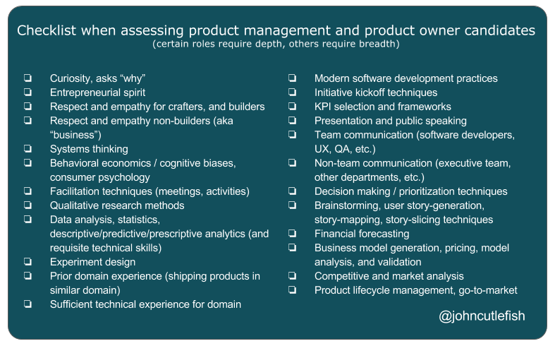

---
path:	"/blog/24-point-checklist-for-pm-po-candidates"
date:	"2016-10-12"
title:	"24-Point Checklist for PM/PO Candidates"
image:	"../images/1*KLOWWMNqgyt2RwjrhLbyQQ.png"
---

For a quick post today I thought I’d share a personal checklist for assessing product management / product owner candidates. These 24 items are useful when 1) thinking about the role you hope to fill, and 2) assessing a candidate. It can take a lifetime of shipping to max out your chops, so it is important to view all of these skills on a continuum.

See [PDF here](https://drive.google.com/file/d/0B04yoW1JFDHGZExOaVpKVVBBOW8/view?usp=sharing)1. Curiosity, asks “why”
2. Entrepreneurial spirit
3. Respect and empathy for crafters, and builders
4. Respect and empathy non-builders (aka “business”)
5. Systems thinking
6. Behavioral economics / cognitive biases, consumer psychology
7. Facilitation techniques (meetings, activities)
8. Qualitative research methods
9. Data analysis, statistics, descriptive/predictive/prescriptive analytics (and requisite technical skills)
10. Experiment design
11. Prior domain experience (shipping products in similar domain)
12. Sufficient technical experience for domain
13. Modern software development practices
14. Initiative kickoff techniques
15. KPI selection and frameworks
16. Presentation and public speaking
17. Team communication (software developers, UX, QA, etc.)
18. Non-team communication (executive team, other departments, etc.)
19. Decision making / prioritization techniques
20. Brainstorming, user story-generation, story-mapping, story-slicing techniques
21. Financial forecasting
22. Business model generation, pricing, model analysis, and validation
23. Competitive and market analysis
24. Product lifecycle management, go-to-market
