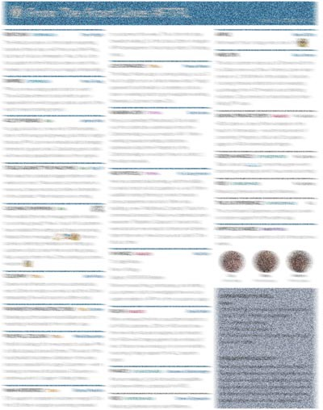

---
path:	"/blog/case-study-from-the-front-lines"
date:	"2016-11-10"
title:	"Case Study: From The Front Lines"
image:	"../images/1*xBQpQAnUHrV6Ro3bdJsumw.jpeg"
---

#### Keeping people in the loop without it sucking

How do you give big picture visibility to 12+ individual teams (100+ devs, UX, PMs, Agile Coaches, etc.) without stepping on people’s time, or instituting stuffy process? Below I share how I tackled this problem with decent results. Perhaps it can inspire an experiment within your large product development organization.

#FTFL … blurred for confidentiality reasons, which has scaled to 20+ teams#### **Organization**

Large, B2B SaaS organization

#### **The Problem**

* **Visibility**. Teams had low visibility about what was happening across the product development org. This meant that the people who might have some helpful information to share — “hey, I know about that part of the codebase” or “I have some helpful customer data about that” — had no trigger to share that information
* **Second Hand Information**. Product managers were tasked with reviewing the full near-term roadmap with their teams. Engineers found this to be a waste of time. I’m not sure if it was the timing, or the content (the information was secondhand), but it didn’t work, and some teams stopped the ritual
* **Celebrate Wins**. While teams would ring gongs to celebrate a success, it was hard to keep track of the wins across the org. Teams periodically shared updates in lunch-and-learns (which was awesome), but time constraints limited the frequency of these meetings
* **Management skeptical / resistant** I briefly tried having an epic-focused Kanban board. Management was highly resistant of any kind of work visualization spanning all teams. Their argument was that extra process might diminish team autonomy (very justified), and that visualizing the upstream “team tetris” (assigning epics to teams) might turn contentious (which it did, largely because teams did not choose their epics, and there were frequent team changes). Their concerns were valid
#### **Experiment Criteria**

I was pretty skeptical about having an impact. Previous efforts to make work visible — with a single epic board, for example — were unsuccessful. People were sensitive about wasting team time. No one cared for “Status Checks”… it wasn’t that kind of culture (that’s good in my book). Teams didn’t have access to the roadmap tool. So I knew whatever I tried needed to be:

* Relevant
* Be first-hand: come directly from the people on the front-lines
* Easy and fast to update
* Easy and fast to read
* Not objectionable or threatening in any way to management
* Not require an extra login
#### **The Experiment**

I nominated a “correspondent” on each team. I focused on developers because they were closest to the actual work, and I wanted the content to be relevant. I posed these guidelines:

* This is an experiment that will likely fail, but I value your help
* We’ll do this every other Wednesday. I’ll remind you on Mondays
* You are the correspondent. I want the story “from the front lines”
* The story shouldn’t take more than 10 minutes to write. Full stop! We are talking 1–3 tweets total. Not a book
* This isn’t a status check. You can mention inane things, odd things, technical challenges, failures, new team additions … anything
* The compiled version will take no longer than 8 minutes to read. The goal is to waste NO time
* This is a purely voluntary role. If you get sick of it, you can pass it along
* If you had no update (no delta from the previous post), just put “no update”
#### **First Try**

I created a Google doc with a slot for each team update, and shared it with everyone. To my surprise, people played along. The updates came streaming in. I needed to gently remind a couple people, but they thanked me sincerely for the reminder. When they were done I scrambled for a title. The first thing that came to mind was “From The Front Lines #FTFL”. I later found out what #FTFL actually meant, but it was too late.

Title in place, I PDFed the thing. For some reason I thought it would be easier to process (and focus) if it was a PDF. I also wanted to make it printable. After putting it in a shared folder, I sent a quick email/Slack blast. #FTFL1 was born!

#### **Feedback**

The feedback was (mostly) positive. A middle manager claimed it “wasn’t scalable” to which one of the correspondents replied that “the old way wasn’t scalable either, so this is worth a try.” Product Management felt stepped on. They wanted to communicate status and felt uncomfortable. They grumbled. But the overwhelming feedback was positive, and it was game on. We kept it up. Correspondents would rotate. The issues kept rolling. It read like a community newsletter with quick, accessible blurbs that made you feel closer to the teams.

It was heartwarming to see the response among those on the front-lines and other folks in the org. Two conversations in particular stood out. The first, when the CTO thanked me for putting it together. Apparently, it allowed him to briefly scan what was happening. The second, when a senior remote employee (one of the first hires at the company) thanked me. It brought him closer to the teams and areas where he could help. I never heard from middle-management, but that’s another story.

A couple days before I left the company I “handed it over” to my good friend Sarah, hoping the tradition would be kept alive.

#### **Update**

I learned recently that it is still going, almost 16 months after I started it, and 12 months after I left the company. The basic format was still in place — PDF, printed, separated by team — though UX had taken a stab at beautification. How unexpected and cool! How many times do people complain about “not seeing the big picture”, try some kind of “update” scheme, and the whole thing falls apart? All the time, at least in my experience. So this was a team effort, and a win.

I think this worked for two key reasons:

* Our heart was in the right place. This wasn’t a status update for management. The goal was to create something valuable for the front-lines, not waste their time
* We respected people’s time — both the readers and the writers
* It was a bottom-up effort, and participation was voluntary
Who knows. It might fade away, but it was a fun thing to be part of. Give it a try! If you’d like to chat about how to set this up in your org, just drop me a Tweet at @johncutlefish or connect on LinkedIn

