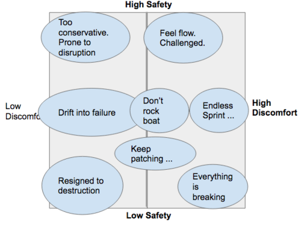

---
path:	"/blog/safety-discomfort-and-the-art-of-self-service-un-king"
date:	"2016-12-05"
title:	"Safety, Discomfort, and the Art of Self-Service Un***king"
image:	"../images/1*1BnJy3pTT-hrtx5tl53SJg.png"
---

To quote [Joshua Kerievsky](https://medium.com/u/28229c304ac9) ‘s brilliant [Modern Agile principles](http://modernagile.org/), you must “make safety a prerequisite”. Without safety and trust, we rightfully resist change. When safety is present, we relish the thrill of going outside of our comfort zone, learning new things, exploring our limits, challenging our biases, and taking risks. [People don´t resist change (only being changed)](https://twitter.com/NielsPflaeging/status/793414761232928768). According to Google research, [psychological safety is the key predictor](http://www.nytimes.com/2016/02/28/magazine/what-google-learned-from-its-quest-to-build-the-perfect-team.html?_r=0) of team success.

<http://diving.about.com/od/forbeginners/a/getStarted.htm>I’m always amazed when an executive bemoans the fact that her team won’t try new things, only to hear about a culture of blame, retribution, and distrust. Compare …

> Oh geez. Things are a mess right now, but in that exciting kind of way. I don’t mind when my boss gives me a hard time and pushes me. It makes me better at what I do, and I trust them. When I describe real blockers, he understands. And he’s always straightforward. No duplicityvs.

> When I’m not around, she talks shit about me. Always second-guessing my work, and never letting me take risks. Also, it is almost like she is playing a game with me: not letting me know if I’m doing a good job, and keeping me guessing. It’s terrible. All I can focus on now is the immediate task at hand, and doing what is asked of me.Improvement requires safety, a modest amount of discomfort, time for recovery, and time for reflection and learning. Discomfort can be a terrible experience, or it can be exciting. It can destroy us, or serve as a signpost and catalyst for better outcomes. [We feel flow](https://en.wikipedia.org/wiki/Flow_%28psychology%29) when we are moderately challenged. In their quest for “harmony”, too many organizations accidentally eradicate positive levels of challenge and discomfort.

A bit of brainstorming on high/low safety and high/low discomfortBest practices are overrated. As a consultant, I very rarely say something to my customer that hasn’t been said before by some members of their team. Those team members might have given up on sounding the alarm, but they know what’s up. Somewhere, in your org, are the ingredients for the solution. Not **THE SOLUTION**, but the ingredients — the people, the context, the experience, and the perspective — for progress to emerge. If process or knowing best practices was your problem, you would have solved it already. I’m happy to think about catalysts and attractors, but not “ways”.

Most of the rigor around change management and “transformation” is founded on a fundamental (conscious or unconscious) underestimation of your people, their resilience, and their desire to improve. The helicopter management that ensues is part of the problem. That, and the delusion that you know the change end-point.

Below I list 45 *potential *areas for experimentation. This list is *not *prescriptive. It is directional. These are heuristics. They work because we *tend* to benefit from *some movement *in these areas*.*

Take batch sizes. Yes, there is an economically ideal batch size for each initiative. But we *tend *to work in batches that are too large, and ship too infrequently. You could pull these out of a hat and experiment randomly if you wanted. My bet is that a safe team trying things at random would vastly outperform a prescriptive change management approach.

Random Experiments^Safety > Best Practices^No Safety

Make it safe to go outside your comfort zone. Your goal is to try safe-to-fail-experiments to move these needles and see what happens. The end-goal IS NOT to move the needle, but rather to see what happens when and if you move the needle!

Try (to):

1. Ship sooner
2. Ship more often
3. Build less
4. Release smaller batches
5. Tweak and iterate more
6. Remove more features
7. Get feedback sooner
8. More direct contact with the customer/user
9. More direct contact with internal resources
10. Gather more evidence of impact
11. Be more obsessed about customer value
12. Try more options
13. Explore more novel solutions
14. Be less prescriptive
15. Commit later
16. Converge and align later
17. Less need for certainty
18. Experiment more
19. Broader mission and initiative scope
20. Less prescriptive
21. More slack
22. More stepping away from the keyboard
23. Less multitasking and context switching
24. Fewer hand-offs
25. Less rigid roles & responsibilities
26. More mobbing and swarming
27. Fewer “transactional” meetings
28. Less bureaucracy
29. Less planning-in-progress
30. Less planning-in-inventory
31. Fewer dependencies and constraints
32. Fewer phase-gates and approval steps
33. Less focus on efficiency
34. More transparency
35. More off-sites and team bonding
36. Invite more voices to the conversation
37. More responsibility
38. More team autonomy and ownership
39. More opportunities to self-organize
40. More trust
41. Less success theater
42. Less politics
43. More authenticate celebration
44. More time to pursue personal projects
45. More time for professional development
Thanks for reading. As always, comments appreciated.

