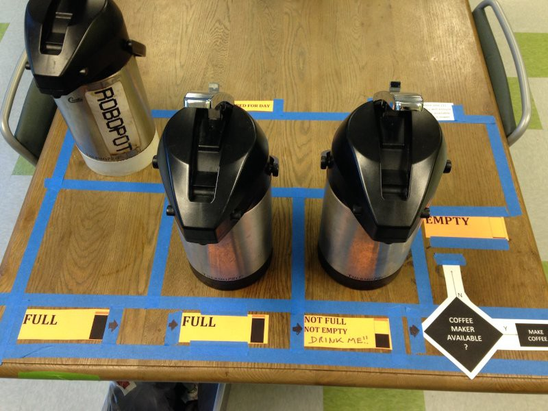

---
path:	"/blog/50-things-ive-learned-about-product-management"
date:	"2016-12-19"
title:	"50 Things I’ve Learned About Product Management"
image:	"../images/1*qDSjH1hEIeCtnQm8jZchmw.jpeg"
---

#### The Sunday, can’t sleep, had coffee after 2PM edition…

It’s often the little things that count…1. You are wrong more often than you are right. The trick is getting a couple shots at solving the problem.
2. Your company can do (almost) everything wrong, and still grow in the short and near term.
3. You can do (almost) everything right, and not outrun the elephant in the room.
4. Without a strong product vision, you’ll end up outsourcing product strategy to the rest of the company.
5. Don’t hire product managers to be (mediocre) project managers. There are awesome project managers out there if that is what you need.
6. The best way to get people off your back is to deliver value continuously (with data to back it up). Real results (and a proud team) eat everything for breakfast.
7. Craft and commerce are not incompatible. Reckless growth and craft are incompatible.
8. Passing the trash to other departments (e.g. “support will deal with it”) always comes back to bite you.
9. Someone on your team has a better idea. Would you know?
10. Shiny objects sometimes work. But shiny things always fade.
11. To learn how to be a good PM, spend time working on a team with a great PM.
12. Show — with data, stories, and examples — don’t tell.
13. Driving out all uncertainty tends to drive out originality (and innovation).
14. You tend to go where you look. If you look too hard at the competition you’ll go towards them, instead of towards point ahead of them.
15. If you’re arguing about the impact of UX on the bottom line, you should probably consider working for a more forward thinking company.
16. Everyone ends up hating the ticketing system. And the wiki. That’s partly because we overload our ticketing systems with extra process/metrics/junk, and no one actually contributes to the wiki.
17. With user stories it’s the conversation that counts. Have the conversation!
18. At some point you’ll have the benefit of the doubt. Make that count.
19. When heroics become the norm, then only heroics will generate reasonable results.
20. Before you send that canary-in-the-coalmine email, keep a journal for a week and reflect.
21. If it’s not a good fit, leave before there are hard feelings.
22. Is the product manager actually managing a *product*? If not, do you need a product manager?
23. If the team isn’t inviting you to the retros, you’ve got to figure out why and fix that.
24. All bets are off until someone is trying to use the feature with their data, in their environment, in their day to day work. You have to leave time to iterate based on that feedback.
25. Sales will tell you that they need a way to track feature requests. They don’t. They need a product that will close deals, white papers, customer referrals, and a defined available market.
26. Trying to land a 747 on a speedboat is never a good idea. Work in small batches, and plan at the last responsible moment.
27. People say product managers need to learn to say “no”. Try “no, because ….” and endeavor to make some sense.
28. Teams will always sniff out success theater. They might not call you out publicly, but they’ll become disengaged.
29. When you are busy and multitasking it is easy to come off as standoffish.
30. Don’t assume that people who complain in private, will also go to the mat in public.
31. Before you go on about 10x engineers, ask yourself if you are a 10x product manager, and if you’re focusing on the 10% of things that will actually drive outcomes.
32. Spend time in the support queue, jump on customer success calls, and try to close some deals.
33. In most cases, your biggest competition is the status quo. Same goes internally.
34. The users that have given up on you aren’t replying to your NPS survey.
35. You are the CEO of the product if you can hire/fire, are responsible to investors, and control the budgeting process. If not, you are probably a product manager.
36. Discuss what you’re ignoring, or making worse, in your quest to make something else better. Build shared understanding about the tradeoffs.
37. Know when to get out of the way. If you’re good, you’ll always have work to do. Don’t insert yourself into every conversation and decision.
38. Beware of complex prioritization schemes that serve (mostly) to make everyone internally more comfortable. Back-of-napkin heuristics are good enough in most cases.
39. Nothing gets people more bitter than a PM who tries to self-promote. Celebrate (and fail and learn) with your team.
40. Savor the moments when your team is kicking ass. It happens infrequently. Not because anyone is doing anything wrong, but because this is hard!
41. If you find yourself asking for small estimates frequently — things that might take a day, or two, or three — make sure you’re actually working towards the most important outcome. If that’s the deciding factory, the value of story must be pretty darn weak.
42. It’s not how many bullet points you add to the feature release notes (or story points completed or the team’s velocity). It’s the customer success stories you can tell, and the outcomes you can create for the business, both in the short and long term.
43. You can fall in love with most product “problems”. Don’t rule out unsexy domains. Your happiness will be largely dictated by your immediate team, and the willingness of the organization to let you and the team solve problems. That can happen anywhere.
44. When people keep bugging you about the roadmap, it’s typically a sign they aren’t happy with what’s happening right now.
45. Block out time each day to think strategically. Block out time each day to interact with customers.
46. If your team is moving slowly, make it safe for them to openly discuss the debt they’re digging out of and/or dealing with.
47. Be available! This is a no brainer, but plenty of PMs keep their calendar stacked.
48. Don’t force convergence prematurely. Often the best path forward comes after a period of confusion and messiness.
49. If in doubt, get out of your head and gather data. Build something and test. Same goes with meetings where there is endless conjecture. Have a bias for action!
50. Avoid calling a hard stop on an effort and surprising the team. It will seem arbitrary, and (hopefully) they are vested in the outcome.
