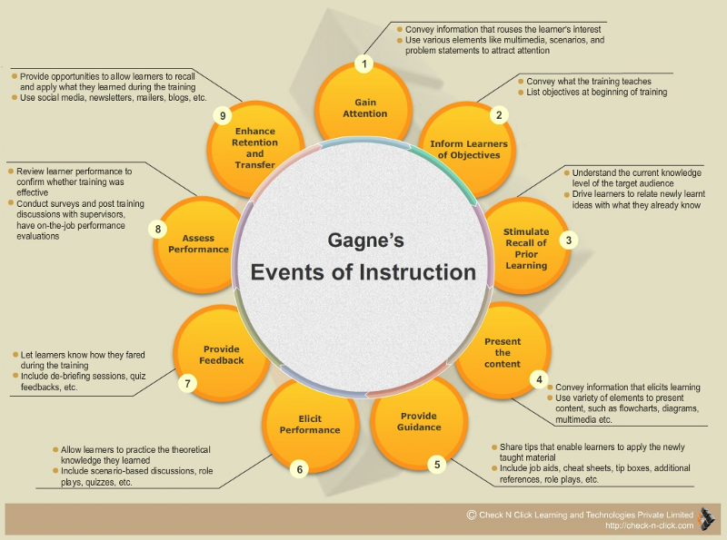

---
path:	"/blog/the-learning-styles-myth-and-user-onboarding"
date:	"2017-01-05"
title:	"The Learning Styles Myth and User Onboarding"
image:	"../images/1*R-k_a3w3TYQbDgtmZ2-qoQ.png"
---

When talking about the role of learning in onboarding, or in SaaS in general, you’ll often hear comments like:

> You know, some people learn by just clicking around, some like to read the manual, some just want to get their first task done, some are quick to call technical support. People just have different learning styles.It’s true that people differ in many ways when they arrive at a new feature or product. But unpacking the idea of learning styles can dispel some myths about instruction and give us some better insight.

The fields of educational psychology and instructional design can teach us a lot about what makes for effective learning in onboarding. The notion that people have a dominant learning style (visual, auditory, verbal, kinesthetic) and learn best when instruction is tailored to that style is still widespread.

Surprisingly, though, this concept [doesn’t really hold up to research](http://blog.cathy-moore.com/2015/06/how-to-respond-to-learning-style-believers/). For one, although every person has strengths and weaknesses and preferences, there isn’t any indication that those differences neatly fit into a half-dozen or so defined styles. Second, studies are much more likely to show that, regardless of personal preference, people learn best when instruction methods are tailored to the type of content being taught.

So, if neat-and-tidy learning styles are largely a myth, what can we take from instructional design research? We know that software users vary in their goals, background, motivation, and preferences for how to learn, and that that variation is far more complex than just learning styles. What affects users’ learning preferences?

* Their goals and sense of urgency
* Their willingness to try new things (one of the [“big five” personality traits](https://en.wikipedia.org/wiki/Big_Five_personality_traits))
* Cultural context and organizational culture context
* Generational differences — people raised around computers and the web tend to have different approaches to information than those who weren’t
* Incentives, potential rewards, potential costs
* Different cognitive strengths and weaknesses
* Technical savvy
* Reading styles ([methodical versus scanning](http://www.slideshare.net/coolstuff/poynter-eyetracking-study-march-07/20-Scanning_readers_tend_to_Scan))
The list could go on and on! How can we approach learning for all of these users? Looking at the instructional design literature, there are principles and models that work and transcend learning styles. This is fertile ground when considering your onboarding. One example is Gagne’s Nine Events for a learner approaching and retaining any new information:

<http://check-n-click.com/pin-up-resource-gagnes-nine-events/>The situation of onboarding, however, often puts us farther from the moment of learning than either a classroom teacher or an online course or tutorial designer. Two concepts from education that can help us tackle this case are self-directed learning and scaffolding.

#### Self-Directed Learning

Self-directed learning is a broad concept, but one clearly fits the situation of an adult learner working in a digital environment with access to the vast array of information on the web. In [self-directed learning](http://www.huffingtonpost.com/suren-ramasubbu/is-learning-increasingly-_b_7154164.html), learners “take the initiative, with or without the help of others, in diagnosing their learning needs, formulating learning goals, identifying human and material resources for learning, choosing and implementing appropriate learning strategies, and evaluating learning outcomes.” This fits with a user trying to get up to speed on a software product. But, whether a student struggling to navigate the vast amounts of information available digitally or a user trying to find what she needs in a manual, overload is often the problem. Feeling overwhelmed by the number of functions in an application often leads to users [skipping over available documentation](http://digitalcommons.utep.edu/cgi/viewcontent.cgi?article=1010&context=cs_papers) and this has led to the increasing minimal manual movement.

#### Scaffolding

How can we help self-directed learners swim a sea of information? [As this article points out](http://www.huffingtonpost.com/suren-ramasubbu/is-learning-increasingly-_b_7154164.html), this is a good niche for the educational principle of scaffolding. The idea of scaffolding is that students learn by being assisted as they attempt new tasks. As their proficiency grows, the instructor gradually withdraws the support mechanism. In a traditional classroom, the scaffold may consist of help from the teacher, or an exercise that breaks a skill into simplified steps. But in an onboarding scenario, there are different opportunities and options for scaffolding. In self-directed learning, the “teacher” or resource can take many forms: content, resource locator, motivator, and prompt for reflection and evaluation.

Of course, teaching is only part of what onboarding does. In addition to improving learning in onboarding, we have to see the larger picture. Onboarding itself can be assigned personas like coach, tour guide, concierge, salesperson, librarian, and others. But when it seeks to teach, it’s best to strive for excellent teaching suited to the content and the situation rather than get bogged down in learning styles. Try to conceptualize how your onboarding can help the self-directed learner get where they need to go.

