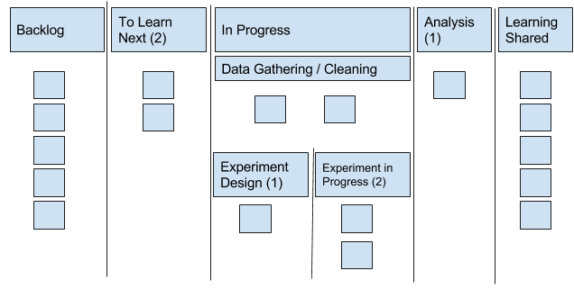

---
path:	"/blog/we-are-what-we-learn"
date:	"2017-01-11"
title:	"We Are What We Learn"
image:	"../images/1*hxVhIjIir7aUKi-8TiB1Tg.png"
---

When I talk to teams about data and evidence-driven product development, I invariably encounter some fear and trepidation:

“What if we measure the wrong thing?”

“What if the data shows no one is using that feature?”

“I’m not sure I really trust their analysis. It’s oversimplified!”

“We don’t have the budget for a data scientist!”

But knowledge is power, right? What are we so afraid of? Plenty. Data can decide which initiatives are green-lighted or canned, which efforts have had an impact, whether to increase or decrease headcounts, when to fire customers, and when to pivot or proceed. This isn’t trivial stuff!

Sometimes fear holds us back from seeking data; other times efforts to use data never bear fruit. Not for lack of trying — plenty of companies invest massively in BI, analytics, data quality, eliminating data silos, etc. But somehow, this yields no new insights and no changes in direction. Somehow all prior assumptions and biases are confirmed, and it’s business as usual.

If there is one thing that the fear of data and failed attempts of data usage have in common, it is the use of data for management, rather than for learning.. These organizations miss the difference between instrumentation and new insights. With KPIs, performance is *indicated* and you’re checking conformance to a predetermined plan. Measurement in this case is used *as a management tool.*

We’ve been told we are what we measure, and that we can’t manage what we can’t measure. I’d flip that a bit to say that we are what we learn. And if we need to learn something, we likely need to step out of the management-by-measurement mentality. Whatever it is, we don’t know it yet! To learn it, we need to be open to improvisation and experimentation. To quote H. Thomas Johnson, “Perhaps what you measure is what you get. More likely, what you measure is all you’ll get.”

Try asking yourself and your team these key questions:

* What did we learn this month?
* What must we learn more about next?
* How should we try to learn about it?
These question are asked far too infrequently compared to questions like “What’s the velocity,” “When will we finish,” “Is [person] performing,” and “Are we on target to hit the revenue goal?” The end result is that teams end up:

* Not practicing, paralyzed by how to get started
* Not exploring different methods and perspectives
* Not addressing data quality issues for *new *areas of measurement
* Not enjoying learning wins as a source of energy and buy-in
You have to make learning a regular part of your work. To make this happen, I have found it helpful to convene a cross-functional learning team. Ideally this team should meet regularly (weekly or biweekly) to keep the momentum going. To make your learning team effective:

1. Form a team drawing from different parts of your organization. This is vital. By making this a team sport, you’re cross-pollinating learnings, methods, question framing skills and more. In addition to generating new learning, the goal is to leave everyone a bit more data-savvy and excited about learning with data.

2. Visualize a learning workflow (parallel to any ticketing systems or other project roadmaps) and make a commitment to moving your questions through it. Your best bet is to keep things conservative in terms of the amount of learning work in-progress. Below is a sample work flow. Note how I’ve divided in-progress questions into two potential workflows: one where the data is available and must be gathered and cleaned before analysis, and the other where some sort of experiment must be designed and run.

3. Engage a data-savvy coach from inside your organization. Ideally you’ll have someone with a strong data science background to act as a coach and technical advisor. This analysis coach helps pair questions and learning goals with the appropriate analysis technique and provides learning resources to get people working through learning projects on their own. If the team or individual hits an impasse, the coach should help out, but the goal is to teach people how to fish.

4. Share the learnings inside and outside the learning team. Learning is contagious! Many teams forget what new insights feel like. They’re hyper-acclimated to thinking about measurement for management (and we HIT this goal) vs. measurement for learning. It’s also important to share your learnings on gathering your learnings. Reflect on the techniques you used and challenges you encountered (especially with access to data and data quality).

If your team feels anxious about data or your efforts at data-driven development fall flat, think about how you’re using data. What are you measuring and what are you learning? Learning is often overlooked, but crucial for real insights.

