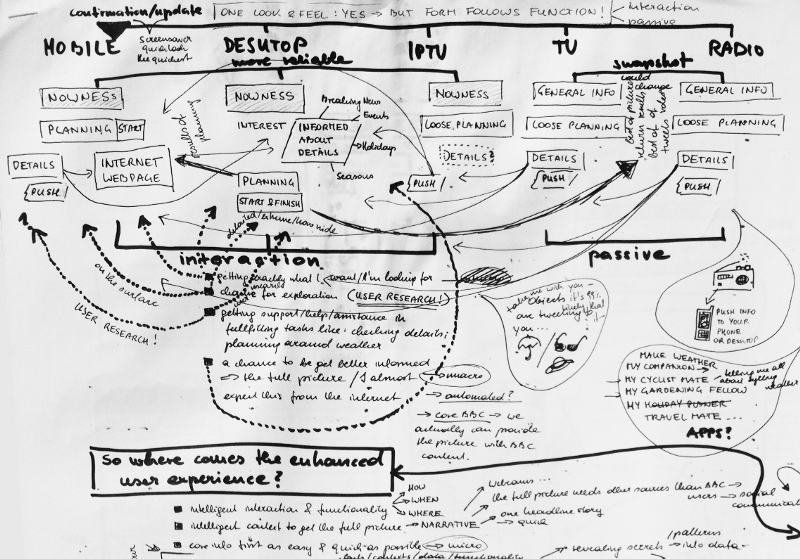

---
path:	"/blog/putting-a-cost-on-debt"
date:	"2017-03-21"
title:	"Putting a Cost On Debt"
image:	"../images/1*QzOJ6QxTmiUWQt7RK2WLxw.png"
---

[http://www.bbc.co.uk/blogs/bbcinternet/2011/11/bbc\_weather\_design\_refresh.html](http://www.bbc.co.uk/blogs/bbcinternet/2011/11/bbc_weather_design_refresh.html)

Dev teams often struggle with persuading the business to prioritize debt work-down and complexity/risk management. The shiny efforts with a promised link to revenue win, and the maintenance work loses. This continues until some sort of embarrassing catastrophic failure, at which point — if it is not to late — the business loses time/money/marketshare trying to fix the issue retroactively. Some companies never regain their full health.

What fascinates me is what happens *before* this pivotal “oh shit” moment. In the trenches there is typically some awareness of the problem. Engineers struggle. Customers experience stability and quality issues. The pace of feature development and value delivery slows. But … nothing happens (or at least nothing that addresses the root cause). Even when there are some grumblings, it never seems to escalate in a meaningful way. Why?

<https://www.reference.com/science/causes-ocean-pollution-8626fe75f49962e>In addition to simply having higher priority (or seemingly higher priority)

 things to work on, there is a tendency to look elsewhere for a fix. Maybe it is the product/project management process? Maybe it is a question of staffing, team structure, or the development practices? Maybe some new silver-bullet technology or tool will save the day? Accumulated complexity is often the trigger for this common plea:

> We have no predictability! We have no accountability! Things are out of controlWe go to great ends to persuade ourselves that we don’t need to slow down. I’ll always remember this CEO freakout moment:

> Damnit team! Why can’t we fix these problems AND grow? Are we incapable of doing two things at once? Can’t we find *a way*?Unfortunately, these fixes — along with the requisite silver bullets to keep momentum — tend to just obfuscate the problem further. Companies will fire, hire, and even re-org, before stepping back and saying “shit, we need to spend some time working down debt”. And that’s one of the crazy twists here: the amount of money (and pain, and disruption) spent to avoid the problem typically far outweighs the cost of addressing the problem. Anything that detracts from the outward perception of forward progress and momentum is too unsavory to try.

A common argument against the prioritization of debt work-down is as follows:

> But it is so hard to put a price tag on this!I respectfully disagree. It is *easy to estimate and measure this*, and accurately describe how increased complexity is slowing down the team. The leading indicators are out there. You have N sensors working on the front-line, who will — given safety — let you know when flow is dropping. I have NEVER experienced a situation where there wasn’t a good deal of advance notice about an impending issue. The same goes for monitoring and visualizing system complexity. The data is available.

Or backing up even further… the assumptions around cost of delay/cost of addressing debt are typically as robust and solid as our assumptions about new revenue/new features. PMs are routinely 2–4x off their impact estimates. So you only need to be as accurate

What is *hard* is the following:

1. Build the trust and discipline among front-line teams to measure lead time, touch time, cycle time, dependencies, etc.
2. Trust the front-line teams, and create a safe environment for them to raise the red-flag. When they do raise the red flag… do something about it!
3. Swallow your pride and admit that something is “broken” (even when you were expressly asked not to focus on fixing it)
4. Put a dollar figure on it.
How do you put a dollar figure on it? Imagine that your company wants to keep releasing new features at a rapid pace. Complexity is increasing non-linearly. Adding people to the problem costs money (and doubling resources doesn’t create 2x the velocity). What would it cost you to *simply maintain* your value delivery rate assuming you don’t battle back complexity? That cost will go up non-linearly.

Now, imagine you hit the wall and have to essentially *stop* new feature development. What would that cost your business? How about a conservative 3x lead time increase (not unheard of)? How about the cost of simultaneously running a big refactor / debt work-down alongside your current new feature development efforts?

Assume you are struggling with debt now. What would you spend **RIGHT NOW** if you could increase your new feature velocity by 3x (*without new hires*) AND prevent that cost from increasing non-linearly? Of course, this isn’t how we typically see the problem. We increase our spending on new resources, new processes, new tools, and shiny new efforts because that *feels* more proactive, and is easier to swallow.

So, in closing I’d like to leave you with a couple key points:

1. Battling back complexity is a business-altering challenge
2. We’re programmed to gloss over the issue (behavioral economics FTW)
3. We frequently miscast the issue as another set of problems. Solving those problems simply distracts us from the core issue
4. Figuring out the cost of complexity is on par with making revenue projections. It is possible. You don’t need to be terribly accurate, either.
5. You will need to create a safe/trusting environment for your front-line contributors. They’ll sense the problem early, but will be hesitant to push back if there’s a penalty for “going slow”
6. The key impact is that lead time will slow. This is easier to wrap your head around than, let’s say, the impact of quality issues (unless customers are leaving in droves). So drive that impact home
