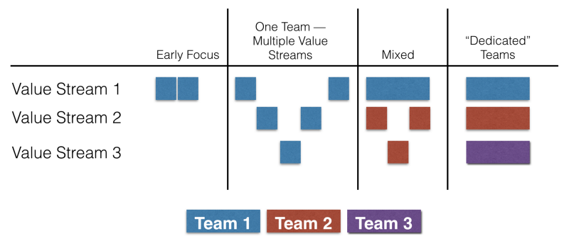
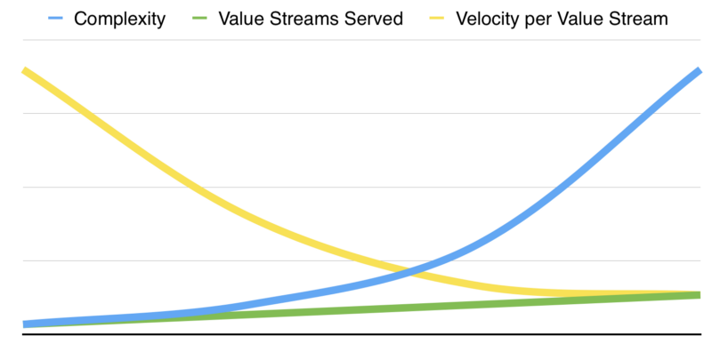
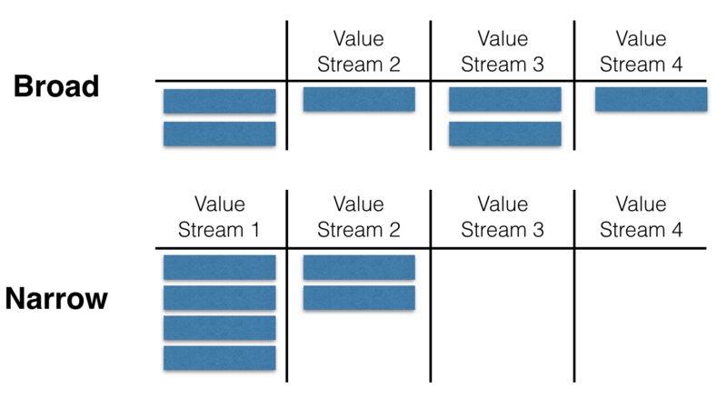

---
path:	"/blog/saas-and-value-stream-soup"
date:	"2017-05-03"
title:	"SaaS and Value Stream Soup"
image:	"../images/1*Aiutq6x5KxsX0HkLkjY4jQ.png"
---

Quick SaaS product lesson …

Offering new “stuff” is relatively easy.

The challenge is continuing to improve on those value streams.

When customers enter into a relationship with a SaaS startup, they do so knowing that things will be rough around the edges at first. The expectation is continuous improvement and innovation. You could consider it as more of a service relationship. Customers — especially those open to adopting new, and relatively untested products — expect you to keep making things better on their behalf (“your team is always innovating!”)

Customer needs and expectations evolve, competitors arrive on the scene, and new technologies become available for building and consuming services. To make matters even tougher, you need “plumbing” that coordinates across these offerings, and that becomes an ongoing concern unto itself as dependencies and complexity multiply. So you’re being hit by multiple angles and it is not easy. This is exactly why startups thrive in dynamic contexts, and why hyper-optimized-for-one-domain enterprises have trouble shifting gears. The fitness landscape is constantly changing, providing opportunities for new players who can sense and exploit the gaps that big players cannot fill.

The temptation early on is to shotgun blast features at different personas, and value streams. This 1) helps close more deals (“hey, we do that!”), 2) gives the outward impression of a dynamic, responsive company, and 3) let’s the startup explore potential pivots. *Everything *is greenfield, and there is *so much to build!* This results in a minimally *viable* product skeleton, but in no way guarantees that you’ll be able to iterate on the distinct value streams from an economic standpoint.

Phases of product development team organizationSpeed has a cost. A “10x” team is capable of delivering far more initial functionality and complexity than it can reasonably service on an ongoing basis. To adequately move the needle across multiple value streams, you’ll eventually need to hire a multiple of your current headcount (hint: it’s not linear)

. And this is the basis of the scaling challenging. The important question is: what will your business *really* need to be when/if it grows up?

When thinking about value streams I focus on the Who, Why, What, and How (see [Impact Mapping](https://www.impactmapping.org/)). For example, at a prior gig we targeted Product Managers, Marketers, Customer Success, and Content Managers/Writers (so four Whos). We addressed multiple “Whys” for some of these personas. Once you got down into the How, things really exploded … with multiple touch-points, “features”, and technologies. What this told me was that down the road we’d need a *big *team (split into multiple teams)

 to actual move the needle across the value streams in question.

There’s no right or wrong here, except that the temptation to go broad is strong (especially if you have strong developers and vocal customers). Once you go broad, you start rationalizing a platform or all-in-one solution (because its tough to go narrow once you’ve gone broad)

. Once you go all-in-one, you have to start thinking big … more capital, bigger team, more value streams, and a more complex sales environment.

So here’s the tip. Even if you are in a project factory / feature factory model at the moment, it is important to think about what your startup might look like in a mission-based model. You’ll need to map out the various value streams (each combination of Who, Why, What, and How), and then gut check what your business would look like if you were adequately moving the needle on those value streams. This is easier than you think. I use my Tweet exercise …

Imagine 3–5 people walking into work each day. They are motivated around a mission. What is their mission in a Tweet? I’m not talking about a high minded, pie in the sky mission statement. I’m talking about something a bit more pedestrian and more actionable. Something like:

* Improve Help Center search relevance for end-users. Raise ticket deflection rates!
* Insights for staff accountants. Fewer ad-hoc reports.
* Helping Customer Success teams doing awesome quarterly business reports. Lower time to prep.
* Churn detection for our SMB business. Lower churn rates.
You can size these up/down as you see fit, but the general idea is to answer the question “if someone told me N number of people were supporting that business goal, would I be surprised?” This will take some tweaking — sometimes the missions feels a little big, or a little small — but keep iterating until it feels right.

What you find when you do this exercise is that many startups are trying to solve WAY TOO MANY value streams. There’s no way they’ll move that many needles without very considerable scaling up. This is the curse of the MVP idea (when not viewed as a minimally viable experiment). It is way too easy to build a product skeleton of something that will be *way bigger *than you expected.

So … starting thinking less about features, and more about value streams. It may seem trivial to add another who — oh sure, it seems to work for them TOO! — but with every Who/Why, you’ll open up a new can of worms. Open that can!

