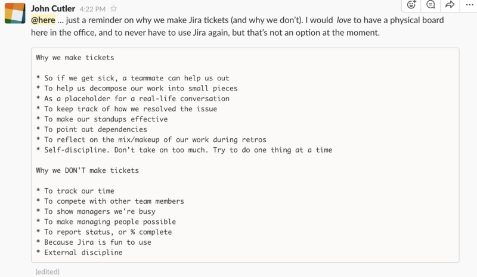

---
path:	"/blog/why-we-write-tickets"
date:	"2017-05-04"
title:	"Why We Write Tickets"
image:	"../images/1*OF0R5473NbZxCwLGXh5j2g.png"
---

Shared with my team the other day in Slack …

**Why we write tickets**

* So if we get sick, a teammate can help us out
* To help us decompose our work into small pieces
* As a placeholder for a real-life conversation
* To keep track of how we resolved the issue
* To make our standups effective
* To point out dependencies
* To reflect on the mix/makeup of our work during retros
* Self-discipline. Don’t take on too much. Try to do one thing at a time
**Why we DON’T write tickets**

* To track our time
* To compete with other team members
* To show managers we’re busy
* To make managing people possible
* To report status, or % complete
* Because Jira is fun to use
* External discipline

> [Hacker Noon](http://bit.ly/Hackernoon) is how hackers start their afternoons. We’re a part of the [@AMI](http://bit.ly/atAMIatAMI) family. We are now [accepting submissions](http://bit.ly/hackernoonsubmission) and happy to [discuss advertising & sponsorship](mailto:partners@amipublications.com) opportunities.
> If you enjoyed this story, we recommend reading our [latest tech stories](http://bit.ly/hackernoonlatestt) and [trending tech stories](https://hackernoon.com/trending). Until next time, don’t take the realities of the world for granted!