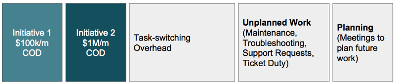

---
path:	"/blog/its-a-wonder-some-teams-get-anything-done"
date:	"2017-07-02"
title:	"It’s A Wonder Some Teams Get Anything Done"
image:	"../images/1*kqO7SqQtzcyNYFYv5vcKYg.png"
---

#### Or, why you should visualize ALL work and use Cost of Delay

Let’s review two (scarily common) examples.

#### Examples

**Exhibit #1**. This team is working on two **initiatives**. Initiative 1 is “costing” the company $100,000 per month. Initiative 2 is “costing” the company $1,000,000 per month.

Work breakdown for a singe teamCost of Delay (COD) is the “[partial derivative of the total expected value with respect to time](https://en.wikipedia.org/wiki/Cost_of_delay)”. ~30% of the team’s capacity is being dedicated to those two value-add initiatives. The rest of the team’s capacity is being “spent” on unplanned work (stemming from unmanaged complexity)

, planning for future efforts, and task switching. Why would any rational person work this way? Easy…to be responsive, stay busy, show some progress on the CEO’s pet project, and pragmatically deal with tech debt. What should they do instead? Something like…

Working down the technical debt to limit the amount of unplanned workSince the unplanned work saps capacity almost equal to the two value-add initiatives combined, it might be wise to knock that out as quickly as possible, especially given the non-linear nature of unmanaged complexity. It could get gnarly fast. Unfortunately, this will be unpopular because “not doing new stuff” is a psychological hit for a team.

**Exhibit #2**. Now let’s take a “shared” team (Team B). Maybe they’re a tools or infrastructure team. Lucky for them, they don’t have the same debt hanging over their head, but they do have to service two “high priority” projects (Team A swears this is high priority, and it literally may be their highest priority). There’s just one problem: one of the efforts (I2) is addressing 10x the cost of delay ($1,000,000 vs $100,000).

Shared team (Team B)

 is splitting its capacity between two projects. Why?Is this bad? Of course! It’s terrible. Initiative 2 accounts for 10 Initiative 1s. If doing both adds one month to the completion of Initiative 2, then the company will have “lost” $1,000,000. Why does this happen? I can think of many reasons:

* Team B has a specialized resource who can’t work on Initiative 2, so instead of training that person, they opt to keep those people busy on something else.
* Team B didn’t push back on Team A because they were worried about being called unresponsive.
* Someone promised a demo of Initiative 1. And in their spare time, a designer cranked out a mockup that everyone *loves*.
#### Discussion

Why is focus so difficult? Why is it so hard to slow down to speed up? Why are these teams making unsound decisions?

1. **Cost of Delay.** Notice how we used Cost of Delay to expose the folly of splitting work across two projects in Exhibit 1, and two shared projects in the case of Exhibit 2. Without an Apples-to-Apples way to prioritize work, this insight would be impossible. Cost of Delay allows us to make smart prioritization decisions when combined with a rough sense of initiative duration.  
**To Do**: Start estimate cost of delay and prioritizing with CD3 ([see here](http://blackswanfarming.com/cost-of-delay-divided-by-duration/)).
2. **Invisible Work**. In my examples, all of the work is visible. That is rarely the case and this is a thorny topic for teams. Exposing “ticket duty” and unplanned work to the world can feel embarrassing. In some cases they’ve asked for the leeway to work down the debt, and have been denied. Or they’re dependent on another team to unblock them, and the help never arrives. Or worse still they don’t want the PM to shoot down their work (even when they know it is necessary). So they battle the unplanned work in secret. I talk more about this in my [Ops Death Spiral post](https://medium.com/@johnpcutler/learned-helplessness-and-the-ops-death-spiral-b0fff7d916b1). Teams doing Scrum are not immune to this.  
**To Do**: Make it safe enough to visualize all work. Engage the team, and explain the upside.
3. **Task Switching**. We chronically underestimate the impact of task-switching (both in our personal lives, and our work lives). Imagine a day that starts at 9AM. Emails. At 9:30 there’s a half an hour standup. After some interruptions, you’re able to get an hour of focused work in before lunch. From 1pm to 3pm you’re stuck in meetings. More unplanned work. And finally from 4pm-5pm you get to crank on a story. Consider the cost of getting started after each interruption. Folks in the trenches frequently talk about “days that get away”.  
**To Do**: Limit work-in-progress (WIP). Block uninterrupted time.
4. **Staying busy**. We are naturally geared to keep busy. When something is blocked, we are programmed to pick up the next task. Product Managers constantly ask “can we parallelize this?” The thought of someone having nothing to do — or god forbid coaching another team member, or knocking out some tiny UX debt tasks — is deeply troubling. High Utilization is dangerous.  
**To Do**: It can be difficult and unreasonable to limit utilization, but the same effect can be achieved by implemented conservative WIP and watching queues.
5. **Teams just need more discipline**. It is tempting to attribute long lead times to a lack of team discipline. So more process is introduced (thereby increasing planning time). You can see from these examples that the problem is one of multi-tasking and unmanaged complexing. Ideally you’re measuring lead times — the time from initiative conception to actually delivered the expected value to customers — so you’ll be able to get an early indicator of when more resources (or more focus) may be needed. But even then … the tendency is to ascribe delays to team behavior/discipline, and not the system.  
**To Do**: Make work visible and be honest about resource allocation. Demonstrate the team is working hard, but is struggling with multiple tasks.
6. **The need to please.** You’d think that optimizing for the company’s economic well-being would be priority #1. But it isn’t. Managers and teams want to be helpful, and add all sorts of dependencies and constraints that need not exist. Leaders want to claim they’re firing on all cylinders and moving on all of their promises. Maybe Team B promised Team A that they’d get started in Q3 (before Initiative 2 hit the scene). Team A may literally be idle without Team B’s help, and no one likes an idle team.  
**To Do**: Hmmm. Frame things in economic terms and commit to the global economic outcomes?
7. **Uncomfortable decisions**. Note the number of tough discussions baked into those examples. We tend to shy away from the tough conversations, or jump in trying to defend our turf to the detriment of identifying the best way forward.   
**To Do**: Read the book [Crucial Conversations](https://www.amazon.com/Crucial-Conversations-Talking-Stakes-Second/dp/1469266822). Use Cost of Delay to keep things grounded in economics.
That’s it. Nothing earth shattering.

> [Hacker Noon](http://bit.ly/Hackernoon) is how hackers start their afternoons. We’re a part of the [@AMI](http://bit.ly/atAMIatAMI) family. We are now [accepting submissions](http://bit.ly/hackernoonsubmission) and happy to [discuss advertising & sponsorship](mailto:partners@amipublications.com) opportunities.
> If you enjoyed this story, we recommend reading our [latest tech stories](http://bit.ly/hackernoonlatestt) and [trending tech stories](https://hackernoon.com/trending). Until next time, don’t take the realities of the world for granted!