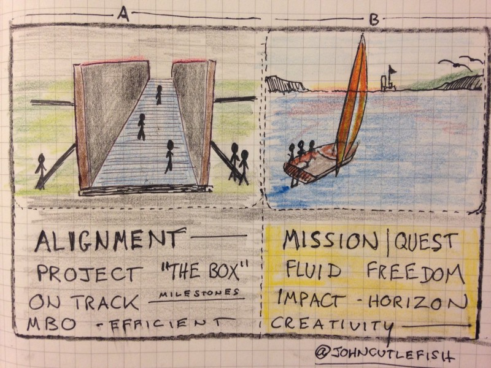
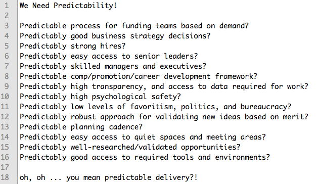

---
path:	"/blog/40-twitter-doodles-lists-and-diagrams"
date:	"2017-07-09"
title:	"40 Twitter Doodles, Lists, and Diagrams"
image:	"../images/1*nsxfB9NVDfF0aMcOogWMiA.jpeg"
---

In prepping for a future [Medium](https://medium.com/u/504c7870fdb6) post, I found myself culling through old tweets. I enjoy doodling, listicles, and diagrams. And I like The Twitter.

Occasionally these drawings and lists end up as [Medium](https://medium.com/u/504c7870fdb6)

 posts, but most often they stay tweets. I’ve shared a couple below that caught the attention of the software-product-nerd-o-sphere.

I view Twitter as a wonderful constraint. One tweet, one image. Which means that a lot is left unsaid, and misunderstandings are common. So take it all with a grain of vague-salt.

> 
> 
> 
> 
> 
> 
> 
> 
> 
> 
> 
> 
> 
> 
> 
> 
> 
> 
> 
> 
> 
> 
> 
> 
> 
> 
> 
> 
> 
> 
> 
> 
> 
> 
> 
> 
> 
> 