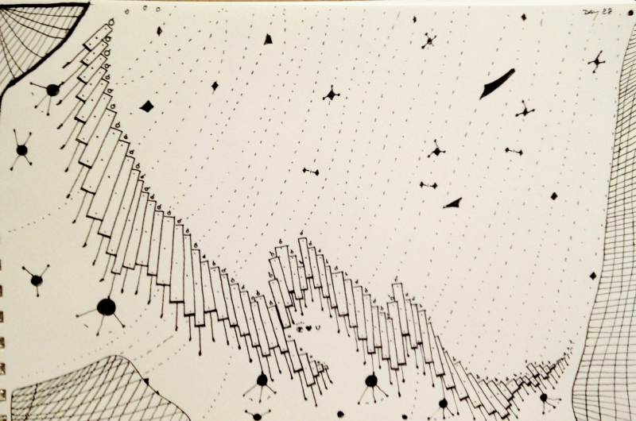

---
path:	"/blog/good-but-hard-questions-episode-1"
date:	"2017-08-18"
title:	"Good (But Hard) Questions — Episode 1"
image:	"../images/1*L23Ug4upCBkUitSWbSyGtw.png"
---

1. If culture is how we act, what is the most destructive behavior we tolerate? Why?
2. Do we believe *better* is possible? Is better necessary?
3. What and when do we celebrate? What does that say about us?
4. Where do we accept mediocrity, and where do we demand excellence?
5. Do we have shared understanding on what we’d like to improve, and what we are willing to sacrifice *in order to* improve?
6. What would need to happen for us to make the difficult decisions?
7. What is a statement we hear frequently when receiving feedback, but that we flat-out reject?
8. Where are we receiving late feedback (that is too late to be actionable)? Why was it delayed?
9. What obvious solutions do we dismiss? Why?
10. Are the right people talking?
11. Are our doors really open? Should they be?
12. Which voices should we be amplifying, but aren’t?
13. Change is often a battle of different change agendas. Who is battling to own/control how we change, and why? Are there overlaps?
14. Where are we seeing hints of a possible future? Is it a good future?
15. Why do people stay? Why do people leave? What can we learn from that?
16. What *can’t* we fix, *even if* it causes pain to our people?
17. What are we doing “just because”? Why?
18. How do decisions really get made here?
19. What does the unofficial org chart look like?
20. Where are we attacking a symptom instead of the root cause? What effect does that have?
21. A year from now, what will we still be talking about?
22. Where must trust and safety be repaired?
23. What can’t we see because we are too immersed in the system?
24. If a “fresh set of eyes” joined us, what would they see that we can’t see?
25. Who internally exemplifies the behavior we’d like to model our culture around? What do they do?
26. In what ways do we encourage local behavior that is effective, but not in alignment with our global goals/needs?
27. When are we more than the sum of our parts? When are we less than the sum of our parts (we bring each other down)?
28. What are our most intractable problems? Why have we failed to make a dent in these issues? Why are they so stubborn?
29. Do we trust our immediate peers? Do we have confidence in their abilities?
30. Scale almost always causes entropy and an increase in complexity. How are we taming these forces?
31. Where is the good we must amplify?
32. Where are our strengths also our weaknesses?
33. What do our individual contributors see that we don’t see?
34. What do we see that is difficult (or impossible) to communicate to our individual contributors?
35. Where are the areas of frequent confusion and poor shared understanding?
36. What (or who) is the elephant in the room? How have we contributed to *keeping* the elephant in the room?
37. What is trying to emerge? Are we rejecting it? Encouraging it?
