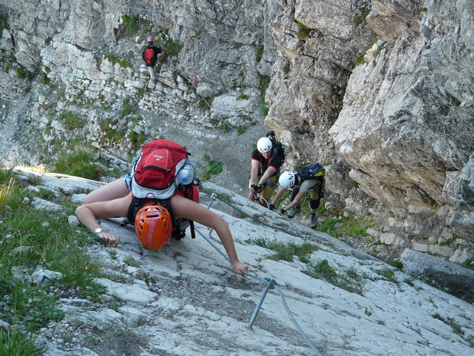
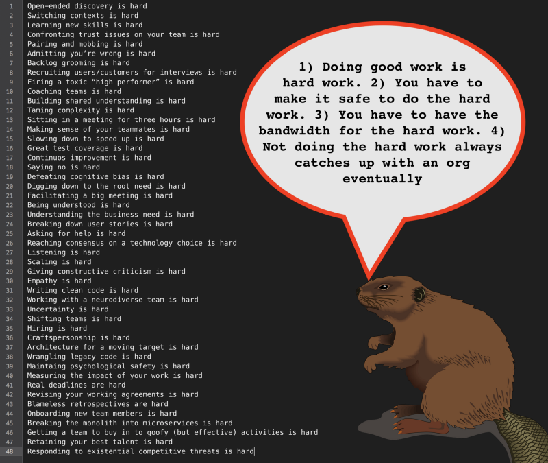

---
path:	"/blog/good-work-is-hard-work"
date:	"2017-08-23"
title:	"Good Work Is Hard Work"
image:	"../images/1*W_ewTA8I4-Uuc3KFdaAcEg.png"
---

Software product development is hard.

Gratuitous, free-to-use photograph of something kind of difficult looking (so Medium has an image)

Doing the hard work takes trust and safety. Without trust and safety, individuals and companies go into self-preservation mode. In these conditions we replace trust with process, and collaboration with control.

All companies have problems. The *best *companies prioritize the most threatening problems and deal with them. New ones pop up, and they keep dealing with them. Complexity creeps up, and they tame it. Everyone has faith that “the important things will get worked out”. Promises (especially the promises for support and respect) are kept. These companies hold entropy at bay, because if you fall too far behind, you’ll never dig yourself out of the hole.

To quote the great Greg Lemond:

> “It never gets easier, you just go faster.A lot of continuous improvement is just making it *possible* to do the hard work (the effective work) and face challenges when they arise.

Because …

* Open-ended discovery is hard
* Switching contexts is hard
* Learning new skills is hard
* Confronting trust issues on your team is hard
* Pairing and mobbing is hard
* Admitting you’re wrong is hard
* Backlog grooming is hard
* Recruiting users/customers for interviews is hard
* Firing a toxic “high performer” is hard
* Coaching teams is hard
* Building shared understanding is hard
* Taming complexity is hard
* Sitting in a meeting for three hours is hard
* Making sense of your teammates is hard
* Slowing down to speed up is hard
* Great test coverage is hard
* Continuos improvement is hard
* Saying no is hard
* Defeating cognitive bias is hard
* Digging down to the root need is hard
* Facilitating a big meeting is hard
* Being understood is hard
* Understanding the business need is hard
* Breaking down user stories is hard
* Asking for help is hard
* Reaching consensus on a technology choice is hard
* Listening is hard
* Scaling is hard
* Giving constructive criticism is hard
* Empathy is hard
* Writing clean code is hard
* Working with a neurodiverse team is hard
* Uncertainty is hard
* Shifting teams is hard
* Hiring is hard
* Craftspersonship is hard
* Architecture for a moving target is hard
* Wrangling legacy code is hard
* Maintaining psychological safety is hard
* Measuring the impact of your work is hard
* Real deadlines are hard
* Revising your working agreements is hard
* Blameless retrospectives are hard
* Onboarding new team members is hard
* Breaking the monolith into microservices is hard
* Getting a team to buy in to goofy (but effective) activities is hard
* Retaining your best talent is hard
* Responding to existential competitive threats is hard
### It’s all hard!

