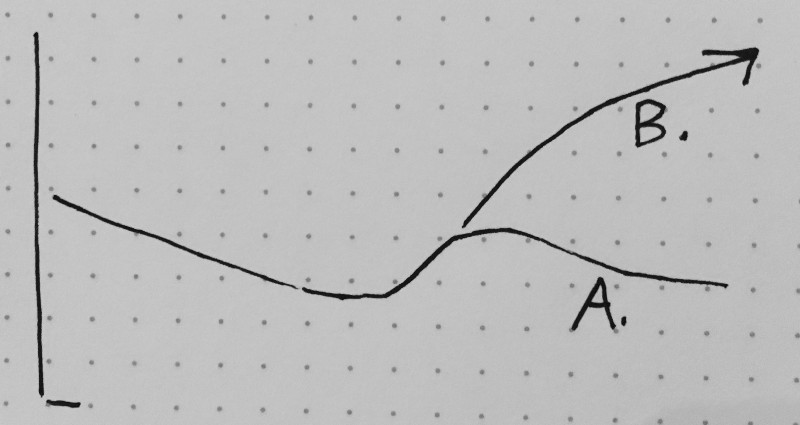

---
path:	"/blog/extra-strength-5-hour-agile"
date:	"2017-08-28"
title:	"Extra Strength 5-hour AGILE"
image:	"../images/1*qxylXoKJB997NJ6gg2ozRA.png"
---

It’ll get you through the day.

Today I want to discuss 5hr Agile, aka Quick Fix Agile, aka We Need To Go Faster Right Now Agile.

Here’s what concerns me.

We owe it to companies (our companies if we’re on the inside) to be honest about the investment required to fundamentally change things. Installing [some tool/method] is never enough. You won’t go from a four (on a scale of 1–10) to a nine without some *serious work. *The turnaround will take years, not months. And you’ll probably need to do some restructuring and hiring/firing.

If your company is doing OK, and you’re not willing to really commit … you’d probably do better to save the money and disruption and preserve the status quo. We’ve all read about the [accelerated death rates of public companies](http://www.businessinsider.com/us-companies-are-dying-faster-than-ever-2015-8), so maybe you’re fighting an uphill battle anyway. A half-hearted foray into Lean/Agile won’t really change things much (see A below).

It’s like going to the gym once a week. You might as well save your knees.

If you’ve worked in a company doing “change-light” you know just how frustrating it is. Front-line teams scurry to adopt the new way, and management and leadership just remains the same. You lose your best people because the change isn’t effective. “Let’s experiment” doesn’t cut it.

To make this work you’re going to need to…

* Hire people who are comfortable working in the “new” way
* Pay people who are not interested in working in the “new” way to leave
* Ingrain continuous improvement into the DNA of the organization
* Shift legacy mindsets, focusing especially on leadership and upper management
* Slow down, limit work in progress, lower utilization rates
* Make craft and quality a top priority
* Make safety a prerequisite (see [Modern Agile](http://modernagile.org/))
* Hire coaches and facilitators
* Bring individual contributors closer to customers/users
* Dedicate teams to outcomes/benefits (vs. solely to “shipping projects”)
* Discontinue the use of proxy metrics (e.g. “velocity”) wherever possible
* Remove layers of management (or retrain for new roles)
* Change the management culture, expectations, and mandate
* Combine certain departments (e.g. Operations and Engineering)
* Embed UX, Data Science, and QA on product development teams
* Reshape the role of QA across the organization and eliminate handoffs
* Address dependencies (may involve hiring)
* Change how you fund/resource initiatives and teams
* Change how you architect and deploy your products/services
* Visualize work on the portfolio/program/team level and address bottlenecks
* Be more open and transparent
* And more …
Not trivial, huh?

We dedicate tons of money to installing Agile practices that don’t rock the boat. I’d argue that rocking the boat is exactly what you need to do.

