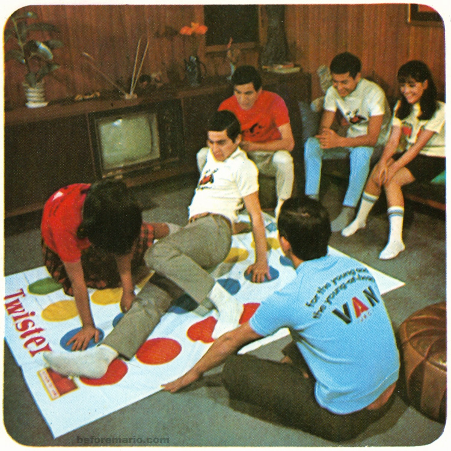
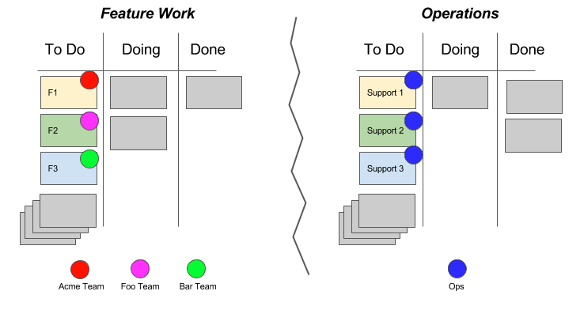
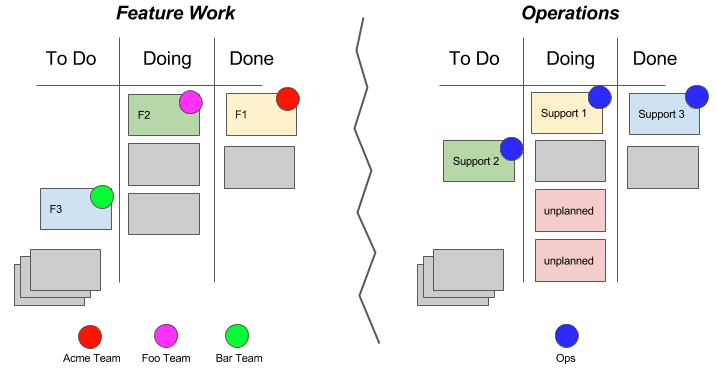
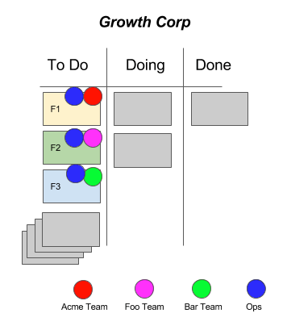
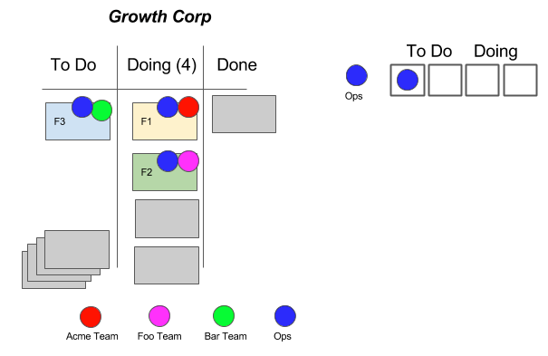
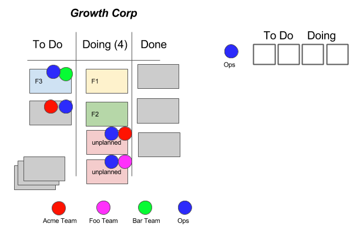
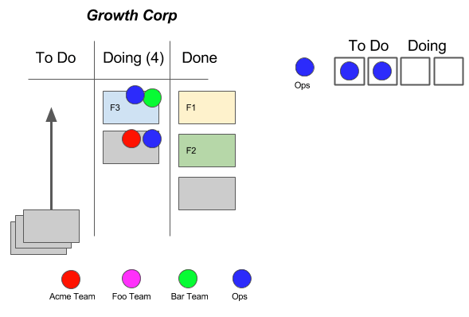

---
path:	"/blog/winning-at-dependency-twister"
date:	"2017-09-09"
title:	"Winning at Dependency Twister"
image:	"../images/1*cWzEUYhDKpgb1Z6Nek7kkw.png"
---

I wrote recently about [quarterly planning](https://hackernoon.com/surviving-quarterly-planning-7d571fb5b034)

. Since then, I have received a bunch of questions about quarterly planning and dependency management.

I’d like to dig into that question more.

Simple, simple example…

GrowthCorp has three high priority new feature initiatives (F1,F2, and F3). A single shared Operations team (Ops) is slated to support these initiatives, along with other mission critical work. As usual, Ops is under the gun… under-resourced, under-trusted, and overworked.

After the quarterly planning dust has settled, Ops creates cards to support the feature work (Support 1, Support 2, and Support 3). There are two boards: Feature Work, and a private Operations board (because when Ops makes their board public, it gets micromanaged.)

At the start of the quarter, it looks like this:

It’s getting near the end of the quarter, and things look like this:

#### **Crap!**

**Bar Team** hasn’t even started F3, and Ops has finished Support 3. What if Bar’s F3 needs change? **Acme Team** is waiting around for Ops to finish Support 1. F2/Support 2 is way behind schedule for both teams. Meanwhile, Ops is having to do production support for shitty feature implementations from last quarter (“unplanned”). And…of course…Acme, Foo, and Bar are complaining about Ops. **WHEN IN DOUBT BLAME OPS.**

Operations leadership has been advocating for headcount for ages, but someone always plays the process and efficiency card.

> Come on. There are inefficiencies everywhere! The Ops Team needs to get better about pre-planning and estimating. You Ops people are so grumpy and uncooperative. Let’s fix these things and then we’ll consider headcount.#### OK. Let’s fix this.

First, let’s put it all on one board and add Ops as a collaborating team for F1, F2, and F3. We can indicate their tasks as sub-tasks or related stories (not shown).

Next, let’s indicate that at any given time we can only really have Ops working on two items (Doing), and be committed to two items in To Do. Note here that Ops has a spare magnet for a To Do item. We move two of our feature items into Doing (F1 and F2)

, and the teams work on these together.

Low and behold, the feature issues creep up (“unplanned”)

. Ops has a working agreement that requires them to shift to production issues. Given that they cannot collaborate on F1 and F2, the feature teams swarm on the unplanned work to help knock that out.

And things keep rolling…

#### In Summary

Teams subject themselves to all brands of masochism in an effort to “thread the needle” and eek out every last grain of efficiency. This happens ALL THE TIME with shared teams like Ops, UX, Data Science, Research, etc.

But in the process of trying to do this optimization (often as part of quarterly planning), they reduce transparency, build up planning inventory, increase rework and canned efforts, and institutionalize big-batch planning cycles.

Without a unified view, the shared teams will always struggle to make the case for headcount, or to embed themselves with the feature teams (or tool up, automate up, etc.). Somehow we persuade ourselves that we can get more out of them.

So …. the big point:

1. Try to visualize work on the same board (especially if you suspect that one part of the org is the bottleneck).
2. Two teams working towards one goal are an adhoc team. Let them behave as one team.
3. Consider adding WIP limits for heavily shared teams in addition to WIP limits for columns.
4. Lessen the hit of quarterly planning. Deal with dependencies at the last responsible moment, and reduce the amount of guessing/pre-loading of teams.
