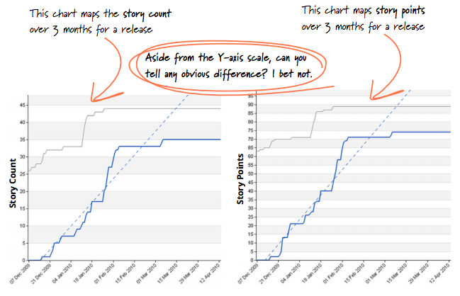
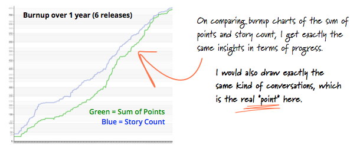

---
path:	"/blog/can-you-stop-using-story-points"
date:	"2017-09-18"
title:	"Can You Stop Using Story Points?"
image:	"../images/1*GZzMz0q8MA9IUrHW092_Ng.png"
---

*Note: This post is targeted at product managers who may have missed the Agile community’s long-running debate over story point estimation. As PMs, we may only marginally influence this practice, but we should make sure we aren’t complicit in abuse/misuse, and that we advocate for what helps our teammates.*

I’m currently in the middle of reading [How to Measure Anything: Finding the Value of Intangibles in Business](https://www.amazon.com/How-Measure-Anything-Intangibles-Business/dp/1118539273/ref=pd_lpo_sbs_14_t_0?_encoding=UTF8&psc=1&refRID=9D84QBBJFC7QQE3K4WAG) by Douglas W. Hubbard. It’s the third edition, so I am very, very late to the party. Hubbard stresses the “job” (the decision) we are hiring a particular measurement to assist with, along with the value of less-than-perfect information. He writes…

> Total elimination of uncertainty is not necessary for measurement but there must be some expected uncertainty reduction. If a decision maker or analyst engages in what they believe to be measurement activities, but their estimates and decisions actually get worse on average, then they are not actually reducing their error…As a product manager, when placing bets I’ll take anything I can get.

In product development, the difference between one month and six months — for work of **equal customer value **— *really matters (at $50k per two week sprint, and far, far more costly opportunity costs). *To make a choice, I’ll show six team members two potential bets and ask them to vote on the item more likely to take *closer to one month*. If the team votes for Bet One by a wide margin (6–0 or 5–1), we’re going to do Bet One. If the vote is closer, we’ll have a conversation.

But I am not going to use that **same information** to plan a handoff with another team, set a fake “motivational” deadline (jerk move), measure the performance of my team, or make promises to start new work in a month’s time. And I’m not going to get pissed if the effort takes five months, because there’s always a chance this might happen. If we’re working to reduce uncertainty and risk, that’ll become apparent soon enough. If we have opportunities to deliver value / extract learning earlier, we will.

Simply put, I believe that signal is better than nothing to help with a specific prioritization job (though there are some contexts, especially with tons of unplanned work, where it could literally have no value…I might as well flip a coin).

Anyway…on to story point estimation (I wrote the above to show that I’m not anti-estimation, or against taking measurements — in this case votes — to help with making a decision). Stories do not take between one and sixth months. If we’re lucky they take between one and three *DAYS,* or a bit longer if there are frequent interruptions with unplanned work, the team doesn’t split stories well, or there is story-level scope creep.

I’ve written about [the crazy user story size spectrum here](https://hackernoon.com/stories-vs-epics-d773118420d2). Suffice to say there is always a push/pull between decomposition, user-centeredness, size, independence, etc.

In my experience — especially if you stress story splitting practices — you can safely use user story counts instead of story points (to do a variety of jobs). This is by no means a new/original idea ([see this 2013 ThoughtWorks ebook on estimation](https://info.thoughtworks.com/rs/thoughtworks2/images/twebook-perspectives-estimation_1.pdf)):

[https://info.thoughtworks.com/rs/thoughtworks2/images/twebook-perspectives-estimation\_1.pdf](https://info.thoughtworks.com/rs/thoughtworks2/images/twebook-perspectives-estimation_1.pdf)[https://info.thoughtworks.com/rs/thoughtworks2/images/twebook-perspectives-estimation\_1.pdf](https://info.thoughtworks.com/rs/thoughtworks2/images/twebook-perspectives-estimation_1.pdf)My personal experiences very much mirror those of Huimin Li and Juliano Bersano (from the ebook)

. I’ve found that there are alternative approaches to making decisions *without* story point estimation, and the confusion, misuse, and abuse that can accompany SPs.

The term “point” elicits thoughts of scoring (“the team *earned* 30 points last sprint, and their score went down to 24 points this sprint, wtf?”). Teams are routinely confused about the practice, and have to reset as they move between teams and companies. I very much respect the thinking behind SPs, but there are (often) better alternatives.

Maybe a team uses story point estimation to get good at decomposition … but its the team’s ability to decompose problems, practice continuous improvement, and test/learn quickly that goes on to make them great and “predictable”.

What can you *still do (or do even better) *without story point estimation?

1. You can **trigger a conversation about scope, solution, risk and complexity** without story point estimation.
2. You can **compare relative complexity*** *without story point estimation.
3. You can*** *encourage story splitting / problem decomposition** without story point estimation.
4. You can make **significant resource allocation decisions** without story point estimation (assuming you stories are reliably small)
5. You can** estimate allocation on different types of work** without story point estimation.
6. You can **have goals** without story point estimation. You can **“fill a sprint”** without story point estimation.
7. You can track **cycle times and lead times** without story point estimation.
8. You can track **story throughput** without story point estimation.
9. You can **measure team performance** without story point estimation.
10. You can **improve predictability over time** without story point estimation.
11. You can **forecast the completion of a large initiative** without story point estimation.
12. You can **tease out the blockers/impediments that are impacting story throughput** without story point estimation.
At the end of the day, you need to figure this out for yourself.

As an intermediary step, I recommend continuing with your story point estimation practice, but also record story counts, [cycle times, lead times, and throughput](https://leankit.com/learn/kanban/lean-flow-metrics/). Try putting a max-length guideline on your stories (e.g. three days). Measure, compare, and reflect.

