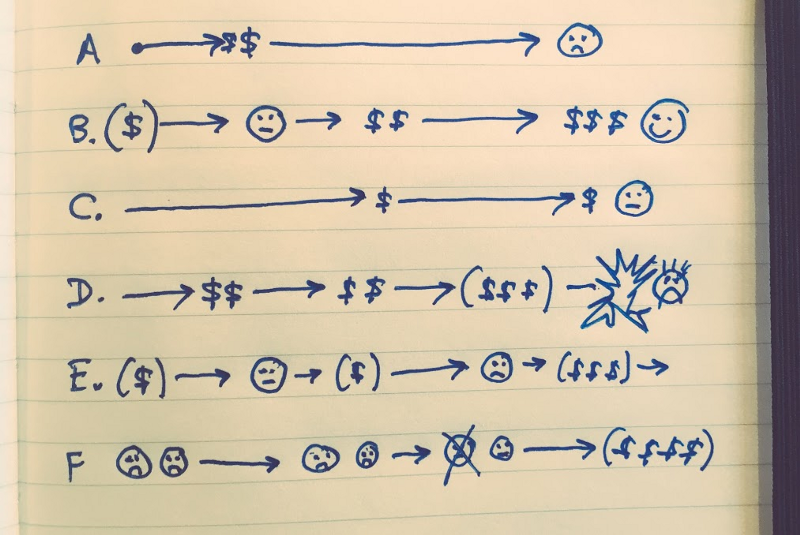
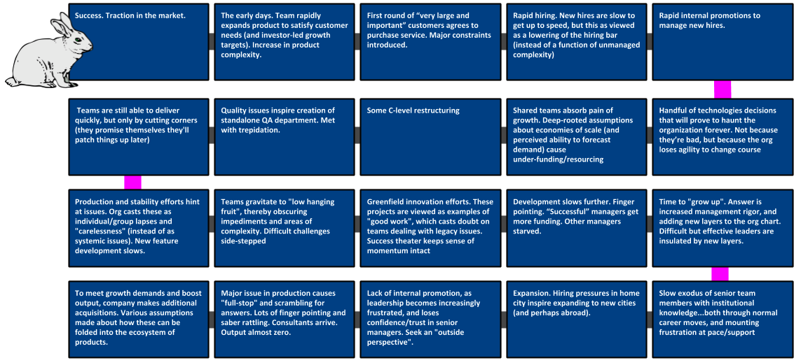

---
path:	"/blog/play-it-again-sam"
date:	"2017-09-25"
title:	"Play It Again Sam!"
image:	"../images/1*ClrxgMdFquj-OWH2zcXyBA.png"
---

I’ve been toying around with a choose-your-own-adventure book. A friend recommended I lay out the *unhappy* path first. That sounded kind of depressing, but it turned out to be kind of fun. There are many ways things can go wrong:

The mistake here is to view this drift into failure as a byproduct of incompetence or malice. It certainly can feel this way for individual contributors sometimes. The upside of rapid growth feels real, and the downside feels far away. Humans kick the can on a lot of things like this.

The point here is that if we come to grips with the inevitability of all this, perhaps we can take it all less personally and DO something about it. Knowing that your situation is no different is comforting in an odd way.

Picked one common path…

* Success. Traction in the market.
* The early days. Team rapidly expands product to satisfy customer needs (and investor-led growth targets). Increase in product complexity.
* First round of “very large and important” customers agrees to purchase service. Major constraints introduced.
* Rapid hiring. New hires are slow to get up to speed, but this as viewed as a natural byproduct of rapid growth and/or a lowering of the hiring bar (instead of a function of unmanaged complexity)
* Rapid internal promotions to manage new hires. Individual contributors thrust into management roles (that are new, and also newly defined)
* Handful of technology decisions that will prove to haunt the organization forever. Not because they’re bad, but because the org loses agility to change course
* Shared teams absorb pain of growth. Deep-rooted assumptions about economies of scale (and perceived ability to forecast demand) cause under-funding/resourcing
* Some C-level restructuring
* Quality issues inspire creation of standalone QA department. Met with trepidation.
* Teams are still able to deliver quickly, but only by cutting corners (they promise themselves they’ll patch things up later)
* Production and stability efforts hint at issues. Org casts these as individual/group lapses and “carelessness” (instead of as systemic issues). New feature development slows.
* Teams gravitate to “low hanging fruit”, thereby obscuring impediments and areas of complexity. Difficult challenges side-stepped
* Greenfield innovation efforts. These projects are viewed as examples of “good work”, which casts doubt on teams dealing with legacy issues. Success theater keeps sense of momentum intact
* Development slows further. Finger pointing. “Successful” managers get more funding. Other managers starved.
* Time to “grow up”. Answer is increased management rigor, and adding new layers to the org chart. Difficult but effective leaders are insulated by new layers.
* Slow exodus of senior team members with institutional knowledge…both through normal career moves, and mounting frustration at pace/support
* Expansion. Hiring pressures in home city inspire expanding to new cities (and perhaps abroad).
* Lack of internal promotion, as leadership becomes increasingly frustrated, and loses confidence/trust in senior managers. Seek an “outside perspective”.
* Major issue in production causes “full-stop” and scrambling for answers. Lots of finger pointing and saber rattling. Consultants arrive. Output almost zero.
* To meet growth demands and boost output, company makes additional acquisitions. Various assumptions made about how these can be folded into the ecosystem of products.
* And it continues …. (for another post)
