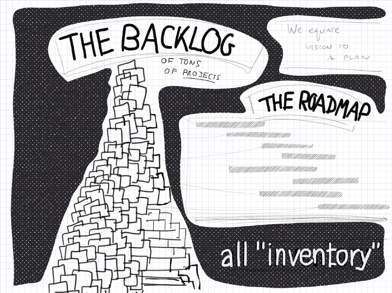
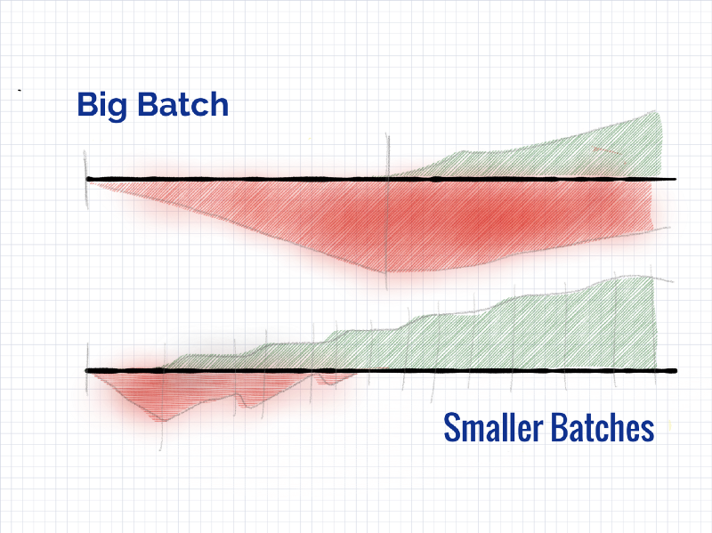
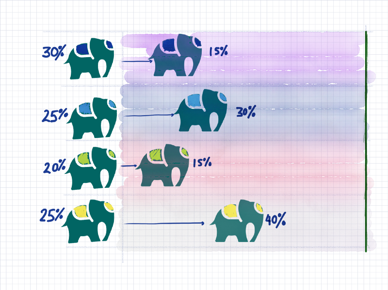

---
path:	"/blog/beyond-features-and-projects-it-arena-2017-lviv-ukraine"
date:	"2017-09-30"
title:	"Beyond Features and Projects (IT Arena 2017— Lviv, Ukraine)"
image:	"../images/1*tYtLFr0IDUv8SEOEButE-w@2x.png"
---

Sharing my deck from the presentation. A couple slides made no sense without background, so I removed them.

### Features, Projects, and Missions?

### Where is the blocker in product development?

### Trends in product management…

### Our options to handle uncertainty…

### Disruption in the pet shrimp biz..

### Trends and cycles…

### From transactions to streams…

### Complex ecosystems. What is the feature here?

### Mountains of stories.

### Quarterly planning…chasing our tail.

### “Agile”

### Prematurely converging before responding. And aborted feedback loops.

### Everything as a Service.

### There’s a spectrum…

### Cube of opportunity. Perpetual uncertainty.

### Definition of Done. Helpful?

### Is rework evil?

### Orbits. Shorten cycle for validating benefits.

### Imagine painting Mona Lisa this way…

### Improve how we do the ‘Jobs’…

### Why do we deliver in smaller batches?

### Betting on elephant races. Bet on games after they’ve started.

### Mission-based teams funded to move key metrics.

### The “simple” board.

### Sales wants to close deals. Solve that problem.

