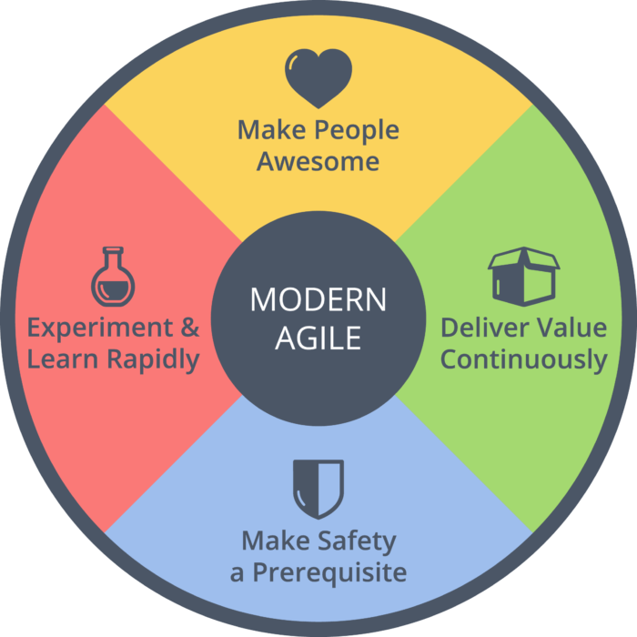

---
path:	"/blog/let-teams-figure-it-out"
date:	"2017-11-11"
title:	"Let Teams Figure It Out"
image:	"../images/1*-4uJNpSIV5PILQRt2peooA@2x.png"
---

#### Continuous improvement, picking Ways, and what really matters

In this post, I’m going to describe a team kicking off its continuous improvement adventure. My description is going to raise some questions. I’ll try to answer those questions, and end with why I think it matters.

This is mildly related to something I tweeted the other day (back in the stone ages when the limit was 140 characters):

> I took some time to reflect on what I was trying to get at. It came across that teams should just make up practices. That’s not what I meant (and most people would instantly see that as a waste of time).

#### The Team

Take a team that is 1) motivated to continuously improve, 2) has the long-term support of their organization, and 3) has a general sense of what awesome might look like for their context (individually, as a team, and as a company).

They spend some time — during working hours — doing some reading (“hey, how have other people tackled this challenge” and “what does expertise and high performance look like”), and jointly decide to try Scrum along with a handful of so-called “technical practices” associated with Extreme Programming. Some of the technical practices are counter-intuitive, but signs point to a potential upside.

They grasp the important point you learn about immediately: empirical process control (transparency, inspection, and adaptation).

It seems like a reasonable starting point, as there is no shortage of freely available learning material. As a slight (but acceptable) modification of Scrum, they agree to rotate the role of the Scrum Master, as well share the role of the Product Owner with the UX designer assigned to the team. They also scrub the idea of “sprint commitments” measured in story points, and decided to stick only to a “sprint goal” involving some cohesive bit of functionality deployed into production.

The team starts learning. They break up into pairs, and these pairs commit to doing 3 days of study/research on individual topic areas. Later that week they conduct a series of collaborate teaching sessions. It’s a week without “normal work”, but it is time well spent.

On Friday afternoon — after putting together a first draft of their working agreements (to be changed, of course) — they put a couple things on the wall: a Kanban board to track their work and continuous improvements experiments, a visualization to show their progress towards *awesome (high quality, customer value, small batches, and individual skills development)*, and a Modern Agile poster they found online while researching.

And the next week they start…

#### Questions

By this point some of you are saying….

> But, but, but, but, but ….I can hear you. So let’s talk about your questions:

**This is a super ideal situation. It never works like this! Management rarely gives this kind of support. They want to see immediate results and/or need to “run” the change.**

JC: Interesting. Maybe that is why 2/3rds of change efforts fail? Maybe the lack of support is somehow related to the lack of self-motivation? Finally, if you want something to succeed, shouldn’t you establish the foundations FIRST? Bring in some management coaches if that is the blocker.

Continuous improvement is an investment. It takes time and focus. An alternative perspective is that it is management’s job to create the conditions for continuous improvement, and not to drive it themselves.

**You can’t do Scrum like that. At least send someone to get certified?**

JC: Are you telling me that a *team* of motivated people — with meetups in every city, hundreds of available books, and thousands of available videos (featuring top practitioners ) — can’t self-learn 2 days worth of certification? If that’s true, we have no hope to learn *the really complicated stuff* we have to learn to stay competitive.

**People generally don’t have this “mindset”. Most people just want to be told what to do.**

JC: Hmmm. Maybe that viewpoint (though true, sometimes?) is part of the problem? Will that magically go away? If your system relies on people being told what to do, and telling other people what to do, then be prepared to move very slowly.

**But what if they don’t know what awesome looks like?**

JC: Are you really telling me that someone with an Internet connection can’t figure out what better looks like? Somewhere? And, if the team has no interest in figuring out what better looks like, what might that tell us about their chances for success? Also, if the business itself doesn’t have a vision of awesome (e.g. they blab on about predictability without mentioning customers, outcomes, or upside), then you’ll probably have other issues on your hands. Start there.

**What if they pick the wrong stuff?**

JC: They’ll adapt. Keep in mind that we can only handle so much change at once. So they likelihood you’d pick “all the right stuff” at first, not to mention learn that all at the same time, was low to begin with.

**Everyone can’t be an expert John! It seems like you are belittling experience and expertise.**

JC: To the first point: correct, but anyone can be a learner (especially the skilled problem solvers who gravitate to this work). Learners know when to get help, and eventually become experts themselves. Cultivating a culture of learning and continuous improvement is foundational.

To the second point, let’s start with some questions.

Do you have anyone internally who is an expert, and has experienced something *better* than the current state of the organization and/or team? Cool. Invite them to work alongside the team. Let’s say you don’t. Well, that’s a problem. Perhaps you should hire some full-time coaches. Is that difficult? OK, cool, hire some experienced external coaches.

I fully respect experience and expertise. But don’t hire it, and assign it to “the teams” when 80% of the problem exists outside the teams (a refrain I’ve heard over and over from the experts I know). I’ve seen very high performing teams, filled with individuals with strong track records in high performing teams, fail miserably without the prerequisites in place.

#### So What?

Here’s the nice thing about this thought exercise.

I don’t think it really makes ANY difference whether someone starts with the “non-technical” parts of XP, Scrum, “start where you are” (Kanban Method), or even some mutant home-grown selection from the tools/practices menu. Attention to the technical practices DOES matter, but runs orthogonal to the whether you do sprints, story-points, have a Scrum Master, etc.

What matters is …

1. An intrinsic commitment to continuous improvement (people have to truly want it, and get pleasure out of it)
2. The long-term support of their organization (including a commitment to establishing and maintaining psychological safety, limiting work-in-progress, etc.)
3. A general sense of what awesome might look like for their context (provided that their *sense of awesome* maps to delivering continuous value to customers, somehow)
The debates on [way] vs. [way] sort of miss an important point.

We’re not talking apples to apples. Scrum foisted on a team, grafted over a project culture, focused only on the team level, and linked to shallow visions of awesome is VERY DIFFERENT from a team opting into continuous improvement to deliver more value to customers, making safety a prerequisite, and being given the bandwidth to *do the hard work* required for continuous improvement. And coincidently, agreeing to experiment with Scrum and XP practices. Very, very different.

This is why you can see companies with high performing teams practicing different ways. The ways are customized for the problem at hand, and the organization encourages the culture of continuous of improvement.

As a community, we need to do better at explaining the why, and explaining the first principles at play. We also need to be honest with ourselves. If the team is not intrinsically engaged (lower and uppercase “t”), nothing of much substance will happen. Sure there’s money in installing Lean, Agile, and Agile-As-Commonly-Understood (aka Scrum), but it helps if the OS of the org is under active development. Our goal needs to be enabling resiliency and true agility, rather than a dependence on prescriptive ways.

