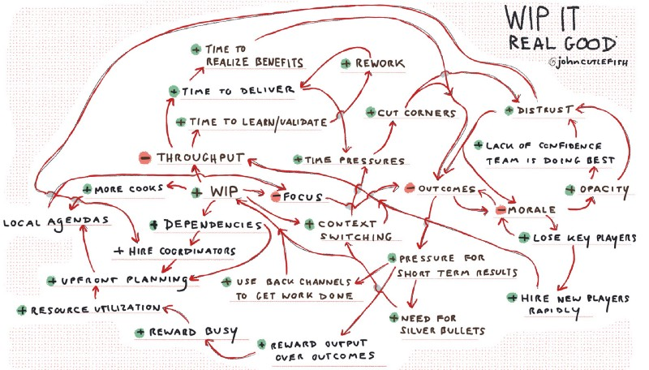

---
path:	"/blog/round-and-round"
date:	"2018-02-12"
title:	"Round and Round"
image:	"../images/1*tQP_5OeklVmIaqvTv2wm7A@2x.jpeg"
---

Crazy week of travel. Apologies for not posting more.

I do these little diagrams for fun (often when waiting for broken airplanes to be repaired while I enjoy my $10 meal voucher to fly to another airport where I’ll miss my connection). I’ve been thinking about cataloging them in a fun little book. Sound helpful/cathartic? Let me know at @johncutlefish on Twitter, or in the comments. Maybe (to kick my ass) I’ll set up a Kickstarter…and then I’ll NEED to finish.

Here are a couple recent ones…

#### **1. Why does that team seem to always take on too much work?**

#### **2. Why does that shared resource seem to be perpetually under-staffed?**

#### **3. Why does the team keep slipping into planning big batches?**

/#### **4. Why does a myopic focus on increasing velocity eventually hurt quality?**

#### **5. Why are the team’s stories never “good enough” ?**

#### **6. Why does my team hide things from me?**

#### 7. Well…you saw what happened when we tried to just hand them a problem, right?

#### 8. It’s not like old times…

#### 9. Sometimes they get super complex, but I’m not sure these are very helpful…

I think it would be interesting to use something like [Donella Meadow’s twelve leverage points](https://en.m.wikipedia.org/wiki/Twelve_leverage_points)

 to suggest some potentially helpful interventions. But that’s for another post.

