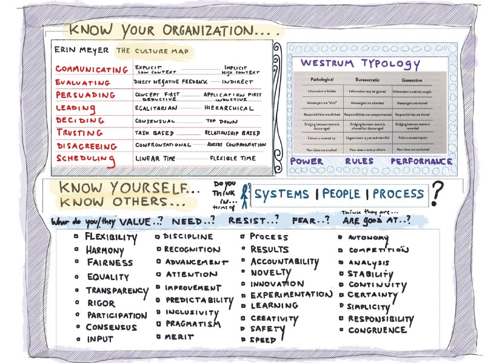
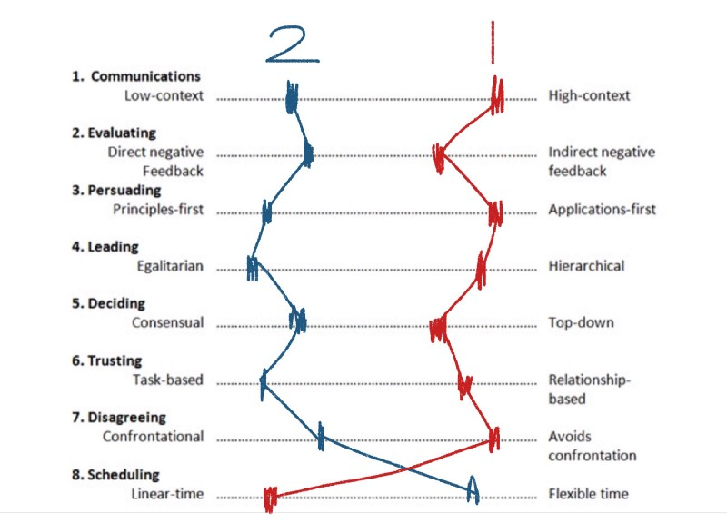

---
path:	"/blog/look-before-leaping"
date:	"2018-02-22"
title:	"Look Before Leaping"
image:	"../images/1*fpXgQfpkecP9nLo6sXNq7g@2x.jpeg"
---

#### Being a smarter change agent / change gardener

Do you want to change your organization? Why?

Or do you want to change your *experience* of your organization? Why?

Or both?

This is a longish post, but it is basically about knowing yourself, your coworkers, and your org. It will not be everybody’s cup of tea. I do tell a personal story in the middle which might resonate…so hopefully this will help someone.

The image above will make (more) sense as you progress through the post, but I suggest looking it over first.

#### Person A and Person B

**Person A** and **Person B **are working together on a change initiative, and things are going south for some reason. Let’s learn a bit more about A and B:

**Person A** cares about: fairness, experimentation, transparency, participation, inclusivity, merit, and congruence. **Person A** takes a systems POV.

**Person B** cares about: results, speed, recognition, accountability, analysis, certainty, and responsibility. **Person B** takes a people/process POV.

Ask **Person A** about **Person B**, and you are liable to hear something like:

> [Person B] is super inflexible! They seem to be putting their own recognition ahead of what is best for the company. I’m not sure they factor in (or even acknowledge) the various system dynamics here, and I’m starting to wonder whether they just don’t trust us to figure things out and make progress. Let’s keep it simple and just try some quick experiments.Ask **Person B** about **Person A**, and you might expect to hear:

> [Person A] is so conceptual! They seem more focused on picking apart the problem than they do finding a solution. I’m not sure they factor in (or even acknowledge) the role of personal responsibility here, and I’m starting to wonder whether they aren’t just trying to avoid having to commit to the plan. Let’s keep it simple, do some quick analysis, and just get going.#### At the Organizational Level

Now imagine their organization…or more specifically two versions of their organization (seen through the lens of [Erin Meyer’s *Culture Map*](https://erinmeyer.com/2016/01/mapping-out-cultural-differences-on-teams/)):

**Org Variation 1**: MORE….hierarchal, top-down decision making, relationship-based trust, linear schedules/plans, avoid confrontation, inductive persuasion (application first)

, indirect evaluation, and implicit/high-context communication. **One could safely argue that Person B will feel a bit more at home in this environment. Conflicts between A and B will favor B.**

**Org Variation 2**: MORE….egalitarian, consensual decisions making, task-based trust, flexible schedules/plans, direct confrontation, deductive persuasion (context first), direct negative feedback, and explicit/low-context communication. **One could safely argue that Person A will feel a bit more at home in this environment. Conflicts between A and B will favor A.**

Pretty basic, right? Any surprises?

#### A Little Story

I’ll use myself as the guinea pig here. Flashback to an episode in my own career…

**Situation:** I was advocating for a more inclusive/participatory approach to continuous improvement (with an eye to the broader system, not just a team-centric approach). The pushback was that management had an existing approach — a yearly survey and normal feedback channels — and that folks should focus continuous improvement efforts locally in their team context. The “big stuff” that bubbled up in the survey — that impacted multiple teams, and those working between teams — was the responsibility of management (and leadership) to address (or choose not to address).

Our back and forth wasn’t exactly like the dialogue above between A and B, but it wasn’t too far off. Of course, I perceived their defense as being married to the status quo, and a desire to stay in control. And they, as expected, viewed my position as going out of my way to poke-the-box and rile people up, and not doing my best to work pragmatically within the system or my role.

On some level, we were perceiving each other (and the situation) in entirely predictable ways based on our own personalities and the org culture. Reflecting now, years later, I can clearly see four aspects of my personality/perspective that were clashing in that setting:

* It is easy to confuse a systems focus (my default perspective) with a process focus. And some people absolutely HATE process. To a casual observer, I was advocating for a new process (while in my mind I was advocating for double-loop learning, and a framework for continuous improvement). **Their process phobia was bumping up against my weird meta-systems thinking.**
* I tend to like all the dirty laundry out on the table. It makes ME feel more comfortable when we acknowledge the elephant and then work together to address the “most important thing”. Others value harmony, and working behind the scenes to fix things. **Their desire to not get people riled up was bumping up against my need for transparency and congruence.**
* I thrive on ambiguity and novelty. Others like to go deep, and have more details buttoned up. **Their need for a bit more certainty and predictability was bumping up against my need for constant change and preventing boredom.**
* Finally, I tend to “sponge up” areas of common resentment and try to find a way to “work it all out” (in the open, see above). In this case, there was a good chunk of people who weren’t happy with the status quo. The problem: I mistook the fact that people were complaining, with it actually being enough of a big deal for them to advocate for a solution and/or that they liked *my way* of advocating. **Their need to vent was bumping up against (and interacting with) my need to advocate to resolve areas of tension.**
I can’t speak for the other folks involved, but I’m confident they also had personality/perspective angles that were impacting how we interacted.

Equally important, I had misread the organization. In retrospect I would regard it as (Meyer again): relationship based trust, avoid confrontation, inductive persuasion, not the most hierarchal — but not flat by any means, with lots of flexibility on the local level (e.g. team level) — but not intra-team/intra-group. At the time, I thought it to be (and probably hoped it to be) more egalitarian and consensus based.

Reflecting, I didn’t really open myself up to the situation as fully as I could of. I was not fully appreciating the interplay of my personal views/profile, the orgs profile, and the profile of those folks I was interacting with. **That lesson has stuck with me since.** I’m not sure it was a great fit, but I might have discovered other rewarding avenues to do good work instead of hitting that dead-end. Ever since then, I have made two commitments to myself when it comes to full-time work:

1. Don’t take a job unless I’m confident it is a good fit (in both directions)
2. Shut up and observe. Understand and map the system before trying to intervene
#### Good Words / Bad Words

Words/phrases like “top-down”, “hierarchal”, “egalitarian”, “fairness”, “avoid confrontation”, “responsibility”, and “accountability” tend to elicit some very strong responses. Most people I know would probably bristle at the idea of working in a “command and control” work culture, or in an organization where actions were incongruent with stated values.

But I would argue — in line with Meyer’s observations across national differences — that it is all a spectrum. I’ve encountered “flatter” organizations in the States that would be considered command-and-control in Northern Europe, and painstaking/lengthy decisions here (in the US) that what qualify as “fast” elsewhere. For her [book about re-teaming](https://leanpub.com/dynamicreteaming), my friend Heidi Helfand researched organizations that get hundreds of people together and literally up and self-assign to projects quarterly. To many that’s much too radical and “impossible”. It’s a spectrum…for individuals, and the organizations they create/participate in.

You can have ten organizations that [*Start With Why*](https://startwithwhy.com/) (Simon Sinek), and you’ll see a wide range of structures, values, characteristics, and behaviors. Amazon is “customer obsessed”, yet in [a New York Times expose of the company’s work culture an employee admitted](https://www.nytimes.com/2015/08/16/technology/inside-amazon-wrestling-big-ideas-in-a-bruising-workplace.html):

> Nearly every person I worked with, I saw cry at their desk.Sounds rough (but are they effective?). Contrast the crying with a focus on long-term value:

> Leaders are owners. They think long term and don’t sacrifice long-term value for short-term results. They act on behalf of the entire company, beyond just their own team. They never say “that’s not my job”.Or how about Netflix’s approach to “B players”?

> Sustained B-level performance, despite A for effort, generates a generous severance package. With respect.Sounds rough (but is it effective?). At the same time, Netflix makes it clear that certain political behavior is not tolerated:

> The more talent we have, the more we can accomplish. Internal cutthroat or sink-or-swim behavior is rare and not tolerated.Anyway. Things aren’t neat and tidy. We, and the organizations we create and inhabit, are complicated creatures. [Studies have shown](https://www.nytimes.com/2016/02/28/magazine/what-google-learned-from-its-quest-to-build-the-perfect-team.html) that group norming in some areas, in conjunction with diversity and safety to be oneself, is what makes teams successful…not a particular mix of cultural characteristics.

You can have a ruthless, hierarchal meritocracy and be successful … and an egalitarian consensus-fest and be successful … provided there’s 1) the right mix of norming, 2) safety, 3) something — or a couple things — the company does very well (product, sales, support, marketing, etc.) and 4) some luck.

#### Change Agents

Since writing my blog, I’ve ended up interacting with lots of people online (Twitter / LinkedIn) and in person who want to change their organizations in some way. The audience is self-selected…I put out the systems thinker / change-agent vibe, and that appeals to some (and not others).

The other day, someone highlighted this self-selection to me in a Twitter DM:

> Someone here took a look at your social media profile and got the impression you would be a bit strident, and perhaps a complainer.
> My suggestion: some of the tweets sound like you are a little frustrated or powerless. Focus on the systemic issue but don’t convey the frustration as much. Your message is dead on perfect, but it might help stylistically to sound a little more empowered.What helpful feedback! Selection bias is an amazing thing. I tend to get overwhelmingly positive feedback, which makes sense because that is how I’m (mostly unconsciously) casting my net. How lucky to have friends who will challenge your perspective.

This got me thinking about blind spots.

When I chat with folks about the change they want to see in their organizations, I usually hear some combination of wanting to…

1. Help their company make more money. Dollars and cents.
2. Help their company be more “successful” in non-monetary ways (e.g. purpose, impact, a “great place to work”, changing the world, nurturing careers, etc.) Successful in this case is often in the eye of the beholder.
3. Take their “team” (local or global) to some sort of known next level. They’re not trying to reinvent the wheel…there’s a “way” that is well-trodden, but the org is hesitant for some reason to experiment.
4. Stamp out some patently dysfunctional, counterproductive behavior that is making them (and their coworker’s) miserable or severely hampering the org. There’s no it depends…what’s happening simply doesn’t work.
5. Understand a mystery dynamic without a known “fix”…it’s a complex problem without clear answers.
6. Push the limits of their personal craft. Apply more rigor, discipline, and experimentation….develop, learn, and grow.
7. Align or reconcile their own values with those of the other people around them, or the broader org. There’s a mismatch of some sort, and it is causing tension. They feel there’s potential for improvement, and they are exploring that.
All of these needs are “personal”: they represent an individual’s interaction with their coworkers and organization.

The interesting thing is I rarely — and I lump myself into this group — hear folks introspect about their own needs, the needs of those around them, and the profile of their org. This might be best represented by #6 and #7 above. There’s a lot of focus on the various problems, opportunities, and resistance, but not a lot of focus on the core dynamics. In many cases (and I have to catch myself here too) there is a conflating of personal needs/values — or the needs/values of a group of people within the organization — with “best practices” or the “right” way to do something.

That’s not to say that sometimes things are just fucked up. There are a ton of struggling companies that have trouble adopting straightforward, known interventions because they are severely hampered by structure, resources, past decisions, “baggage”, a failing market position, etc. One company’s success often comes at another company’s demise. But in less dire situations, it often boils down to navigating the needs/values of the participating actors, including the actor you may (or may not) know the best: you.

#### In Closing…

So my parting advice, and this is based on personal experience, is to really focus on observation and introspection before trying to connect the dots. If you are an acquired taste, invest a lot of time in getting to know the details of a work culture before you take the plunge. What do you value, resist, and need? What do they value, resist, and need? Do you/they predominantly take a systems, process, or people view?

Know your org. Know yourself. Know others.

