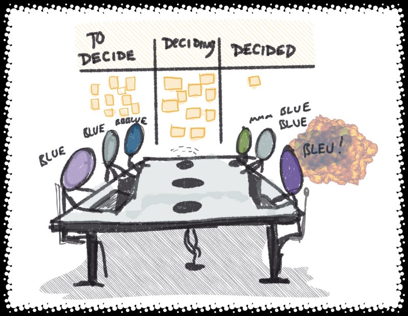

---
path:	"/blog/cost-per-reasonable-decision-cprd"
date:	"2018-04-01"
title:	"Cost Per Reasonable Decision (CPRD)"
image:	"../images/1*Zs8BxzBm9KqCbaF05gXS2g@2x.jpeg"
---

*Note: With the arrival of my son, I’m slowing down on the blogging. Give me a couple months (or more sleepless nights)

, and I’ll be back it.*

What is your Cost Per Reasonable Decision (CPRD) ? What is your Reasonable Decision Throughput (RDT) ?

Consider the **costs**: the email threads, the 1:1s, the small meetings, the large meetings, the meeting prep, the mockups and samples prepared, the time spent communicating the decision, the meetings to rehash the decision (and correct the misunderstandings caused by having so many people involved)…and the opportunity costs of all that time/energy that could be spent elsewhere.

I asked a couple folks to estimate the direct cost of some recent decisions in their companies. The results ranged from $25 to $5,000,000 (not including opportunity costs).

> But this decision is really, really important…OK. What is the incremental value of an “8” decision that takes days/weeks/months (and *lots* of people ) vs. a “6” decision that takes minutes? And are your decisions so *big (and feedback loops so long) *that you’ll be unable to extract yourself early if things are going south, or double down if things are going well? Some decisions ARE like that. Most aren’t.

Another thought, what if you took the $50,000 required to make [some decision] and offered training such that you’d be more confident in pushing decisions down closer to “the work”? Or, spent time to thoughtfully draw boundaries (e.g. “do whatever works, but don’t mess up \_\_\_\_\_\_\_\_\_\_”). Or limited the blast radius of decisions such that the one stinker — you know, that one from last year that everyone keeps fixating on — would stop haunting people.

> But wait, there is keeping people in the loop…and then there is making the decision.If they’re truly just “in the loop”, then why let them slow you down? Email them the decision after the fact. Chance are they are *mostly* just in the loop, but have (or perceive themselves to have) some sort of approval/veto power. Do they have valuable data/context to inform the decision?

> But that one decisions from last year…If your team’s decisions are perfect all the time, there’s a good chance you’re in a low growth, low variability situation. So don’t fixate (availability heuristic). Be honest with yourself … what is *their* batting average” vs. *your* batting average”. On some level, leader’s have it both easier than, and harder than, front-line teams. *Big decisions *tend to take longer to percolate, so it is harder to say “that was a bad idea”. But when things do go wrong, they go *very/teribly wrong. *Front-line teams crash and burn more quickly (and obviously). Cut folks a break. Compare the stinkers to the good decisions, **and don’t assume a bad outcome means a poor decision (luck).**

Perhaps more importantly, have a system in place to learn from past decisions. Lots of companies that freak about new decisions, do very little to learn from past decisions.

> You don’t understand…things are so critical at the moment. We cannot fail.That is a tough place to be in. Maybe fix why you can’t fail occasionally.

> Are you making an argument for top-down decision making? We make great decisions very quickly…something gets lost in translation when it comes to execution, though.Execution is where most of the decisions happen. What you are calling decisions in this case may be extremely high level (more like goals, or mandates). For the real decision battlefield, stroll down and talk to middle-management. They’re both trying to manage up — getting you to make decisions, and/or grant them autonomy — or managing down. Those meetings where you approve the budget once a year…now those are expensive. They’re short for the Cs, but count up all the “prep” meetings.

> Our decision making isn’t the problem… it is STICKING to our decisions.Should a team stick to a decision that stops making sense? And did you have all the data available when you made that decision-that-must-be-stuck-to? In my experience, early decisions lack nuance, testing, and grit. The hand wavy “let’s DO this” evolves into something a lot richer and robust. And often different.

> Have you seen my calendar?How many decisions does your org have in progress (DIP)? Are they all high value? Are you applying leverage to the decisions that will benefit from increased scrutiny? That’s the problem with batching decisions of different value….you tend to treat the all the same way.

> These meetings do go on forever…Focus on making reasonable decisions, reasonably quickly. A big problem here is information. Without data, making decisions seems to take longer (guesses are like that). Data is reliant on feedback loops. Feedback improves with a steady stream of reasonable, smaller decisions. This is (one of the reasons) why annual budgeting and annual roadmap activities turn into a shit-show, especially in rapid growth companies.

> This does not apply to us because we CLUSTER decisions. There’s an economy of scale when you do it this way.But there’s also a diseconomy of focus, and lots of context switching. What would it take to make decisions at the last responsible moment, and in the most responsible context.

> Once we make the big decision, then we’re fine with people going for it…provided we get to quickly review/approve.Is that really worth it, especially if you’ve framed the original decision correctly? Beware of becoming the bottleneck, and also inspiring approval theatrics whereby situations are sugar-coated and over-simplified.

#### **Summary**

Imagine putting all of your decisions on a work tracking board. There would be *some* resemblance to the flow of work in your org. But it might look a lot different. We obviously don’t want fast throughput of crappy decisions. But assuming reasonable decisions, we want rapid throughput of small, safe-to-fail decisions, coupled with focus and attention on the high-level strategic decisions that will set the course for the org for months/years.

Sometimes the $1,000,000 (or $45k, or $10k) decision is worth it. Often it isn’t. Consider the irony that many orgs spend $50k to make a single decision over work that will take two weeks to actually implement and test.

