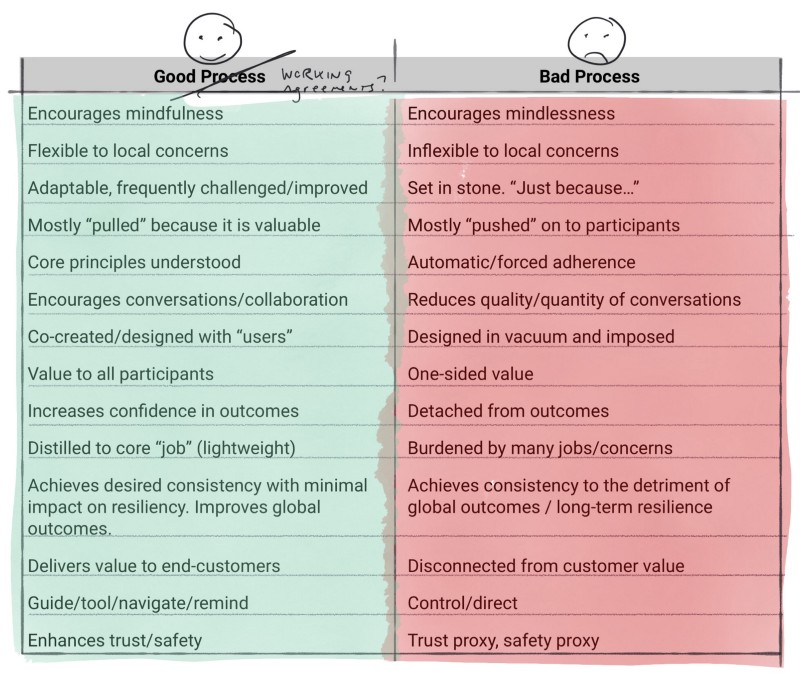

---
path:	"/blog/good-process-vs-bad-process"
date:	"2018-05-16"
title:	"Good Process vs. Bad Process"
image:	"../images/1*5CQd_PwjL3pUiwlWwWGNew@2x.jpeg"
---

Busy with the newborn, but still pondering, [tweeting](https://mobile.twitter.com/johncutlefish), writing some [thinky posts](https://hackernoon.com/beyond-outcomes-over-outputs-6b2677044214) (influenced by the lack of sleep, no doubt), and occasionally doing [short, low fidelity podcasts](https://anchor.fm/john-cutler/)).

Last night’s sleepy list…when is process “good” ?

### Good process (is) | Bad process (is)

**Encourages mindfulness** | Encourages mindlessness

**Flexible to local concerns** | Inflexible to local concerns

**Adaptable, frequently challenged/improved** | Set in stone. “Just because…”

**Mostly “pulled” because it is valuable** | Mostly “pushed” on to participants

**Core principles understood** | Automatic/forced adherence

**Encourages conversations/collaboration** | Reduces quality/quantity of conversations

**Co-created/designed with “users”** | Designed in vacuum and imposed

**Value to all participants** | One-sided value

**Increases confidence in outcomes** | Detached from outcomes

**Distilled to core “job” (lightweight)** | Burdened by many jobs/concerns

**Achieves desired consistency with minimal impact on resiliency. Improves global outcomes. | **Achieves consistency to the detriment of global outcomes / long-term resilience

**Delivers value to end-customers** | Disconnected from customer value

**Guide/tool/navigate/remind** | Control/direct

**Enhances trust/safety** | Trust proxy, safety proxy

