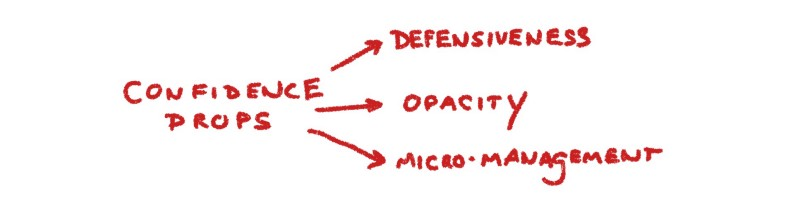
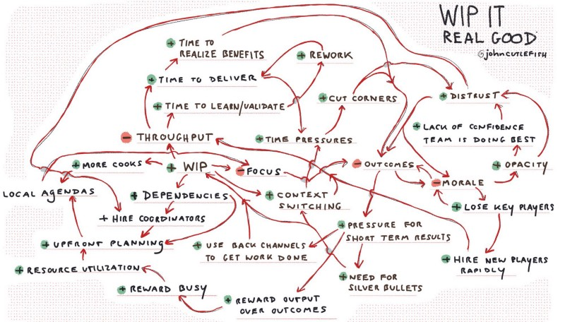
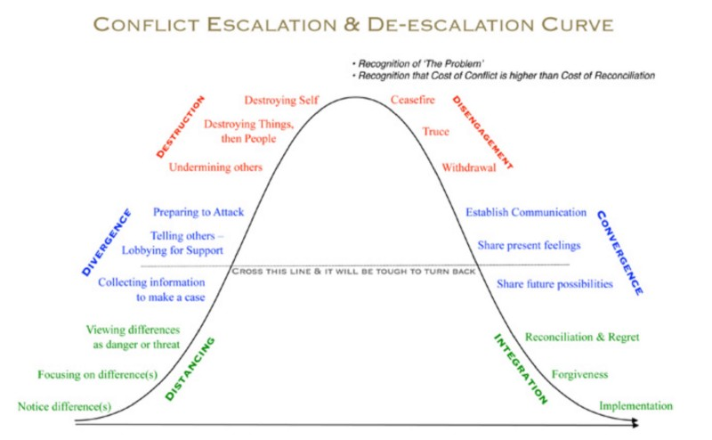

---
path:	"/blog/systems-and-people-behaving-badly"
date:	"2018-05-17"
title:	"Systems and People Behaving Badly"
image:	"../images/1*DA-gDBaAH2DBExlpHMRQgQ@2x.jpeg"
---

*Note: In this post I’m pretty lazy about my use of the words “system” and “systemic”. Stick with me…*

Take a situation like having too much work in progress/process.

That situation can trigger problems.

What starts as a fairly common intuition trap, can end up causing confidence in people and process to drop. When confidence drops, you start to see *other problems*.

These problems — defensiveness, opacity, and micro-management — can feel intensely personal. Taken to the extreme, these are the types of work experiences that cause people to leave companies AND cause people to be let go (or smoked out)

 of companies. So you have…

…a relatively benign and common trap (high work in progress, which frankly is pretty straightforward to address)

 leading to entrenched people issues.

It is in vogue (in some circles) to claim that “most problems are systemic!” And then [mention Deming](https://www.leanblog.org/2012/03/the-cause-of-94-of-problems-is-really/)…

> Deming would evoke disbelief in his management seminars when he insisted that 94 percent or more of all problems, defective goods or services came from the system, not from a careless worker or a defective machine. He would go on to say that to improve an organization’s goods or services, the system had to be improved rather than searching for the guilty worker or broken equipment. Top managers in America’s leading companies were dubious students. But, in almost all cases, when they implemented his ideas, they were surprised to find that they agreed with him: The management and the system they were managing were the true source of both problems and improvements.Which is all well and good, but sort of ignores an important point…**systemic issues can cause people to act in shitty and self-destructive ways.**

I’d argue that left unchecked the people issues become THE PROBLEM. Does it matter that the root cause was high WIP? Maybe if you catch things early enough — hurray for visualizing work and having limits in th first place — but not once the gnarly people issues have become entrenched. It doesn’t matter. Lowering WIP limits will not, in isolation, solve the (new)

 underlying problems. Would this repair a relationship?

> You know all those times I was being a jerk and not trusting you … that was because the high WIP dude. I come in peace. It was the WIP that did it.Probably not.

Does viewing this diagram make it all better?

To some people, yes. They’ll say something like…

> Oh wow, I can see how all these small issues can add up to something super crappy.But not to others…

> So you’re basically saying we’re all fucked.And WE are in the right, of course. What tends to happen is that we absolve our own bad behavior — oh, that was the system — while continuing to blame others for specifics (well, she SHOULD have known better).

> [*Fundamental Attribution Error*](https://en.m.wikipedia.org/wiki/Fundamental_attribution_error)*: The tendency for people to over-emphasize personality-based explanations for behaviors observed in others while under-emphasizing the role and power of situational influences on the same behavior (see also actor-observer bias, group attribution error, positivity effect, and negativity effect).*What you are left with is classic [conflict escalation and de-escalation](http://ftp.iza.org/dp7492.pdf). If we’re stuck trying to punish what we view as shitty behavior in others, then we are liable to take a scorched earth approach (often destroying whatever reputation/trust we have in the process).

> Numerous experiments have shown that individuals are willing to destroy their own resources in order to sanction another person’s unkind or unfair behavior.Our normal instincts to “freeze, fight, or flee” simply escalate the conflict. Peace requires someone to take a leap of faith…

> To attain peace, players use costly signals to communicate their willingness to stop fighting. The most important signal is refraining from any investment in conflict, which implies an almost certain loss of the contest.All this is to say that your NEW systemic issue is a wicked problem involving people behaving badly. Trust and safety must be gradually restored. Fixing the original root cause will not solve the new problem. You must de-escalate, and often in the workplace that involves small acts of collaboration and undeniable value (the “costly signals to communicate [our] willingness to stop fighting”) in the face of lingering — and very real — interpersonal issues.

I’m beginning to think that in change efforts we often don’t explicitly ask for a ceasefire / truce, or call out that the “cost of conflict is higher than the cost of reconciliation”. Doing so AND highlighting the system-level contributors, would go a long way towards a reset and the required de-escalation.

