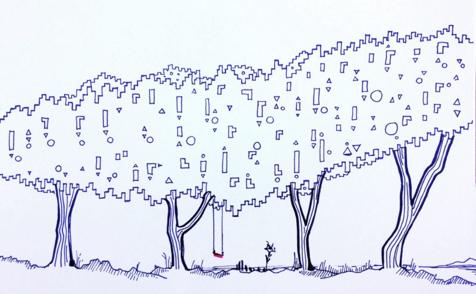

---
path:	"/blog/three-deep-breaths"
date:	"2018-05-22"
title:	"Three Deep Breaths"
image:	"../images/1*asABah2yyJbYSDRzek7Pjw@2x.jpeg"
---

At work (and out of work), we often sabotage our own goals/credibility by letting people get under our skin. I say this from experience. It can be so hard to play the “long game” when you are passionate about moving something forward, or are sensitive to some area of chronic toxicity or coherence (the elephant)

.

Yet I believe we can all be authentic and have integrity *without falling into the trap. *By no means does this mean we should remain in a toxic/unhealthy situation — leave if this is truly the case — but it is all too easy to become *part of the problem* (or at least perpetuate it), and jeopardize what we set out to do. Many stalemates/conflicts at work simply require someone to step back and take the less psychologically charged and observant path. It’s a critical part of leading.

So, when the tension increases…

Pause. Three deep breaths.

Stay confident, curious, maybe a bit detached, observant

Center yourself, both feet on the floor. How did you feel right now?

Notice your internal narrative/commentary. Observe your self-talk.

Buy time…

* “I’ll have to let that sink in for a moment”
* “Let me repeat back what I’m hearing…”
* with good non-judgemental, non-combative questions
Identify “the trap”. “I can feel myself wanting to \_\_\_\_\_ but that will not serve me well in the long run.”

Remember: repeating what you’ve tried in the past will get the same results

How can you be authentic and come from a place of strength (not fear, defensiveness, bitterness)?

Smile. View the situation as a puzzle, game, theater, or surrealist movie. “This is kind of weird!”

Use stories/data instead of theory/logic. Relate questions to your own salient needs.

Rehearse replies but “save them in your draft folder”

Keep asking … “does my response here get me closer to what I actually need/want?”

Worst case… respectfully excuse yourself from the room

What works for you? How do you, to quote William Ury (author of Getting to Yes With Yourself), “go to the balcony” to cool off, reflect, and plot a win/win path forward?

