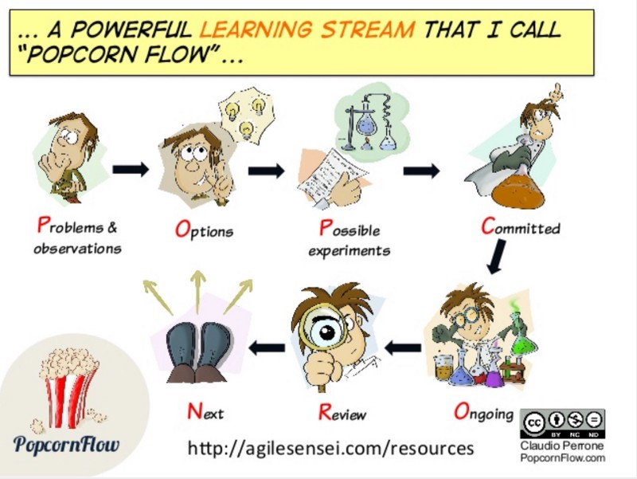

---
path:	"/blog/focused-advocacy-and-improvement"
date:	"2018-06-21"
title:	"Focused Advocacy and Improvement"
image:	"../images/1*hWG3ozz1Shp1_99kHhFpHg@2x.jpeg"
---

Lately I have been doing some team coaching in multiple organizations.

I’ve noticed a pattern and I find it very interesting.

At any given time, there will be a ton of continuous improvement advocacy and experimentation in progress — people hoping to improve something beyond their immediate control. Often there is convergence on a pain-point or opportunity. But…the advocacy (and whatever momentum there might be) is being dissipated through countless small groups discussions, 1:1s with managers and teammates, back-channels, and scuttlebutt. **In short, there *should* be momentum, but there isn’t. There IS consensus, but it is squandered.**

So you get a weird dynamic. You have leaders saying

> we can’t fix what we don’t hear about
> people need to bring us solutions, not problems
> people are asking us to fix shit every day
> we’re listening, don’t they know we \_\_\_\_\_\_\_\_\_…and you have front-liners saying “no one seems to listen to us” and “we aren’t empowered to fix these problems!”

When this loop spins out of control, you get a lot of blame, resentment, and an erosion of trust. When the pain bubbles over, it often does so at the worst possible moment. It also festers.

This gets complicated because continuous improvement work is rarely viewed as “the work”. People have their day jobs, and then they have a whole shadow flow of the work they’re doing to *improve* their day jobs.

Observing this recently on a team (of teams), I would guess that this side-channel advocacy work was occupying between 20–40% of the team’s bandwidth. Now, these problems were *very important and high leverage*, but the efforts were so diffuse and scattered that no one was really making any progress. The return on effort was extremely low (or negative, as the scattershot approach was actually turning off potential partners).

In many cases, there were duplicate efforts, and a lack of sharing/cross-pollination of ideas. The magnitude of the feedback was not fully felt. This meant that when leadership tackled one person’s advocacy effort — solving the problem for Person X — they did so without considering different perspectives, consensus, blast radius, and limiting change-in-progress. The pragmatic approach just caused more confusion.

Finally, the team had a major case of good-idea-ism, and a lack of prioritization. Instead of saying something like “ok, we know this is important to you all, but it simply isn’t the most important thing we can tackle” there was a lot of “oh, that’s interesting” or “yeah maybe” or “let’s set up a meeting for that”. Which, of course, lead to a sense of poor accountability and follow-through. Management was viewed as non-responsive. And the “individual contributors” were viewed as not stepping up. Again, mostly a systems issue that manifests as individuals behaving poorly.

The lesson here is complex because in most orgs there is a very defined approach to continuous improvement on the small-team level(2–8 people). Have a problem? Talk to your team and/or manager! **But, at least in my experience, and in any organization of a reasonable size and complexity, a good chunk of the problems impacting individual teams sit at a more global level.** You can’t simply show up at your small team retrospective and sort it out.

So — and some people disagree with me here — I believe that **organizations benefit from an explicit approach to advocacy beyond the immediate team level**.

The pushback I’ve gotten (from primarily leaders) tends to run along the lines of:

> Well, this is the job of our leaders. We’re listening. We don’t want people to burn cycles on this. The painful stuff will rise to the top. What if we don’t want to fix that right now? We don’t want too much process…this kind of stuff should be spontaneous because we’re a “can do” culture. We don’t want to stop people from building consensus themselves and showing initiative. What will we do if we can’t deliver on the change? How will we hold ourselves accountable? We have no role to own this!The flip side, is the perspective from the front-lines:

> I just want to know how the game works, and get explicit acknowledgment of the issue. I can respect if it isn’t the most important thing, but better do that than send me off on a wild goose chase. I have no idea whether other people even feel this is important…it would be great to know.
> We need some accountability here — for ourselves and for leadership. If something is important to fix, we should focus on fixing that! They say “talk to my manager”, but then how can I be involved in the solution? Or they say “just fix it” without any appreciation of the complexity of the issue, or the clout outside my group that the change actually requires.Here’s my take. I can see the situation from both sides. But does anyone actually benefit from the lack of clarity? We know the impact of churning, back-channeling, duplicate efforts (without a plan to converge on the best option), and low morale. We know the power of autonomy, mastery, and purpose. Those on the front-lines crave some sense of agency and transparency (so does everyone, actually), and some level of “say” (input, at least) into “how things work”.

At a minimum it probably makes sense to make your current model explicit. What should someone do / where should someone go when they have a “problem” or see an opportunity for improvement — at the team level, group level, department level, division level, and company level? How are those asks “tracked” and how is progress communicated? Who works to figure a path forward? Who is accountable?

It might be as simple (and moderately participatory) as: we run an annual employee survey, do X-Y-Z with the feedback, report back to the team, some items are left to employee task forces which you can volunteer for, and the management team holds itself account for a handful of “big” continuous improvement items.

Another approach might be using something like [PopcornFlow](https://www.slideshare.net/mobile/cperrone/popcornflow-continuous-evolution-through-ultrarapid-experimentation) to visualize continuous improvement efforts (and limit experiments in progress). But you still need to fill in the blanks. How do Problems & Observations get on the backlog? Who recommends Options and Possible Experiments? Who decides which experiment(s) to Commit to? Who actually participates in each Experiment? Who and how are experiments reviewed? These details are the details that matter to your team members.

https://www.slideshare.net/mobile/cperrone/popcornflow-continuous-evolution-through-ultrarapid-experimentationThe whole idea here is clarity and focus. And that’s basically my point here: how do you harness your team’s interest in continuous improvement such that it is both rewarding and effective?

