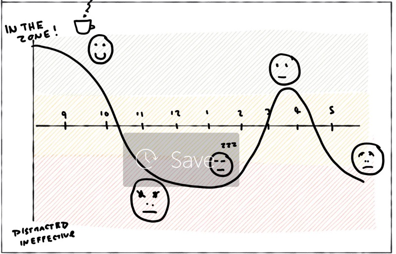

---
path:	"/blog/invest-energy-and-focus-not-time"
date:	"2018-07-10"
title:	"Invest Energy and Focus, Not Time"
image:	"../images/1*xeQWukelbtr7_7ejG_NPVw@2x.jpeg"
---

This is a well known self-help/productivity concept, but it bears repeating in the context of product development.

You frequently find managers asking something along the lines of:

> How are we investing our time?Consider…

* How effective you are when you’re “in the zone” vs. when you’re distracted
* The impact of frequent, unplanned interruptions (e.g. production issues)
* The cost of a cognitively draining meeting
* Achieving a “creative rush” during unstructured time
* Struggling to keep a complex, bloated system “in your head”
* The morale boost that comes with shipping something that has immediate impact, or mobilizing the team around an powerful mission
* The sense of drag you experience while working through poorly organized code
* Solving a problem while on a treadmill during your lunch hour
* The “startup time” when switching to a new task, or returning to a task
* The value of “getting things out of your head” (GTD style)
* The difference in effectiveness between when a team is struggling to find a groove, and when things “click”
It is a lot *easier* to think about investing time. ‪”Energy and focus” are messy. Time feels very concrete, spreadsheet-worthy, and intuitive. However, at least n=1, I would rank my most productive days as at least 10x more effective than my least productive days…and they are both 8hrs long.

My experience says the same is true for teams. The effects are compounded. Low-energy is infectious and sets in motion a cascading effect. Freedom to focus is a catalyst. A meeting after lunch — full and sluggish — becomes a drag.

So here’s a good exercise. Try an experiment. As a team, discuss when you’d like to have a “power hour”. How will you make it distraction free? When in the day should it occur such that energy and focus levels will be high? Shut down Slack. Clear your head before. Don’t be on a super full stomach. Coffee? Maybe get away from the noise in your 0pen-office. Decide on *where* you want to focus this energy…a singular, powerful goal. And…crank!

Now compare that to your run of the mill hours. What was different? How about outcomes? With that experience in hand, now look for other ways to invest flow on what matters instead of raw time. If you’re like most people, your team will only have between 1–3 “shots” of this daily…so use them wisely.

No, you can’t do this all day (you will not have the focus). But you’ll learn more about the difference between investing energy and focus, and time.

