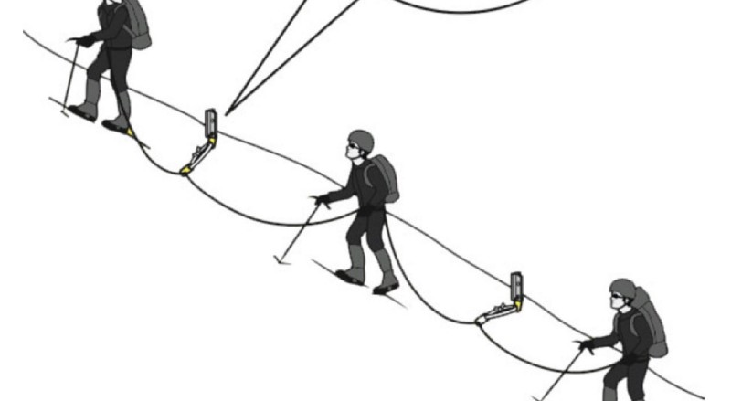

---
path:	"/blog/slack-vs-blocked"
date:	"2018-07-13"
title:	"Slack vs. Blocked"
image:	"../images/1*Ez_JoxGvK5eVMuIpNyKYGA@2x.jpeg"
---

### Slack Definition(s)

**Slack**

1.not taut or held tightly in position; loose.

“a slack rope”

2.(of business) characterized by a lack of work or activity; quiet.

“business was rather slack”

These contrasting definitions sum up my challenge with the word *slack*.

1. Slack as something healthy — a prerequisite to flow and high throughput
2. The fear that “less work” is happening — that workers are “slacking off”
3. Extending #2, that slack is something to be “filled” and avoided
### Slack vs. Blocked

Lacking context, it is easy to confuse the sensation of slack with the sensation of being blocked. This is especially difficult if the “blocker” or bottleneck is somewhere distant (e.g. customer feedback is delayed) or something structural like team specialization, a shifting product strategy, or a change in the technology landscape.

* **Blocked:** You have work in progress but cannot actively work on it (for some reason) OR you have no work in progress but are blocked somehow from working on the highest value work or removing the blocker. You are constrained, even if you can make yourself busy.
* **Slack:** You have no work in progress AND/OR you are generally able to shift quickly to emerging opportunities. You are “not held tightly in position”. You are free. Acting will not leave work “piled up”.
Why is this distinction important? If we mistake being blocked for “healthy slack”, we’re liable to miss opportunities for continuous improvement. The team never addresses the constraint/bottleneck. Institutionalizing the idea that slack is something to control and “fill” just makes matters worse…you’re just chasing a local maximum, and optimizing for busy-ness.

### Slack vs. Blocked Examples

Non-work examples might be helpful here:

**Blocked:** You have a handful of important life goals. Whenever you hit a roadblock, you jump into a lot of “busy work” instead of pushing through. The busy work makes you feel productive (you do get valuable things done) but you’re not addressing the super important stuff. In this case you are blocked.

**Slack:** Now take the healthy practice of not overbooking your day. You find yourself with some “slack” while waiting for a close friend to arrive for lunch. You poke your nose into a book store. A quick check of ToDoIst and your “books to read” project, and you remember a book you’ve been meaning to buy. You buy it, and head off to your important lunch.

And work examples:

**Blocked:** A team is thwarted by dependencies and a clumsy deployment pipeline. Instead of swarming to address those issues — the org frowns on teams “overstepping team assignments” — they take on new work and amass a large batch of work to be deployed. From the outside they appear highly productive. Tickets are “moving quickly”. But this obscures the fact that nothing is actually getting to customers.

Another variation. Teams “build around” the bottleneck, adopt untested technologies, and do whatever it takes to keep moving forward. Sure they’re busy, but they’re working around the blocker.

**Slack:** A team makes a conscious effort to reduce batch size and deliver value continuously. Often this involves opting for efficacy over perceived efficiency. When there is a lull, they do less structured (and much smaller chunks of) work, as well as self-directed learning and side projects. This leaves them ready to respond instead of being “locked in” by a new effort.

### Small Stuff Backlogs — Slack Mopping

Teams often establish “small stuff backlogs” to address the case of being temporarily idle (e.g. tests to write/fix, UX debt, tweaks). Grab something small off the queue! This is practice is perfectly fine except for a key gotcha. If you are blocked, shouldn’t you be working to remove the blocker? Easy access to busy work can distract teams from addressing the blocker.

In short…consider whether you are truly slack.

### The Work

A closing thought. Above I am referring to people being blocked (or busy, or slack).

If we focus on the work, not the people, the terms take on new meaning. When work is blocked, it doesn’t matter whether people are busy working on other things. Slack is healthy as it lets us be more responsive to *the work*. So by (for example) doing a standup by “walking the board” — going item by item — we may get different results than by going person by person.

