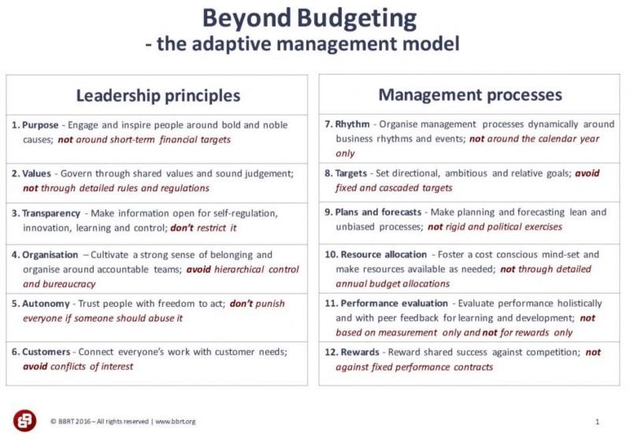

---
path:	"/blog/why-some-tool"
date:	"2018-07-15"
title:	"#Why[Some Tool]"
image:	"../images/1*q6Zc8LtOD-M_BhFbHu_A3w@2x.jpeg"
---

I was having a heated discussion with someone recently about story points. It was one of those standard “that’s not the fault of story points” arguments that goes nowhere. I realized a very common pattern — one that I have found to signal an opportunity for “refactoring” common approaches. It is age-old…basic decoupling and separation of concerns.

#### The Question

With every process, tool, methodology, and framework you adopt…ask:

> What job(s) are we hiring [the thing] to do?**List them out.** What you’ll find, is that you are frequently asking [the thing] to do more than one job. Let’s take a simple example: story points.

#### Example: Story Point Jobs

1. Estimate duration for a project
2. Keep track of progress towards a bigger goal OR deadline
3. Know how many stories to “pull” into a sprint
4. Calculate some sort of productivity metric (e.g. velocity)
5. As a catalyst to discuss complexity and encourage story splitting
6. Support a team in making a time-boxed commitment
7. As a commitment “carrot”
8. Assign workload to different categories (e.g. “lights on” vs new features)
9. *A couple more I’m forgetting*
#### Ask More Questions

With these jobs explicitly described, take a step back and consider the following for **EACH JOB**:

* **How does the job provide value to the company?** You’ll find yourself saying something like “it helps us do [some **other job**]”. How does that *parent* job provide value to the company? Keep going — from job to parent job — until you hit something core and fundamental. **Map this out**.
* **Is [the thing] (story points in our example) the best tool for each job?** Are there better/safer/leaner/more graceful/more resilient tools for that ***specific job***? How do other companies sharing your context/domain solve for that job? What about potential disruptors to your industry? You should have no trouble listing 3–5 alternative approaches to get the same outcome. If you’re experiencing trouble listing alternatives, consider applying this question to the parent job (see previous bullet).
What did you learn by doing this exercise?

#### Typical Realizations…

Asking these questions tends to expose the following:

* **There are better approaches when considering individual jobs and when mapping jobs to core needs.**
* **We overburden single jobs/tools**. Typically, the tool does one or two things reasonable well (hopefully), and a bunch of things not-so-well.
* **Multiple jobs cause confusion**, especially among the users of the tool. “Why are we doing X again? Is it working?” It becomes impossible to have a reasonable conversation about benefits.
* **Multiple jobs make it difficult to “refactor” the tool/process.** We can’t improve one job, without swapping out the whole tool/process.
* **Often, teams are just adopting something “just because”.** Because…they used it elsewhere, they have experience with the tools, they read a blogpost, or some consultant told them to do X. They’re not really thinking the core job through.
This tweet from David Nicolette captures another potential issue:

> Once [the tool] becomes a “best practice” it is common to mash together all of the jobs and lose sight of why [the tool] was found valuable in the first place. Very rarely do we discuss “best practice for \_\_\_\_\_\_\_\_\_\_\_\_\_\_ and in [some context]”.

Back to story points: what job do they exceptionally well? In what context?

#### Separation of Concerns

The direction I’m taking above is likely very familiar to you already (especially if you are an engineering or designer). Some refer to it as **Separation of Concerns**:

> Separation of concerns is an important design principle in many other areas as well, such as urban planning, architecture and information design. The goal is to more effectively understand, design, and manage complex interdependent systems, so that functions can be reused, optimized independently of other functions, and insulated from the potential failure of other functions. ([Wikipedia](https://en.m.wikipedia.org/wiki/Separation_of_concerns))A great example here is [Beyond Budgeting](https://bbrt.org/). One of the core ideas of Beyond Budget (listen to [this great podcast with Bjarte Bogsnes for a great overview](http://www.bosslevelpodcast.com/bjarte-bogsnes-and-beyond-budgeting/)) is that traditional Budgeting is overloaded and suboptimal. It actually services ***three distinct jobs***:

target setting, forecasting and resource allocation.

* Target setting
* Forecasting
* Resource allocation
Beyond Budgeting addresses these needs/jobs (and sub-jobs) **individually** as described in this great slide [by Dr. Peter Bunce](https://www.slideshare.net/mobile/LESSConf/the-beyond-budgeting-principles):

What I find personally amusing with this table is the degree to which words like “accountability” and “planning” ruffle feathers in certain circles (e.g. Agilists)

. But when you dig down to how Beyond Budgeting addresses those needs, you realize that the needs are foundational — it is the dominant/legacy solutions to those needs that feel dysfunctional and out of date.

#### So What?

The key idea here is that approaches (frameworks, tools, methodologies, etc.) doing *multiple jobs* are an opportunity for innovation and refactoring.

In situations where [some way] is being abused or failing to live up to its potential, I often find [the way] being overloaded and hired to do too many jobs (when there are better approaches to solve for individual jobs). In the case of something like story points, there are specific things they excel at, but they come with a ton of unnecessary baggage. Or another example: “we need deadlines for accountability and engagement” might signal the question “how else might we encourage accountability and engagement” without the mess of jobs that come along with deadlines.

Many people never question the Why behind the tools they hire.

“Just because…”.

Innovation happens when we figure out how to fulfill the same need in a new, lighter, safer, and more “agile” way. Saying #No\_\_\_\_\_\_\_\_ fails to acknowledge the core need. Saying #Why\_\_\_\_\_\_\_\_\_ unpacks the job-to-be-done, and considered alternatives.

