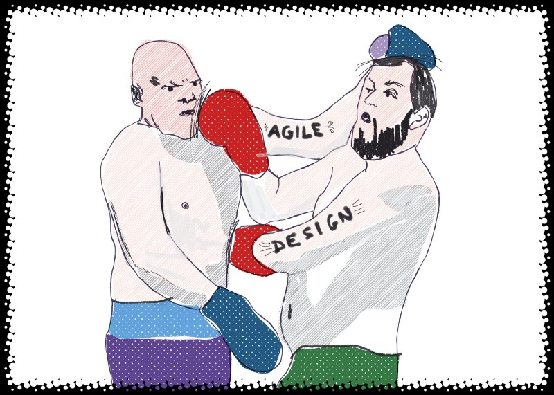

---
path:	"/blog/is-agile-the-enemy-of-good-design"
date:	"2018-07-28"
title:	"Is Agile the Enemy (of Good Design)?"
image:	"../images/1*pUltUFND1ZZBMzHGt6cvlQ@2x.jpeg"
---

### Integration

To have this discussion, we need to first talk about Integration. Integration is…

> an act or instance of combining into an integral whole.Frequent integration helps humans solve problems more effectively:

* You and I are lost in the woods. We agree to fan out, explore, and periodically return to an open clearing to *integrate* our findings (e.g. I found water, you found shelter).
* A teacher conducts a weekly quiz. The quiz doesn’t count towards the final grade, but it is meant to *integrate* things on a couple levels: 1) to reinforce the prior week’s learning, and 2) to “test” progress to inform future lessons and signal weak spots. The quiz helps us “bring things together” and “know where we stand”.
* IKEA designs integration into how its furniture is constructed. You can hit temporary dead ends while assembling IKEA furniture (if you botch a step), but it is virtually impossible to “get to the end” with an improperly assembled item unless you get very creative.
* A mountain bike designer assembles/fabricates a pre-production prototype and goes for a test ride. The test *integrates* a number of design decisions with the reality of the trail.
* A team of five attempts to periodically integrate their various contributions to the project and “see if it all works together”. A team of designers meets regularly for a [design crit](https://uxplanet.org/things-you-should-know-before-going-into-a-design-crit-65e7dcc80ff5) “to make sure the rationale behind their designs is solid and convincing.”
Simply put, integration reduces risk and helps us solve problems. It’s universal.

### Agile and Integration

Here’s a potentially helpful thought for UX trying to figure out Agile.

Like many of the approaches to design you know and love, **Agile is fundamentally about frequent integration. Self-organizing teams, working directly with customers, retrospectives, daily standups, sustainability, the focus on “working software” and quality, and working in small increments all encourage more frequent integration.**

There is a key difference with software, however, and this difference is worth exploring. I recently described Lean and Agile to a footwear designer friend. She remarked:

> This sounds kind of like how we design shoes — working closely with engineering, coming up with prototypes, trying them, refining the designs, and getting them ready for production. Designers designs the shoe — some are less technical and just have a concept and a sketch, while others are more technical. Designers pick the materials. The Director of Materials finds and sources materials. Engineering is concerned with fit, cost, margin, the ability to manufacture the shoe, quality, and construction.Sounds kind of familiar. The difference is “ready for mass-production”.

Shoes are iteratively designed, and then mass-produced. Some attempt this model with software. A designer can design and assemble a prototype, periodically expose the prototype to users, progressively refine it, and — when they’re comfortable with the design — hand off “the design” to engineering for “building” or “producing”. That process involves integration, but at the hand-off the integration is *partial*. The prototype is “missing the guts”…it’s like a building with no HVAC, no plumbing, no electricity, no other building tenants, and no structural integrity.

**Unlike the pre-production shoes that can be worn for a trail run, the software prototype doesn’t truly “work” yet. “Coding” is software design. Code is the “design” ready to be “built” by the build server (repeatedly). So without code, the design is incomplete.**

Now, this *may* be fine. Learning (and partial integration) has happened, and the learning is reasonably valuable. Lots of agencies work this way because their customers want to see “exactly what it will look like”. But you incur a couple familiar risks by taking this approach:

* Premature convergence
* The design is not technically feasible
* The design phase encouraged a “big batch”
* The prototype “tests well” but fails to truly meet user needs
* You miss opportunities to deliver value (and learn) earlier
* You miss opportunities to engage engineers early in ideation
* The end product does not fully leverage what is technically achievable
### Brass Tacks

And here is where we get to brass tacks. In theory, Agile is supposed to address those risks. But Agile — like many other things in cut-throat business — is often no match for the universal threats of output fetishism, success theater, and cutting corners. Trust me…these predated Agile.

My software product designer friend explains:

> Given a choice between big design upfront and trying to work in the Agile way, I will always opt for big design upfront. Why?
> **The stuff you’re talking about rarely happens.** It is all about “ship, ship, ship”. We don’t pivot. We don’t refine. The product owner just wants to mark it done in Jira. The MVPs are an excuse to get crappy stuff out the door. I guarantee that if I am methodical with my prototype testing, I can come up with something better because I will expose it to users. Not AS great as doing it the perfect Agile way, but better than nothing. I mean I struggle even to do usability testing. **So you know…yes in theory all that is good, but it doesn’t happen.**Her point about MVPs is spot on. They’re sold as a way to learn, but in practice teams are accustomed to shipping that thing QUICKLY and with LOTS OF CUT CORNERS, and then being told “it’s fine, let’s move on!” Perfect example.

### Agile for Designers (In Theory)

In theory, Agile-inspired patterns should be an incredible asset to designers. You can work iteratively and get stuff that works (without breaking) into the hands of customers. The “first pass” can be rough and focused primarily on key research questions. With subsequent iterations, the “thing” comes to life with greater fidelity and polish. There’s no requirement to release to *all* customers — a closed beta will do — but the nature of software lends itself to rapid iterations and refinement. It’s more like service design and running an restaurant than designing things for mass production. The food isn’t fake, and neither is the service…but you keep refining.

Importantly, there are no rules against more holistic thinking…rather you’ll just chip away at that big holistic blob more iteratively (similar to how you address architecture in an Agile context). Teams are grateful for the big picture.

### Agile for Designers (In Practice)

So that’s the theory. In practice, Agile patterns can be used to “ship” mediocre product very quickly, or amazing product relatively quickly. Cut corners can be cut faster. Opportunities can be seized and exploited faster. It’s a bit of a black box with some forcing functions to encourage frequent integration.

Designers often believe that:

* Designers should “define and design” and engineers should type/build/construct
* Without designers to act as crap-cop, engineers will make a mess of things
* There’s no place for deep, creative, holistic design work in the context of sprints and working alongside software developers
* Agile — because it wasn’t designed by designers — must be somehow biased against the needs of designers (and users)
* Agile is structurally output focused, and encourages the feature factory
* Agile encourages small and uninspiring thinking and ends up drowning teams in incrementalism
* “Tech” tries to rule the show, and holds the cards, and that design must defend itself in order to do great work
A lot of angst there.

### Agile (The Enemy, Or…)

In short, Agile is the enemy. Said one design friend:

> I find that agile however it is defined in practice is 100% of what I’m fighting to make design effective in the orgs I work for/with.To which I responded:

> Tell me more. Because in my work it is traditional views of middle management, proxy metrics, success theater, MBO, output fixation, short-termism, lack of measurement, traditional finance approaches/budgeting, individual vs team focus, short job tenures, lack of psychological safety, and push vs pull mindset. Nothing to do with Agile.And another designer concurred:

> Let’s stop beating a dead horse to death. The enemy of both actual agilistas and the UX/design community in 2018 is, as John points out, short-term, output-centric thinking driven by a focus on short-term financial results, and all the cultural ramifications of this mindset.I’m biased. I agree.

### Now What?

So where does this leave us? Designers have a right to be concerned. At least with waterfall no one prematurely yells “ship it” in the middle of the project. Designers have time to work instead of trying to jump on and off the sprint conveyor belt. And because the “thing” is built in a big batch, they have time to tackle the design problem holistically right from the beginning. “Good” waterfall beats abused Agile any day.

> “Good” waterfall beats abused Agile any day.So what can you do? I see two broad approaches:

1. Retrenching
2. Upping everyone’s game
**Retrenching** involves advocating for processes that put design permanently upstream from the software developers (the old design then build). In an environment etrenched in an output mindset, this is not a terrible idea. Good design can happen. The developers may even prefer this as moderately good design beats crappy design any day.

**Upping everyone’s game** is tougher. It involves…

* Embracing what is possible with frequent integration
* Fully embedding on cross-functional product development teams.
* Advocating for good design in the context of cross-functional teams.
* Advocating for an iterative approach that benefits users (not stopping once the tests pass, and management asks to jump to the next project). Outcomes over outputs.
* Facilitating co-design activities with software developers and other stakeholders.
* Limiting your “upstream” work — choosing instead to work alongside other team members and take the journey together.
* Inspecting and adapting alongside your team members, and tweaking your working agreements and process to yield the best outcomes (and happiest team members) possible. As a designer, you can probably help in this regard.
### Conclusion

In closing, I’d like to share a personal observation. The only way to battle short-termism and the urge to cut corners is to show great results. Without a sense of outcomes, any way of working will experience a “drift into failure” and falling back into an output fixation. Any “better” way of working is ripe for abuse.

I think that designers are uniquely qualified to “up the game” of product development teams by doing great work, and helping everyone become a (slightly) better designer.

As for designers hating Agile…I’d offer that Agile represents some patterns that “worked” at some point (and in some context). I’m sure designers can relate to drawing from multiple traditions to figure things out. The focus on frequent integration is hopefully familiar. With Agile, the key is leveraging those frequent integrations for good, not mediocrity.

