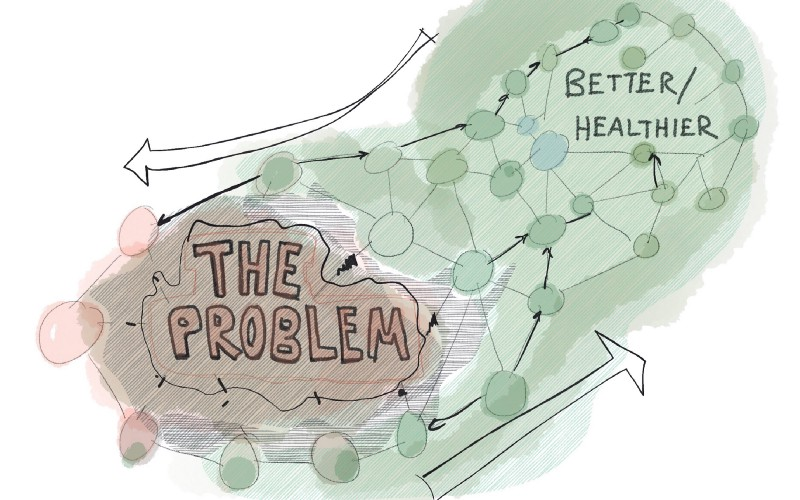

---
path:	"/blog/your-org-problems-are-not-unique"
date:	"2018-08-02"
title:	"Your Org Problems Are Not Unique"
image:	"../images/1*u0qf-AdDcG3yCXVFVX9KGw@2x.jpeg"
---

#### But that doesn’t make them easy to solve (except on paper)

For a while now, I have been waiting to encounter a *unique* organizational problem…something that, after a couple hours of research, one couldn’t generate a list of promising (and relatively safe) interventions. No luck. Not one problem. The knowledge is out there for the taking.

Which got me thinking. Pondering…

The pattern I keep noticing in organizations is that there is a battle for who controls continuous improvement. This battle is fought vertically, between layers of the org hierarchy, and horizontally between departments, functional groups, factions, etc. **So change isn’t so much about *what* to try or deciding whether something is broken, but rather about *who* controls (and gets credit for) for trying to fix it.**

My friend works at a public company with a “15 year old, industry lagging approach to production”. The solution (to get from a 2 to 7.5) is out there for everyone to see, but progress has been held up for five years because “the head of engineering and the head of product have very different views on how to solve this.” Again, we’re talking meat-and-potatoes, block-and-tackle type interventions…nothing groundbreaking or what could be called *innovative* by any stretch.

Nonetheless, the problem goes unfixed. Why? She explains:

> At this point, admitting the problem is easy to fix is too politically difficult. It has become about winning, and finger pointing. They both battle to get the CEOs ear. He knows they’re both at fault, but he can’t exactly fire them both. That would cause a major disruption and somehow we keep hitting our numbers. The longer we wait, the more entrenched the problem becomes. It has gotten to the point that their reports are bitter across the isle as well. It’s a mess.Of course, the naive me suggested a large-scale kaizen event to bring together the front-liners and chart out a way forward. Common sense. Let the people closest to the problem work it out. “Not going to happen! We’re too siloed, and that’s manager work, not worker work!” Doh.

I see this pattern over and over…being able to trace the root-cause for chronic (but on paper straightforward to address) organizational issues back to key conflicts over change on the upper-management/senior level. This is not to say that there aren’t problems everywhere (there are, of course), but that the issues that stick around, and have a large blast radius, tend to be have intractable deep roots “higher up”. The easy/local issues get knocked out. These tough issues remain, though often manifesting as recurring problems on the front-lines.

These front-line symptoms are the “no-brainer” problems that defy fixing. If they haven’t been fixed yet…well, there’s something deep and dark holding the problem in place. The problem is not *the problem*.

When teams approach continuous improvement, they are advised to “focus on what the team can control or influence” In today’s complex org structures, there is often very little that a team can *completely control*. Which leaves influence. Influence starts to crawl up the org chart, and enevitably hits these stubborn chronic challenges: core-conflicts over who will own and dictate a change.

The convenient narrative is that “our problems are unique”. They typically are not unique. But that is a lot easier to process than “we have these irrational, messy human issues that make it hard to solve problems that are easy, on paper, to solve, and that we opt to keep everyone around because somehow, something works and outweighs the bad **** so we keep the status quo in place.”

To the front-liner it may feel “totally irrational and petty”, but again the roots run deep.

It isn’t until something structural changes — someone leaves, perhaps — that suddenly the no-brainer solution is tried, things work, and you have a bunch of bitter people wondering why their advice was never headed. Hint: it had nothing to do with the How.

Anyway. I find that change agents are often too rational. It isn’t about best practices or common sense. Dismissing these issues as overtly political or petty do not advance your mission. You’ll have to work with these tensions, but likely will not be able to “take them head on”. Only one person can do that, and it is likely the CEO (and they may be a part of the problem). Instead, consider creating a non-threatening positive attractor that effectively neutralizes the conflict, while providing an avenue for everyone to participate in the progress/success.

