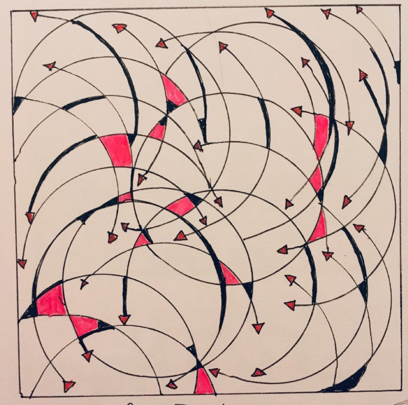

---
path:	"/blog/the-tribe"
date:	"2018-11-20"
title:	"The [?] Tribe"
image:	"../images/1*N9vls-bAXmhTHWYFUXWk5Q.jpeg"
---

There’s a tribe out there that is hard to pin down. We…

* are the puzzlers, makers, designers, crafters, entrepreneurs, and change agents
* Believe the real *rockstars*, mini-or-10x-anythings are supporting our teams
* reject the “feature factory” and shipping for shipping’s sake
* see lasting value and meaningful learning are the key units of value
* embrace minimalism and pragmatism — “maximizing the amount of work not done”
* work to positively impact everyone in the ecosystem — the team, community, customers, investors
* thrive in cross-functional teams, in all their weird, geeky, and diverse glory
* embrace uncertainty. It’s where opportunity lurks
* can’t be boxed into an org chart (or titles), and routinely challenge professional stereotypes
* work best when we have direct access to users, customers, and data
* understand that all ways (e.g. Agile, Design Thinking) are *necessarily* incomplete
* use “just enough” process, and not more…always seeking minimalism and flexibility
* seek out best practices, but know they’re just a beginning. We borrow liberally
* work to up-level our teams — coach, mentor, teach, speak, pair, and run book clubs
* invite instead of impose, show instead of tell
* work to build trust and psychological safety on our teams
* above all, stay curious, stay humble, and keep learning
I don’t know what to do with this observation…other than just putting it out there! Systems thinkers? Passionate makers? Again, hard to pin down…

