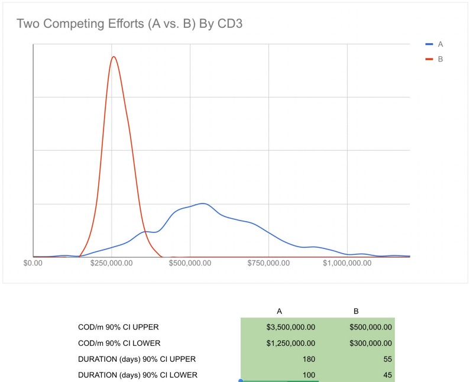

---
path:	"/blog/certainty-theater"
date:	"2018-12-09"
title:	"Certainty Theater"
image:	"../images/1*qOdlhBAjvlgbIUayhPbBoA.png"
---

We often reward Certainty Theater (a not-so-distant relative to [Success Theater](https://link.medium.com/A6cWDWa7uS))

.

I remember when a CTO asked me for a more detailed, s[olution-oriented roadmap](https://hackernoon.com/keep-features-off-your-roadmap-b14543340881). I resisted. He asked repeatedly. I finally caved and spent twenty minutes sketching out a dozen ideas based mostly on gut feel. “John really nailed this! He has a super clear vision. We need to start on this in Q2!” Ooof…not my best work. I was participating in Certainty Theater.

Why did I resist? Because I knew the [opportunity](https://medium.com/@johnpcutler/opportunity-vs-intervention-64611e6835f2) was lucrative…and that the company would deliver better outcomes if a cross-functional team of designers, developers, and customers [started together](https://hackernoon.com/start-together-finish-together-5b47ca1209b3) (including further exploring the problem). If I committed to that big batch of prescriptive work before we started together, we’d miss out on all sorts of opportunities to make better decisions. Why did I cave? Well, he was a senior leader, and I also carved out “space” to do what I wanted for a while.

He wasn’t being malicious. The idea of holding off seemed like bad business. He wasn’t comfortable with that level of uncertainty, and hadn’t experienced the upside of starting together. To top things off, his team was under a lot of pressure to “deliver predictably” and also had to juggle a lot of competing requests (which necessitated [playing Tetris](https://medium.com/@johnpcutler/stop-playing-tetris-with-teams-sprints-projects-and-individuals-b1e4ed6d8bc0), which necessitated more rigid plans).

You notice this pattern of rewarding certainty all over organizations. “Bring me solutions, not problems!” Annual budgeting and inflated plans to “get the headcount”. The “solid roadmap”. The persuasive pitch. The startup that’s “killing it” (but not). Delivering “predictably”. New executives are asked to dream up a plan in 60 days and “execute”. “Getting ahead” of the work. 4 business days to plan the whole next quarter. Pitching a new product vision to aid in fundraising. The “crystal clear mission”.

I’ll always remember this bit of career advice given to me by a friend of the family (a person who had survived the nasty politics of an organization for 20 years):

> John, it is almost better to execute perfectly on a predetermined plan than to appear to waffle. If you do, and it doesn’t work, you’ll be known as someone who executes, but just ran into bad luck. Better to be naively decisive.Is that true? Perhaps. Maybe that is the root of it. Often it is unintentional…ignoring the base rate, falling for confirmation bias, and a host of other gotchas. Consider that some high % of product development efforts fail to materially drive customer/biz outcomes. Do we start each kickoff with a reminder that “there’s a 20% chance we’ll make a big difference here!”

Take this example of two competing efforts — one that represents a big opportunity (with 1–3x range), and could take 100–180 days, and one that is a “certain” 45–55d, and a more certain opportunity size.

We’ll often pick effort B because we’re lured in by that certainty. A is the better choice. We’re not rational actors, and our organizations are not necessarily optimized for global outcomes/benefits.

The challenge is that in some contexts certainty is 100% warranted and expected. It’s possible to find a precise answer and plan things to the T. Yes, your new laptop was provisioned and at your desk in under 24hrs. Yes, the event happened at the right place/time. Yes, we hit the quarterly sales goal. In these situations, someone who can’t be certain, and deliver certainty, isn’t doing a great job. But in many contexts that isn’t the case — software product development being one of them. At any given time, one company will be operating at many points along the spectrum, which puts a big burden on how things get communicated as there’s no one-size-fits-all approach.

Leaders/managers frequently make the mistake of glossing over uncertainty because they are concerned that people will be demotivated. What they miss is that people DO crave certainty in some things (like keeping their job, that their work is making a difference, that they’ll get opportunities to learn/advance, and that they’ll get access to the right tools-of-the-trade), but that doesn’t mean they crave certainty in all things. Take my example. The opportunity was, with a high degree of certainty, the right thing to focus on (inspiring and purpose-driven), but the precise interventions were unknown.

Communicating about uncertainty with certainty is learned thing. I’ve found that people respond to a crystal clear delineation between the known and unknown. They appreciate data when it is available but not “made up stuff”. They want to see that you tried and that there’s some coherent rationale to the risk/bet you’re proposing. Perhaps above all, they want to know that you’re taking some of the burden for the uncertainty, and not just foisting it on them. It’s about a coherent explanation. For product development teams that can be about crafting a bounded “game” / experiment that holds water, instead of just leaving things “open ended”. **They want structure and rigor, not certainty (if that makes any sense).**

I’d extend that to pitching a startup. You can pitch your excitement for solving a compelling problem while conveying that it will likely take a couple tries to get to make progress.

That’s about it with this post. You get the idea. How do you foster productive discussions about uncertainty that 1) don’t end up in analysis paralysis, and 2) don’t end up making you appear “weak” or “unprepared”?

