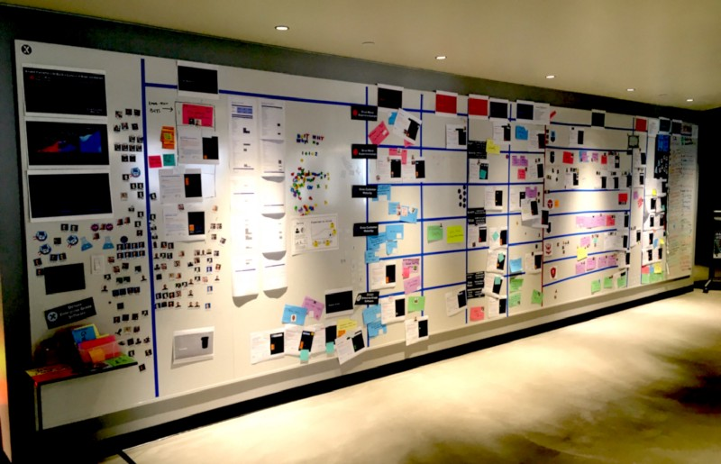

---
path:	"/blog/visualize-flow-at-a-higher-level"
date:	"2019-01-22"
title:	"Visualize Flow at a Higher Level"
image:	"../images/1*16lpIRrABaTVdL0DSl35zQ.jpeg"
---

In my experience, you almost always find more dependencies between teams than we initially see/acknowledge. One common trap is imagining only “the work” and ignoring planning, “upstream” problem decomposition and exploration, reviews, hiring, and [a host of other things].

Another trap is missing the “downstream” activities like marketing, releasing, training, supporting. Yet another trap is side-stream reactive work entering the system with little notice. On paper you can have “self organized and autonomous” teams but in reality have anything but.

How do you get here? 1) Everyone complains about not being independent, so you 2) create a new structure that in theory makes everyone autonomous, but 3) the core reasons why the dependencies existed haven’t changed. You’ve actually further obscured the problem. These newly formed structures crank up their own inertia, boundaries, and interfaces. Inevitably you find human load balancers navigating the old dependencies. And these newly “independent” groups just work around the old issues … even further confusing the matter (because things feel, on the surface, to be different).

Scrum’s laser like team focus is a feature, not a bug. But in any org with >8 ppl you have to tend to the broader system (which is almost certainly a greater impediment). The danger is obscuring this. On a couple occasions now I’ve found that the actual “blocker” was the CEO’s rate of decision making, and desire to get involved in minutiae. That will be hard to address in a team-level retro, and will be impossible to “see” unless you visualize everything.

So the lesson is always visualize work more broadly / at a higher level than you initially think necessary (left, right, up, down). Because we *tend* to obscure this accidentally and with the best of intentions. Focus here will be fruitful (albeit probably uncomfortable). A secondary lesson is don’t just visualize “the work”. Consider all the promises in progress and try to radiate this information so the team can inspect/adapt.

[Keith Nottonson](https://www.linkedin.com/in/keithn) amazing work at Optimizely