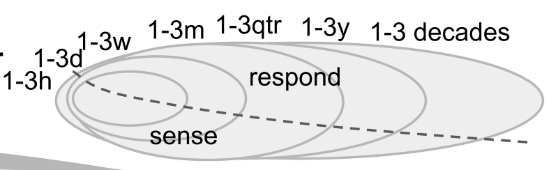
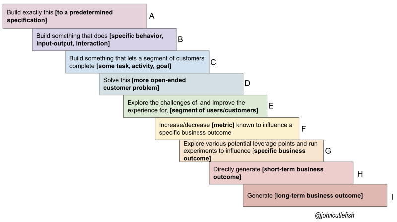
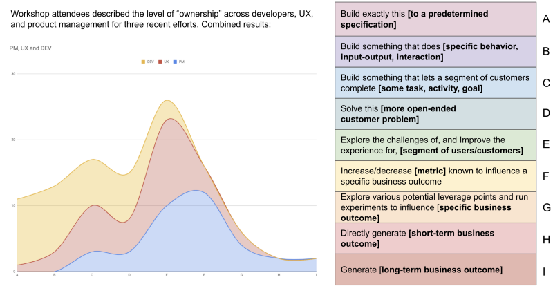
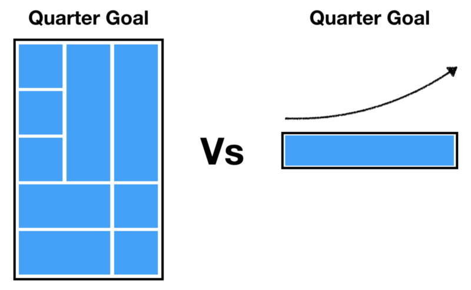

---
path:	"/blog/working-fast-and-slow"
date:	"2019-06-11"
title:	"Working Fast and Slow"
image:	"../images/1*6Xtxci56D_M7k9D6WIHYxQ.png"
---

#### And the beautiful mess of product development…

I was chatting with a team recently and an engineer said something that really made me happy:

> We know something is working when we spend longer on it, instead of shorter.Her team was delivering into production daily/weekly. They could have easily bragged about how “quickly” they “move things to done”. But she didn’t. Instead, the engineer pointed out that when they’re in the groove, learning quickly, and having an impact, they tend to *keep working* instead of just jumping to the next thing. The “it” in “spend longer on it” was not a feature or project. Rather, “it” was a more compelling and overarching mission.

The engineer’s observation exposed one of the complexities of measuring [cycle/lead time](https://leanandkanban.wordpress.com/2009/04/18/lead-time-vs-cycle-time/). Say I have two efforts:

* **A:** Long-running initiative (12 months) with hundreds of small enhancements, and numerous opportunities to pivot/proceed
* **B:** A two-month, single larger-batch effort
Where do we draw the line? We could draw a box around something like “new capabilities” or “user-facing improvements” or “business epics” or “something the business will value” or X…but on some level we are always dealing with an intricate nesting of bets. Apples-to-apples comparisons are very difficult.

To what degree does thinking about “time to fulfill an order” actually reinforce dated notions of R&D as ticket/order-taker, especially in Software as a Service where we are constantly refining how we deliver value?

Bets can take many forms. Bets are small and large. Bets are risky and safe. Some games can be bet on incrementally (after the horses have left the gate). Some can’t. Some bets are small, but take a long time to unfold/mature. With other bets we know immediately if we’ve won. Often, risky exploratory bets are followed by more prescriptive and certain bets. And…to top it off, bets are nested and related (time-wise, impact-wise, etc.). At any given time we have 1–3 hour bets linked all the way up to 1–3 decade bets.

In my workshops we look at this spectrum of work — the operative point being that work is typically happening at all of these levels concurrently (and sometimes sequentially in the example of a discovery effort followed by more prescriptive work)

:

Often, where people “operate” differs in terms of role…but it is all connected. Here is sample distribution by role (pulled from a workshop in Thailand)

. Apologies for the small legend … orange=developers, red=UX, blue=product managers.

Hopefully you get the idea. All connected. All happening at the same time.

I know someone will reply here and tell me about a perfect work-item distinction they use in their company, and why measuring cycle-time and lead-time at that level is great. All I ask, is for you to consider the interrelatedness of it all. In session after session I keep coming to the same two conclusions:

1. What matters is coherence and shared understanding…being able to link the narrative between bets
2. Often, efforts to simplify this beautiful mess just distract us
This is why story-point velocity, in my opinion, is a faulty metric, but that measures of rapid learning. rapid experimentation, impact, and rapid integration are helpful. A VP of Engineering friend of mine shortens a team’s sprint to one day when they’ve had trouble working small. Is this one day cycle time? Did they suddenly improve? Good question!

The irony is that if we evolve product teams to where we want them to be…we’ll actually be less, and less able to identify “chunks” of work. It becomes more continuous and adaptive.

In this example, do we calculate avg. cycle time using all the prescriptive work in the leftmost quarter goal? Or the three month series of experiments (as part of a single mission) to move the quarter goal on the right?

In closing, a team handling tickets with an SLA will find a lot of value in cycle/lead time (e.g. “we handle 95% of tickets between 8 and 12 days”)

. And, I do believe that keeping track of cycle/lead time for work at different “resolutions” can be very helpful. But I recommend resisting the urge to oversimplify. Because when a product team is truly aligned around an outcome, it becomes harder and harder to tell a simple story to explain why they are successful…

> We know something is working when we spend longer on it, instead of shorter