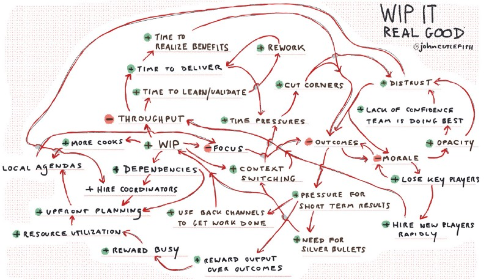

---
path:	"/blog/the-system-bites-back"
date:	"2019-06-18"
title:	"The System Bites Back"
image:	"../images/1*8BvCldlQu1m1LeriLsBcpA@2x.jpeg"
---

One of the thorny challenges when attempting to improve a system optimized for high WIP, is that it is almost never as simple as “visualize work and lower WIP!” Nor is it always about factors external to the team. Expect deep, and seemingly irrational resistance. Why? Consider what the system is currently optimized for:

* The system is optimized for saying yes and starting. The shift to saying “not now” (and focusing on finishing) is painful.
* New people (often senior team members) have been hired with the express understanding that they’ll “get stuff done” and have access to product development capacity. Explaining that you can’t work on “their thing” is hard. It is easier to say yes to everyone and play Tetris. No one likes starting a new job and not being able to make progress.
* Suddenly you’ll have team members with “nothing to do” which is always an uncomfortable feeling. Sure you can address this with encouraging them to help other teams in need and/or “small stuff” queues but you often find resistance (“I wasn’t hired to do that, I was hired to do my job!”)
* High WIP situations sometimes devolve into the “10 teams of 5 are actually 50 teams of 1” problem…namely individual backlogs, and individuals maxed out. So, you aren’t dealing with 10 teams working things. You are dealing with 50 individuals.
* Countless structures and rituals exist to manage all of that work in progress. Consider the management functions that have thrived because there’s a need to figure out how to keep utilization high…to nail down estimates, have long meetings to juggle dependencies, and to “protect” teams because they are so busy. Reducing WIP changes the game.
* You are changing the focus from local optimization to a more global perspective. Unearthing the real dependencies in a system — especially if teams have kept the veneer of autonomy — is hard.
* Even the phrase “lowering work in progress” sounds risky. I remember a CEO saying something like “Are you really ****ing saying we can only do three things at once? That is crazy!” That sounds aggressive on their part, but what if the org has been managing to do 10 things at once (just a ton slower)?
* Pull-based systems challenge some notions of “stretch goals”. Technically, the system cannot be overloaded. “How do you get people to push their limits?”
* There’s a good chance you’ll look at the work on the roadmap (or backlog, or whatever) and admit that you can’t really work on the top priority items. That is not an easy pill to swallow.
* High WIP means large planning inventories and people getting in the habit of spending a lot of time in meetings planning what’s next. Shifting the focus changes their day-to-day.
* An inevitable conclusion is that you need to either 1) hire in a particular area, or 2) focus on resolving debt in a particular area. Neither are easy. Chances are people have been advocating for hiring, but it hasn’t happened. Same with the debt. So now you’re expected to actually address the issues that have caused contention…but now with everything visualized and out in the open.
* Some individuals have thrived due to their ability to “game” the system to their advantage (and find ways around the congestion). More transparency challenges the status quo.
* Similarly, you’ll find an informal, ad-hoc way to make certain things go quickly. This gets exposed, and there’s a backlash. Great example: the CEO “fast-track”. Now, you’re needing to tell the CEO that this fast-track has been slowing everything else down.
* Confrontation is hard. By keeping WIP high, teams have avoided confrontation and hard decisions. Now they need to face those decisions. Simply visualizing the work can force difficult discussions.
* Heroics predominate and some people like heroics (and some organizations reward heroics).
* To game a high WIP situation, one approach is push large batches into the system. Might as well, right? While you get the chance? So, even when you lower WIP, you’ll still have these batches lingering for long periods of time. Swarming will not be easy at first. So…after advocating for the shift, things will take JUST AS LONG, which is disheartening.
* Simply slowing down to take stock of the actual work in progress is painful given how overloaded people are. It feels like an imposition. It feels like “process overhead” while teams are drowning under the current workload. Unless the team truly carves out the time to do this extra work, it will eat into the day-to-day.
* In high WIP environments there is typically a lot of side-channel/invisible work. You would think that surfacing this work would be a form of catharsis. Here it is! But the added scrutiny often brings unintended side-effects. People feel like they’re under a microscope, and fear micro-management. In many cases, they’ve bubbled up the pain this work causes in the past, and nothing has really happened. So…surfacing it seems to open up old wounds.
* There is a stigma when one team is singled out as “the bottleneck”. Teams have grown accustomed to working around the problem, and now you suddenly have to face the fact that a single team (or individual, or dynamic) has been rate-limiting the whole organization. There’s a tendency to place blame, when meanwhile this poor team has been maxed out.
So…keep these things in mind when the system bites back!

