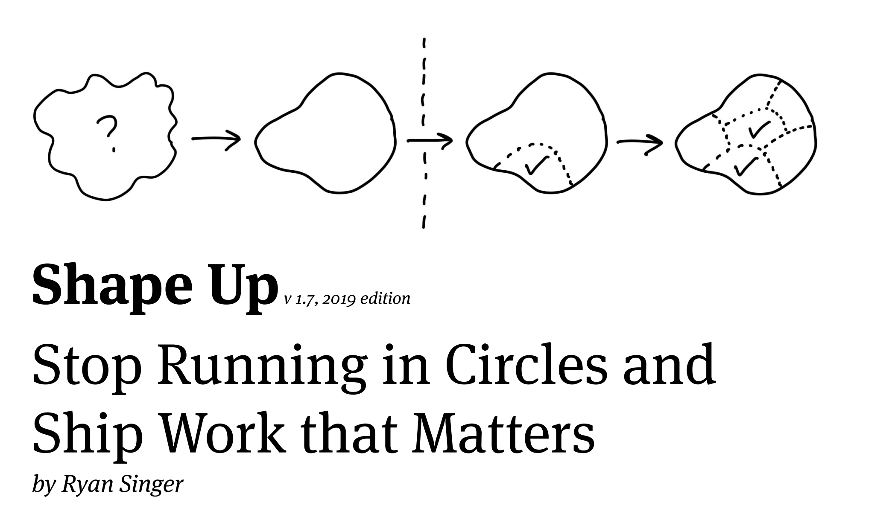

---
path:	"/blog/shape-up-review"
date:	"2019-12-13"
title:	"Review Notes: Shape Up"
image:	"../images/shapeup.png"
---

These notes are based off of the [v 1.7, 2019 edition of Shape Up](https://basecamp.com/shapeup/shape-up.pdf). They may introduce new versions at which point the page numbers will not line up.

I wrote this after having a number of people ask me about Shape Up. It is in bullet and notes form. Basecamp is doing something right, because this has come up in conversation multiple times.

## General Notes

1. Keep in mind Basecamp has a product development team of twelve people. I mention this because on some level this book could be seen as a snapshot of a single product team at your company.
2. Throughout the book there is a clear split between “the teams” and the person/people doing the shaping and betting. And occasionally we hear about managers (not often). Consider how this might translate to a single, empowered product team when there are multiple product teams at your company. How do the roles map? Would these be a Product Manager, Designer, and Tech Lead? Or something different.
3. You’ll hear about six week time-boxes early on. Don’t fret if you are doing two week sprints right now. Or no sprints. There’s more to it. On a high level, this is your standard fixed length, variable scope project with a heavy emphasis on working iteratively throughout. Be prepared, however, to work more iteratively than you do right now.
4. Some of the most valuable sections of the book are the real world descriptions of slicing, splitting, decomposition, and iteration techniques. This is a well-trodden territory but Ryan’s drawings are really well done. Hill charts are a nice visualization. Alone, these would make for a super valuable book club with developers and designers at your company. If you are feeling adventurous, hit Google for “story splitting”, user story mapping, some aspects of BDD, and [Elephant Carpaccio](https://qualibrate.com/blog/wp-content/uploads/2018/09/Elephant_Carpaccio_exercise.pdf).
5. There are a lot of unsaid things about the product culture at Basecamp, Ryan’s perspective on design (and product management), their risk appetites, whether they are all remote (I think they might be?), etc. Keep that in mind. Where this manifests most is in beliefs about how many people should “shape”, who does what, who wants to do what, etc. It works for them, but ask what would work for you.
6. The book is a great study of principles like optionality, enabling constraints, limiting planning inventory, sustainable pace, limiting work in process and progress(single batch, actually), “integration” (in the holistic sense, like “making x work” and “not doing horizontal slices”, and “do something don’t talk about it”).
7. Ask yourself why this REALLY works for Basecamp. My hunches are: 1) growing but stable small team, 2) no venture-backed growth goals, 3) very tight founding group, 4) a single product — I haven’t used Basecamp for a while, how is it?, 5) technical chops…not a lot of fires and things exploding, people writing their own tests, a solid architecture, 6) from a scope perspective, the product is narrow and they’ve been doing it for a while, 7) some of these approaches may be more necessary when people are working remote (this is called out in the book), and 8) lots of trust, psychological safety, and willingness to experiment with ways of working (see their other books). And iterating on this for 6+ years.
8. This is pretty similar to how many teams (that I have interacted with) have designed their approach — so my guess is that there are underlying principles that validate some of these patterns.
9. The book is great. I do worry that it is heavily biased to certain perspectives about the role of designers, leaders, teams, etc. When I read it, my first thought was “I wouldn’t want to work there if I was on a team.” To quote a friend “it’s a surprisingly disempowering approach for team”, but they make a point of talking about empowering teams. So there’s something to learn more about there.
10. Being a shaper would be “fun”, but I personally prefer a more collaborative approach. As a veteran of getting whole teams involved in things — customer research, co-design, discovery, etc. — I got sad imagining that sole shaper. I’ve seen very young/new engineers and designers be extremely effective at what Ryan calls shaping — doing it as a whole team, as well — that it all made me nervous. But I assume it works for them (again, I haven’t used their product in a while, but it did the job when I did). Consider that most people are working in fantastically dysfunctional settings, and this represents a step up. But that if you did this for a while, you might want to step *it* up in terms of decision authority, designing your own rituals, giving things their own names, etc.
11. Probably the second most important contribution of this book is just bringing detail to how teams think about the things bigger than “a sprint”. I’ve talked extensively over the years about a rough “rule of 3s” — 1–3hrs, days, weeks, months, quarters, years — and how all of that work is linked together. While organizations may differ in terms of the prescriptiveness of their bets, you simply can’t look at the small little sprints and go from waterfalls to little two-week whirlpools. This is A+ content and great because it describes their approach to addressing this broader resolution. Other approaches vary, but the principle remains the same: you have to work small and work holistically, and things of value take longer than two weeks.
12. If you do work this way, figure out how to reflect on your decision quality — both on the shaper level, the bettor level, and the builder level. I’m not sure there are any parts of this that talk about bets flopping. I would need to re-read to check. But it smacks, at times, of the genius solo designer crafting their masterpiece and doing the “deep work”, while the teams execute. I’m pretty sure that was not the intent, but it is implied in a couple places.
13. Though Basecamp figured this out in isolation (see Detailed Notes below), it is important to note that most of the concepts are not new. There is nothing wrong with this. Some of the most brilliant contributions come from people doing things in isolation and putting their unique stamp on it. This book is a deep exploration of how they work. Major, major kudos.
14. As for the “this is not Agile or X,Y, or Z” stuff, I don’t know…that probably tells us more about the current state of Agile than anything else. Or just makes for great marketing (it helps to be against something?)…with Basecamp correctly reading the collective Agile angst in the air as of late. Basecamp != Jira (thank goodness). I really want to do a follow-up post giving book references for all of the prior work that could help people. Yes, much of it falls under “Agile” and “Lean” (turns out those Agile folks aren’t as stupid as people make them out to be). It would require mapping old language to new language, but it might be helpful.

## Detailed Notes

Some page-level notes.

**Page 1**

> We have an entirely different approach. One developed in isolation over nearly 15 years of constant trial and error, taking note, iterating, honing in, and polishing up. We’ve shaped our own way.

This is great. It does not mean, however, that what they came up with is entirely different. Both can be true, and that is fine. I mention this mostly because there are lots of people out there in the agile, lean, design, and research communities who can help you do things like this. Don’t let labels deter you.

**Page 5**

> By 2015, we had a core team that had lived through these experiences and hit an impressive stride.

Note that this is six years after 2009 when they had the “first test of the idea”. No matter what you do it will take practice. Consider what would be possible if your current team had practiced something and iterated on something for six years. Many teams aren’t trusted to do that. Fix that trust issue and start!

**Page 6**

Google “six week cycles” to learn how others have arrived at this time-box. Intercom has a [nice post](https://www.intercom.com/blog/6-week-cycle-for-product-teams/) about their journey. There are some other interesting posts there. But I think there’s something more at play…some sort of underlying principle. We know one/two weeks is too short. We know a quarter feels too long. A month — hmmm — we need a tad more than that. So six feels like the shortest long interval you can get away with. Any longer and the batch feels too big. Also: Drift’s Burndown and “Marketable Moments”.

> senior people can shape up better projects.

You need to ask the core question of whether this is what you want your senior people to be doing. I can’t be the judge, but different work cultures ask different things of their more experienced (and less experienced) team members.

**Page 7**

> At every step of the process we target a specific risk: the risk of not shipping on time. This book isn’t about the risk of building the wrong thing. Other books can help you with that…

Extremely important. Lots of people assume this book is a complete approach to product development. It isn’t. As Ryan points out, it is about the risk of not shipping on time. There are smatterings of content on “wrong thing”, but that isn’t the focus.

> We reduce risk in the planning process by capping our bets to six weeks. If a project runs over, by default it doesn’t get an extension.

A wonderful statement of a fixed length, variable scope project.

> We build one meaningful piece of the work end-to-end early on and then repeat

This is absolutely critical when considering the six week time-box. While not using sprints, it captures the true essence of end-to-end slices and iteration. Many people say “see, they don’t use SPRINTS”, and I ask about how they collaborate daily. There’s this sense that somehow with Shape Up they’ll go for weeks on end doing brilliant work before showing it. The opposite is true. There’s more collaboration, just with less interrupting process. Or they are a designer imagining themselves as Grand Shaper working for weeks in creative isolation, only to realize that in this model they may be handed a fat marker drawing and told to get somewhere in three days.

**Page 9**

> Words are too abstract

This very much depends on the experience of the team. Some teams begin with words, and then quickly move from words to something they can look at. The question is…what do you need to get started, and how experienced is the team in going from words to the next step?

**Page 11**

> This is the level of fidelity we used to define the solution:

When teams start together and do co-design activities, you will see similar artifacts early on. My point is that you can get similar artifacts in different ways.

**Page 12**

> Property 2: It’s solved Despite being rough and unfinished, shaped work has been thought through. All the main elements of the solution are there at the macro level and they connect together

Do your teams want to work on solved problems? Maybe. Maybe not. Have a discussion with them about the desired level of prescription.

**Page 13**

> [Shaping]is also strategic work.

Keep in mind that strategy means many things. Some might regard the shaping described here as very tactical. Discuss what “strategic” means in your context.

Also, consider the side-effects of dividing your company into “shapers’ and “builders”. What if a builder wants to shape? Or a shaper build?

**Page 16**

> Fixed time, variable scope

An interesting twist here is that the Scrum guide (if that’s your thing) actually defines sprints (which can be six weeks long) as fixed time, variable scope projects. That said, the concept of the “sprint goal” has been largely ignored. I’m not a big Scrum advocate for other reasons, but people always miss this.

**Page 19**

Love the mention of the 2.0 curse. It is real.

**Page 28**

> Working at the right “level of abstraction” not only ensures we move at the right speed, it also leaves this important room for creativity in the later stages.

This is a great universal statement. Your challenge is coming up with what “creativity” means in your environment.

**Page 34**

> But it’s still a good idea to call out any cases you specifically aren’t supporting to keep the project well within the appetite.

This is great advice no matter how you work. A great activity is to brainstorm the edges of the problem (or solution) with your team.

**Page 35**

> This is a good time to grab some technical experts and walk them through the idea.

You might also choose to involve them from the beginning. They might have interesting insights that you can use from the very beginning.

> Try to keep the clay wet. Rather than writing up a document or creating a slideshow, invite them to a whiteboard and redraw the elements as you worked them out earlier, building up the concept from the beginning.

Show don’t tell. Great approach.

**Page 39**

> A problem without a solution is unshaped work.

But it might be a shaped problem.

> Giving it to a team means pushing research and exploration down to the wrong level, where the skillsets, time limit, and risk profile (thin vs. heavy tailed) are all misaligned.

Very org specific. Watch out for making this assumptions about your team.

**Page 41**

> This is an example of selectively getting into more visual detail because we need it to sell the concept.

Selling is an interesting word. Watch out for only rewarding the good salespeople in your organization. Other people have great ideas.

**Page 47**

> People comment on the pitch asynchronously. Not to say yes or no — that happens at the betting table — but to poke holes or contribute missing information

This is a great practice no matter what you do. The question is, how can you create an environment that is amenable (and safe enough) for this?

**Page 49**

> No backlogs

Search Twitter or elsewhere for the #nobacklogs hashtag.

> There are just a few well-shaped, risk-reduced options to review. The pitches are potential bets.

Research the idea of backlogs as a list of “options”. Then research “limiting planning inventory”. Together, these give you a list of potential bets. The key here is why it works. 1) Limiting options, and 2) Limiting bet inventory.

**Page 50**

> Important ideas come back

Very true. You see this over and over as a product manager. “Don’t worry, if it important we’ll hear about it again. That said, imagine you are the person mentioning that idea for the 10th time. It might get overly depressing.

**Page 52**

> Some companies use two-week cycles (aka “sprints”). We learned that two weeks is too short to get anything meaningful done. Worse than that, two-week cycles are extremely costly due to the planning overhead. The amount of work you get out of two weeks isn’t worth the collective hours around the table to “sprint plan” or the opportunity cost of breaking everyone’s momentum to re-group.

Valid critique of the Scrum rituals. Lots of overhead. The wild thing about two weeks is that in some sense it is TOO LONG, and in others TOO SHORT. In the sense that without frequent collaboration, you can far astray in two weeks. But it is too short for meaningful stuff.

**Page 53**

> Therefore, after each six-week cycle, we schedule two weeks for . This is a period with no scheduled work where we can breathe, meet as needed, and consider what to do next.

It is awesome that the book brings up this practice. It happens, but is not very common. Sometimes it “just happens” because teams don’t fill the available time-box.

**Page 54**

> Our betting table at Basecamp consists of the CEO (who in our case is the last word on product), CTO, a senior programmer, and a product strategist (myself).

If you take a step back, on some level Basecamp is the size of a single product team. So one way you can view this book is as a sort of snapshot of a team (instead of a company). So twenty teams would be like twenty Basecamps. This might clarify some of the hierarchal stuff here. It also veers into the whole mini-Function debate (e.g. Mini CEO), and that is a whole can of worms.

> The meaning of a bet

See Spotify DIBBs for more on bets. It is a powerful framing for sure. There’s a lot to it. One thing I would add is that there’s no reason in particular that bets need to be prescriptive. You *could* have a more open-ended bet. Your guidelines for framing bets will vary.

**Page 55**

> We do not allow the team to be interrupted or pulled away to do other things.

This is almost a prerequisite. Think about how many reactive issues you currently face. They cover this in “what about bugs”, but assess whether your environment is open to this. Are crises “rare”.

> We intentionally create a risk that the project — as pitched — won’t happen. This sounds severe but it’s extremely helpful for everyone involved.

Wonderful example of an enabling constraint. Also…requires a ton of discipline and safety. Make sure that is in place.

**Page 65**

> Generally speaking, if the silence doesn’t start to break after three days, that’s a reasonable time to step in and see what’s going on.

Consider this when thinking about how your team works now (and the normal two week sprint where teams scramble at the end of two weeks to have something to show).

**Page 66**

> Teams discover tasks by doing real work.

Critical point if you are used to “Tasking” stuff in Jira.

**Page 67**

> Instead they should aim to make something tangible and demoable early — in the first week or so. That requires integrating vertically on one small piece of the project instead of chipping away at the horizontal layers.

Keep in mind here that “vertical” slices often refer to technology. And horizontal slices often refer to the user experience. So when someone says “take a horizontal slice” they may mean something positive like taking a slice across a holistic experience. This is addressed later in the 3d diagrams.

**Page 69**

At some companies developers and designers pair more closely. It varies. This is pretty tight collaboration if you think about it.

**Page 69/70**

We haven’t heard anything about the humans using the product getting involved, yet. That isn’t the focus of the book — getting things done on-time is — but ask yourself what that might look like in your environment.

**Page 73**

In many ways, the strongest part of the book is this section on developer/designer collaboration. If you haven’t seen it in action, this will help.

**Page 74**

> The point is to finish something meaningful in a few days and build momentum — to have something real to click on that shows the team is on the right track.

What you see here are these naturally small batches. They aren’t fixed time-boxes, but they serve the same function. Some teams achieve this with a “maximum” time-box length of three days. It is a neat technique.

**Page 76**

> As we saw in the previous chapter, the slices of work integrate front-end and back-end tasks. This allows us to finish one slice of the actual project and definitively move on. That’s better than having lots of pieces that — fingers crossed — are supposed to come together by the end of the cycle.

Highly recommend Jeff Patton’s User Story Mapping if you have not checked it out already. Also, this cuts to the essence of user stories, which were never meant to be carved up by “the stack”. It also highlights the insanity of not letting multiple people be assigned to a ticket (in Jira).

**Page 84**

> In the same way, every project has a natural anatomy that arises from the design you want, the system you’re working within, and the interdependencies of the problems you have to solve.

Recommend checking out behavior driven design and domain driven design. There is a big body of work here. I’ve been doing more Event Storming/Modeling lately and I find it valuable.

**Page 90**

> Every piece of work has two phases. First there’s the uphill phase of figuring out what our approach is and what we’re going to do. Then, once we can see all the work involved, there’s the downhill phase of execution.

Just occurred to me that these are like the divergent and convergent parts of the diamonds in the double diamond.

**Page 93**

> Note how the hill shows how the work feels at different stages. The uphill phase is full of uncertainty, unknowns, and problem solving. The downhill phase is marked by certainty, confidence, seeing everything, and knowing what to do.

This is a great articulation of the decades-old critique of burn-down charts and story points. They don’t really communicate what is happening.

**Page 94**

> With this second-order view, managers can judge what’s in motion and what’s stuck. They can see which problems the team chose to solve and how much time they spent at each stage from unknown to known to done.

This leaves me wondering about the role of manager at Basecamp. Who are they? What do they do? Why aren’t they doing work? Are they Shaping?

**Page 115**

Read the Adjust to Your Size appendix section.

That’s it! Hope you found this helpful.

I think this book is great. I am sad that more companies don’t write in detail about how they work. Someone mentioned this evening that people don’t learn from “principles”, rather they “fork” other people’s efforts. If that is true, we need more to fork from.

In the intro, Jason Fried talks about team’s fumbling around, and seeing the light. For team’s fumbling around, maybe this is your ticket (though you might just graft your current issues on this new way). For teams not fumbling around, maybe take this as inspiration to continuously improve how you work — like Basecamp has done for 15 years.